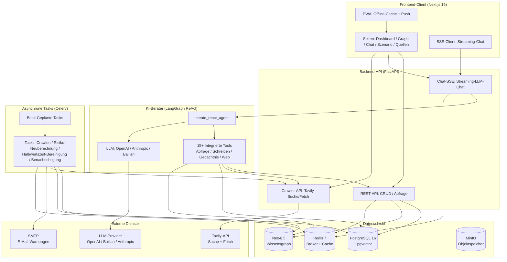
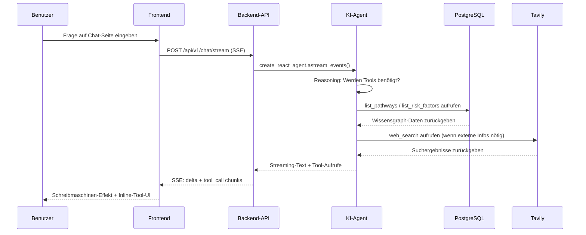

<h1 align="center">LifeTree · 人生树</h1>

<p align="center">
  <em>Ein intelligentes Informationssystem für mittel- bis langfristige persönliche Entscheidungsfindung: Aggregiert öffentliche und private Daten, kombiniert Wissensgraphen mit kausalem Reasoning und bietet einen dynamischen Entscheidungs-Sandbox für wichtige Lebensentscheidungen.</em>
</p>

<p align="center">
  <a href="https://github.com/CaryK753/LifeTree/actions"></a>
  
  
  
  
  
  
  
  
  
</p>

<p align="center">
  <strong>Sprachen / Languages:</strong>
  <a href="README.zh-CN.md">简体中文</a> ·
  <a href="README.zh-TW.md">繁體中文</a> ·
  <a href="README.en.md">English</a> ·
  <a href="README.es.md">Español</a> ·
  <a href="README.de.md">Deutsch</a> ·
  <a href="README.fr.md">Français</a>
</p>

<p align="center">
  
</p>
---

## Inhaltsverzeichnis

- [Projektvorstellung](#projektvorstellung)
- [Systemarchitektur](#systemarchitektur)
- [Tech-Stack](#tech-stack)
- [Funktionen](#funktionen)
- [Schnellstart](#schnellstart)
- [Docker Ein-Klick-Bereitstellung](#docker-ein-klick-bereitstellung)
- [Lokale Entwicklung](#lokale-entwicklung)
- [Konfiguration](#konfiguration)
- [Plugin-System](#plugin-system)
- [License](#license)

---

## Projektvorstellung

**LifeTree** ist ein intelligentes Informationssystem für mittel- bis langfristige persönliche Entscheidungsfindung. Es ist kein einfaches To-do-Listen- oder Notiztool, sondern ein dynamischer Entscheidungs-Sandbox, der Wissensgraphen, kausales Reasoning, Bayes'sche Netzwerke und Monte-Carlo-Simulation integriert.

### Welches Problem wird gelöst?

Beim Treffen wichtiger Lebensentscheidungen — Einwanderungswege, Karriereübergänge, Bildungsinvestitionen, Familienplanung — stehen wir oft vor:

- **Fragmentierte Informationen**: Relevante Daten sind über Browser-Lesezeichen, Chat-Verläufe und Dokumente verstreut, schwer zu systematisieren
- **Einseitiges Reasoning**: Wir sehen nur kurzfristige Vorteile und ignorieren langfristige Risiken und Opportunitätskosten
- **Statische Entscheidungen**: Nachdem eine Entscheidung getroffen wurde, wird sie nicht dynamisch aufgrund neuer Informationen revidiert

LifeTree löst diese Probleme durch:

1. **Informationsaggregation**: Automatisches Crawlen öffentlicher Daten (RSS / Web / API), manuelle Eingabe privater Daten (Dokumente / Bilder / Notizen), einheitliche Strukturierung als Wissensgraph-Knoten
2. **Kausale Modellierung**: Modelliert Ziel → Pfad → Anforderung → Risikofaktor als gerichteten Graphen, verwendet Bayes'sche Netzwerke zur Quantifizierung von Unsicherheit
3. **Szenario-Simulation**: Monte-Carlo-Simulation der Erfolgswahrscheinlichkeit, Risikoexposition und Zeitkosten unter verschiedenen Wahlpfaden
4. **Dynamische Warnung**: Celery-geplante Tasks überwachen die Informationsaktualität (Halbwertszeit-Modell), lösen automatisch Risikoneuberechnung und E-Mail-Warnungen aus
5. **KI-Berater**: LangGraph-basierter ReAct-Agent, der 15+ integrierte Tools aufrufen kann, um den Wissensgraphen abzufragen, neue Knoten zu erstellen, das Web zu durchsuchen und Seiteninhalte zu crawlen

### Beispielszenario

Dieses Repository enthält integrierte Beispieldaten für den **Kanadischen Federal Skilled Worker (FSW)**, der Folgendes abdeckt:

- Ziel: Einwanderung nach Kanada über den FSW-Kanal
- Pfad: EE-Pool-Eintritt → ITA-Einladung → Dokumenteneinreichung → Ärztliche Untersuchung → Landung
- Anforderungen: CLB 9 / ECA-Zertifikat / Arbeitsnachweis / Finanznachweis
- Risikofaktoren: Alterspunktabzüge, Schwankungen der Sprachscores, politische Änderungen, Quotenwettbewerb

---

## Systemarchitektur



### Datenfluss



---

## Tech-Stack

| Schicht | Technologie | Beschreibung |
|---|---|---|
| **Frontend** | Next.js 16 (App Router) | React 19, standalone output, PWA |
| | Vercel AI SDK | Streaming-Chat-Komponenten (Thread / Message / Composer) |
| | Tailwind CSS + Radix UI | Theme-System (hell/dunkel/System) |
| | Cytoscape.js + React Flow | Wissensgraph + Szenariobaum-Visualisierung |
| | ECharts | Statistische Diagramme |
| | SWR | Datenabruf und Caching |
| | i18n | 6 Sprachen: zh-CN / zh-TW / EN / ES / DE / FR |
| **Backend** | FastAPI | REST + SSE + Streaming-KI |
| | SQLAlchemy + Alembic | ORM + Migrationen |
| | Pydantic v2 | Datenvalidierung |
| | Instructor | LLM-strukturierte Ausgabe |
| | LangGraph | ReAct-Agent + Tool-Orchestrierung |
| | Celery + Beat | Asynchrone Tasks + geplante Tasks |
| **Datenbank** | PostgreSQL 16 + pgvector | Relationale Daten + Vektorsuche |
| | Neo4j 5 | Wissensgraph (APOC) |
| | Redis 7 | Celery-Broker + Cache |
| | MinIO | Objektspeicher (Datei-Uploads) |
| **LLM** | OpenAI-kompatibel | Unterstützt OpenAI / DeepSeek / Zhipu / vLLM |
| | Anthropic Claude | Natives Protokoll |
| | Alibaba Cloud Bailian DashScope | Chat / Vision / Embedding / Rerank |
| **Bereitstellung** | Docker Compose | Ein-Klick-Vollstack-Start |
| | GitHub Actions | CI/CD Multi-Arch-Image-Build |
| | GHCR | Image-Registry |

---

## Funktionen

### Kernmodule

- **Zielkompass**: Dashboard-artiges Zielmanagement, Fortschritts-, Frist- und Risikostatus-Tracking
- **Wissensgraph**: Cytoscape-Kraftgerichteter-Layout, Knoten = Entitäten, Kanten = Beziehungen, Klick-Erkundung
- **KI-Berater**: Streaming-Chat, 15+ integrierte Tools (Abfrage / Schreiben / Gedächtnis / Web-Suche / Web-Fetch), Inline-Rendern der Tool-Aufruf-UI
- **Szenario-Simulation**: React Flow + dagre-Baumlayout, Monte-Carlo-Simulation, Verzweigungswahrscheinlichkeitsringe + Risikoindikatoren
- **Quellenverwaltung**: Glaubwürdigkeitsbewertung (hoch / mittel / niedrig / benutzermarkiert), Informationshalbwertszeit-Management (exponentielles Zerfallsmodell)
- **Risikowarnung**: Benachrichtigungscenter, Schweregrad-Einstufung (dringend / Warnung / Info), SMTP-E-Mail-Versand
- **Informationseingabe**: Drag-and-Drop-Upload (PDF / Word / Excel / PPT / Bilder), Mineru-Parsing, KI-strukturierte Extraktion

### Integrierte KI-Tools

| Tool | Typ | Beschreibung |
|---|---|---|
| `list_pathways` | Abfrage | Alle Pfade für ein Ziel auflisten |
| `list_requirements` | Abfrage | Eintrittsanforderungen für einen Pfad auflisten |
| `list_risk_factors` | Abfrage | Risikofaktoren auflisten |
| `list_recent_events` | Abfrage | Letzte Ereignisse auflisten |
| `get_scenario_summary` | Abfrage | Szenariozusammenfassung abrufen |
| `run_scenario_reasoning` | Reasoning | Bayes'sche/Monte-Carlo-Reasoning ausführen |
| `create_goal` / `create_pathway` / `create_requirement` / `create_risk_factor` | Schreiben | Wissensgraph-Knoten erstellen |
| `list_memories` / `remember` / `forget` | Gedächtnis | Langzeitgedächtnis-Verwaltung des Benutzers |
| `web_search` | Web | Tavily-Websuche |
| `web_fetch` | Web | Tavily-Webinhalt-Fetch |

### PWA-Funktionen

- Offline-Cache (App Shell + statische Ressourcen + API-Antworten)
- Streaming-Chat umgeht Cache (`/api/v1/chat/stream` direkt zum Backend)
- Installation auf Desktop / mobilem Home-Screen
- Themefarbe passt sich an Hell-/Dunkel-Modus an
- Drawer-Modus-Seitenleiste: Im PWA-Modus oder bei Viewport < 1024px wird die Seitenleiste standardmäßig ausgeblendet und per `SidebarToggleButton` oben links auf der Seite eingeschoben. Ein Inline-Skript + die Klassen `html.pwa` / `html.drawer-mode` verhindern das Aufblitzen vor der Hydration.
- Erkennung von `navigator.standalone` unter iOS, deckt Fälle ab, die die `display-mode`-Media-Query verfehlt.
- Safe-Area-Padding für Notch / Home-Indikator.

---

## Schnellstart

### Voraussetzungen

- Docker + Docker Compose
- Oder: Python 3.11+, Node.js 20+, pnpm/npm (nur für lokale Entwicklung)

### Option 1: Docker Ein-Klick-Start (Empfohlen)

`docker-compose.yml` verwendet standardmäßig vorgefertigte Images von GHCR (`ghcr.io/caryk753/lifetree-backend`, `ghcr.io/caryk753/lifetree-frontend`) — ein einziger Befehl hebt den kompletten Stack:

```bash
# 1. Repository klonen
git clone https://github.com/CaryK753/LifeTree.git
cd LifeTree

# 2. Umgebungsvariablen konfigurieren
cp .env.example .env
# .env bearbeiten, mindestens einen LLM-API-Key ausfüllen

# 3. Ein-Klick-Vollstack-Start (Infrastruktur + Backend + Worker + Frontend)
docker compose up -d

# 4. Datenbank initialisieren (erster Lauf)
docker compose exec backend python scripts/init_db.py

# 5. Beispieldaten laden (optional)
docker compose exec backend python scripts/seed_fsw.py
```

> Möchtest du eine Version fixieren? Überschreibe den Image-Tag per Umgebungsvariable:
> ```bash
> BACKEND_IMAGE_TAG=0.1.0 FRONTEND_IMAGE_TAG=0.1.0 docker compose up -d
> ```

Nach dem Start besuchen:
- Frontend: http://localhost:3000
- Backend-API: http://localhost:8000
- API-Dokumentation: http://localhost:8000/docs
- Flower (Celery-Monitor): http://localhost:5555
- MinIO-Konsole: http://localhost:9001
- Neo4j-Browser: http://localhost:7474

### Option 2: Images lokal bauen

Falls du Backend-/Frontend-Code ändern oder debuggen musst, übergib `--build`, damit compose mit dem lokalen Dockerfile baut:

```bash
cp .env.example .env
# .env bearbeiten, mindestens einen LLM-API-Key ausfüllen
docker compose up -d --build
docker compose exec backend python scripts/init_db.py
```

### Option 3: Lokale Entwicklung

Siehe Abschnitt [Lokale Entwicklung](#lokale-entwicklung).

---

## Docker Ein-Klick-Bereitstellung

Die vollständige `docker-compose.yml` umfasst folgende Dienste:

| Dienst | Image | Port | Beschreibung |
|---|---|---|---|
| `postgres` | `pgvector/pgvector:pg16` | 5432 | PG + pgvector-Vektorerweiterung |
| `neo4j` | `neo4j:5.20` | 7687, 7474 | Wissensgraph + APOC |
| `redis` | `redis:7-alpine` | 6379 | Celery-Broker + Cache |
| `minio` | `minio/minio:latest` | 9000, 9001 | Objektspeicher |
| `backend` | `ghcr.io/caryk753/lifetree-backend` | 8000 | FastAPI-Anwendung |
| `worker` | `ghcr.io/caryk753/lifetree-backend` | - | Celery-Worker |
| `beat` | `ghcr.io/caryk753/lifetree-backend` | - | Celery-Beat-Scheduler |
| `flower` | `mher/flower:latest` | 5555 | Celery-Monitor |
| `frontend` | `ghcr.io/caryk753/lifetree-frontend` | 3000 | Next.js standalone |

```bash
# Alle Dienste starten (standardmäßig GHCR-Vorgefertigte-Images ziehen)
docker compose up -d

# Lokalen Build erzwingen und dann starten
docker compose up -d --build

# Logs anzeigen
docker compose logs -f backend frontend

# Stoppen
docker compose down

# Stoppen und Datenvolumes löschen
docker compose down -v
```

### Image-Tag-Steuerung

Standardmäßig wird `latest` verwendet; eine Version kann per Umgebungsvariable fixiert werden:

```bash
BACKEND_IMAGE_TAG=0.1.0 FRONTEND_IMAGE_TAG=0.1.0 docker compose up -d
```

Falls du Images manuell pullen musst (z. B. für eine Offline-Umgebung):

```bash
docker pull ghcr.io/caryk753/lifetree-backend:latest
docker pull ghcr.io/caryk753/lifetree-frontend:latest
```

---

## Lokale Entwicklung

### 1. Infrastruktur starten

```bash
cp .env.example .env
# .env bearbeiten, LLM_API_KEY etc. ausfüllen

# Nur Infrastrukturdienste starten
docker compose up -d postgres neo4j redis minio
```

### 2. Backend starten

```bash
cd backend
python -m venv .venv && source .venv/bin/activate
pip install -e ".[dev]"

# Tabellen erstellen (erster Lauf)
python scripts/init_db.py

# API starten
uvicorn app.main:app --reload --port 8000

# In anderem Terminal: Celery-Worker + Beat starten
celery -A app.workers.celery_app worker -l info
celery -A app.workers.celery_app beat -l info
```

### 3. Frontend starten

```bash
cd frontend
npm install
npm run dev
```

### 4. Beispieldaten laden

```bash
cd backend
python scripts/seed_fsw.py
```

http://localhost:3000 öffnen, um das Zielkompass-Dashboard zu sehen.

---

## Konfiguration

### LLM-Konfiguration

LLM-Provider auf der Einstellungsseite (`/settings`) konfigurieren:

1. **Provider hinzufügen**: Protokoll wählen (OpenAI-kompatibel / Anthropic / Alibaba Cloud Bailian), baseURL und API-Key ausfüllen
2. **Modell hinzufügen**: Modell-ID ausfüllen (z.B. `gpt-4o-mini`), Fähigkeiten aktivieren (chat / vision / embedding / rerank)
3. **Rollen zuweisen**: Für jede Rolle ein Modell auswählen

Unterstützte Provider:
- **OpenAI-kompatibel**: OpenAI / DeepSeek / Zhipu / OneAPI / vLLM
- **Anthropic**: Claude-Serie (chat / vision)
- **Alibaba Cloud Bailian**: Qwen / gte-rerank / qwen3-rerank
  - Chat / Vision / Embedding über OpenAI-kompatibles Protokoll
  - Rerank wird automatisch an den nativen Endpunkt `/api/v1/services/rerank/text-rerank/text-rerank` geroutet
  - Embedding standardmäßig 1024 Dimensionen

### Tavily-Suchkonfiguration

Tavily-API-Key auf der Einstellungsseite ausfüllen, um zu aktivieren:
- `web_search`- und `web_fetch`-Tools des KI-Beraters
- Quellen-Crawling (RSS / Web-Crawling)

### SMTP-E-Mail-Konfiguration

SMTP auf der Einstellungsseite konfigurieren, um den Versand von Risikowarnungs-E-Mails zu aktivieren. Unterstützt den Versand von Test-E-Mails zur Konfigurationsprüfung (Berechtigungsprüfung erfolgt vor dem Versand). Konfigurationsfelder:

- SMTP-Serveradresse, Port
- Benutzername, Passwort
- Absender-E-Mail, Absendername
- TLS verwenden (STARTTLS, Port 587) / SSL verwenden (Port 465)

### Authentifizierung & Mehrbenutzermodus

LifeTree unterstützt zwei Nutzungsmodi, gesteuert durch die Umgebungsvariable `LIFETREE_USE_MODE` (Standard `single`), in der Datenbank `app_config.use_mode` gespeichert, umschaltbar über `PUT /settings/use-mode`:

- **Einzelbenutzermodus (`single`, Standard)**: keine Anmeldung erforderlich — das Backend bedient Daten über den Default-User-Fallback. Nutzer, die einen persönlichen Datenbereich wünschen, können sich weiterhin manuell über das Benutzermenü anmelden. AuthGate zeigt keinen Anmeldedialog an.
- **Mehrbenutzermodus (`multi`)**: Anmeldung erforderlich — der AuthGate-Anmeldedialog kann nicht geschlossen werden. Die Admin-Rolle wird über die Umgebungsvariable `LIFETREE_ADMIN_USER_IDS` gesteuert.

Unterstützte Anmeldemethoden:

- E-Mail + Passwort (JWT-Access/Refresh-Tokens), mit optionalem E-Mail-Verifizierungscode-Registrierungsablauf (`send-code` / `register-with-code`)
- OAuth-Anmeldung: Google / GitHub / Microsoft, Endpunkte `/auth/oauth/{id}/start` und `/auth/oauth/{id}/callback`

Datenisolation: events / sources / plugins / Chat-Konversationen werden nach `user_id` isoliert. Frontend-Chat-Daten werden partitioniert nach `lifetree.chat.conversations.v2.<userId>` im localStorage gespeichert; nicht angemeldete Nutzer verwenden den Geltungsbereich `default`.

### Admin-Plattformkonfiguration

Im Mehrbenutzermodus haben Admins Zugriff auf eine eigene Plattform-Konfigurationsseite zur Verwaltung von:

- Modell- und Service-API-Schlüsseln (OpenAI / Anthropic / Alibaba Cloud Bailian / Tavily / SMTP usw.)
- Nutzerverwaltung (`GET/PATCH/DELETE /admin/users`) und Plattformstatistiken (`GET /admin/stats`)

Nicht-Admin-Nutzer können die vom Admin konfigurierten API-Schlüssel auf der Einstellungsseite nicht sehen.

### Umgebungsvariablen

Vollständige Variablenliste unter [`.env.example`](.env.example).

---

## Plugin-System

Das Plugin-System von LifeTree ermöglicht die Anbindung an beliebige Datenquellen (RSS, Web-Scraper, API usw.) über benutzerdefinierte Python-Skripte und strukturiert externe Informationen automatisch in Ereignisse, Metriken, Assertionen und Beziehungen im Wissensgraphen. Sowohl eingebaute als auch benutzerhochgeladene Plugins werden unterstützt.

### Plugin-Vertrag

Jedes Plugin ist eine Python-Datei, die die folgenden statischen Methoden implementiert:

```python
from app.services.plugins import Plugin, PluginManifest, PluginParam

class Plugin:
    @staticmethod
    def manifest() -> PluginManifest:
        """Gibt Plugin-Metadaten zurück: Name, Beschreibung, Parameterdefinitionen."""

    @staticmethod
    def fetch(params: dict) -> str | bytes:
        """Holt Rohdaten, gibt Text oder Bytes zurück."""

    @staticmethod
    def transform(raw, llm) -> str:  # optional
        """Optional: verarbeitet Rohdaten mit einem LLM vor, bevor sie an den Strukturierungsdienst übergeben werden."""
```

- **Eingebaute Plugins**: liegen in `backend/plugins/`, werden mit dem Image ausgeliefert. Siehe [`sample_rss_feed.py`](backend/plugins/sample_rss_feed.py) und [`sample_web_scraper.py`](backend/plugins/sample_web_scraper.py).
- **Benutzerhochgeladene Plugins**: Upload über den Endpunkt `/plugins/upload`, gespeichert unter `backend/plugins/user_uploaded/{plugin_id}.py`, mit Metadaten in der Tabelle `user_plugins`. Docker Compose konfiguriert ein Named Volume für `/app/plugins/user_uploaded/`, sodass benutzerdefinierte Plugins Container-Neustarts überdauern.

### Plugin-Upload

Die Plugin-Seite unterstützt den direkten Upload von `.py`-Dateien — kein Image-Neubau nötig, um benutzerdefinierte Plugins hinzuzufügen. Uploads durchlaufen mehrere Sicherheitsprüfungen:

1. **AST-Syntaxprüfung**: lehnt Quellcode ab, der nicht geparst werden kann.
2. **Import-Sperrliste**: blockiert gefährliche Module einschließlich `os` / `sys` / `subprocess` / `shutil` / `ctypes` / `socket` / `multiprocessing` / `importlib` / `pickle` / `marshal` / `pty` / `posix` / `nt` / `resource`.
3. **Gefährliche-Builtins-Prüfung**: fängt `eval` / `exec` / `__import__`-Aufrufe ab.
4. **Vertragsvalidierung**: muss eine gültige `Plugin`-Klasse mit einer `manifest()`-Methode offenlegen.
5. **Temp-Modul-Ladeverifikation**: importiert das Modul aus einem temporären Pfad, um sicherzustellen, dass `manifest()` aufrufbar ist.

API-Endpunkte:

| Methode | Pfad | Beschreibung |
|---|---|---|
| `POST` | `/plugins/upload` | Benutzer-Plugin hochladen (unterstützt `overwrite=true`) |
| `DELETE` | `/plugins/{id}` | Benutzer-Plugin soft-löschen (eingebaute Plugins können nicht gelöscht werden) |
| `PATCH` | `/plugins/{id}/enabled` | Benutzer-Plugin aktivieren / deaktivieren |
| `POST` | `/plugins/{id}/run` | Fetch + Transform + Ingest |

### Plugins beisteuern

Pull Requests für benutzerdefinierte Plugins sind willkommen:

1. Forke das Repo und erstelle die Plugin-Datei unter `backend/plugins/` (Dateiname muss lower-case snake_case sein, z. B. `my_feed.py`).
2. Implementiere den Plugin-Vertrag — stelle sicher, dass `manifest()` und `fetch()` korrekt funktionieren.
3. Beschreibe Zweck, Parameter und Testansatz des Plugins in der PR-Beschreibung.
4. Nach Review wird es in den Hauptbranch gemergt und mit der nächsten Version veröffentlicht.

---

## License

GNU Affero General Public License v3.0 — see [LICENSE](LICENSE) file for details.

---

<p align="center">
  <em>LifeTree · Jede wichtige Entscheidung evidenzbasiert treffen</em>
</p>
