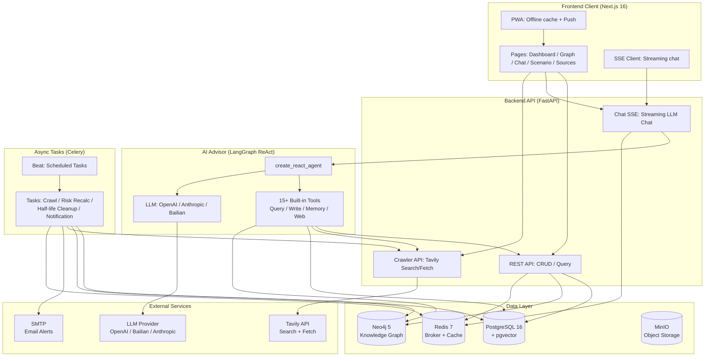
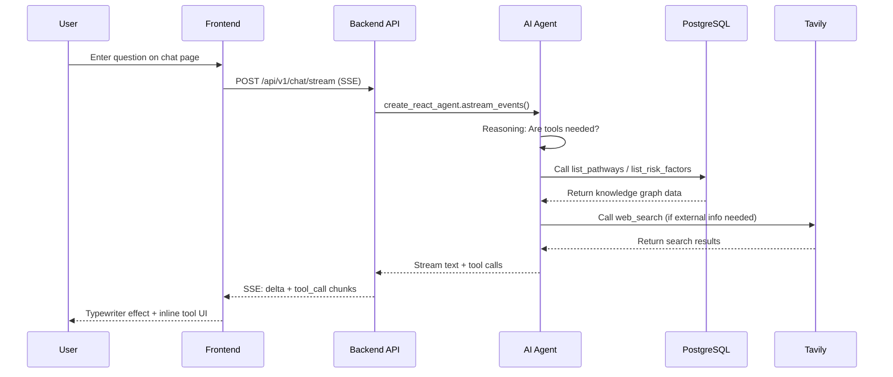

<h1 align="center">LifeTree · 人生树</h1>

<p align="center">
  <em>An intelligent information system focused on medium-to-long-term personal decision-making: aggregating public and private data, combining knowledge graphs with causal reasoning, providing a dynamic decision sandbox for major life choices.</em>
</p>

<p align="center">
  <a href="https://github.com/CaryK753/LifeTree/actions"></a>
  
  
  
  
  
  
  
  
  
</p>

<p align="center">
  <strong>Languages:</strong>
  <a href="README.zh-CN.md">简体中文</a> ·
  <a href="README.zh-TW.md">繁體中文</a> ·
  <a href="README.en.md">English</a> ·
  <a href="README.es.md">Español</a> ·
  <a href="README.de.md">Deutsch</a> ·
  <a href="README.fr.md">Français</a>
</p>

<p align="center">
  
</p>
---

## Table of Contents

- [Project Introduction](#project-introduction)
- [System Architecture](#system-architecture)
- [Tech Stack](#tech-stack)
- [Features](#features)
- [Quick Start](#quick-start)
- [Docker One-Click Deployment](#docker-one-click-deployment)
- [Local Development](#local-development)
- [Configuration](#configuration)
- [License](#license)

---

## Project Introduction

**LifeTree** is an intelligent information system focused on medium-to-long-term personal decision-making. It is not a simple to-do list or note-taking tool, but a dynamic decision sandbox that integrates knowledge graphs, causal reasoning, Bayesian networks, and Monte Carlo simulation.

### What Problem Does It Solve?

When facing major life choices — immigration paths, career transitions, education investments, family planning — we often:

- **Fragmented Information**: Relevant data is scattered across browser bookmarks, chat logs, and documents, hard to systematize
- **One-Sided Reasoning**: We only see short-term benefits, ignoring long-term risks and opportunity costs
- **Static Decisions**: Once a decision is made, it is not dynamically revised based on new information

LifeTree solves these problems through:

1. **Information Aggregation**: Automatically crawls public data (RSS / web / API), manually inputs private data (documents / images / notes), and uniformly structures them as knowledge graph nodes
2. **Causal Modeling**: Models goal → pathway → requirement → risk factor as a directed graph, using Bayesian networks to quantify uncertainty
3. **Scenario Simulation**: Monte Carlo simulates success probability, risk exposure, and time cost under different choice paths
4. **Dynamic Warning**: Celery scheduled tasks monitor information freshness (half-life model), automatically trigger risk recalculation and email alerts
5. **AI Advisor**: LangGraph-based ReAct Agent that can call 15+ built-in tools to query the knowledge graph, create new nodes, search the web, and crawl page content

### Example Scenario

This repository includes built-in **Canadian Federal Skilled Worker (FSW)** example data, covering:

- Goal: Immigrate to Canada via the FSW channel
- Pathway: EE pool entry → ITA invitation → Document submission → Medical exam → Landing
- Requirements: CLB 9 / ECA credential / Work experience proof / Proof of funds
- Risk factors: Age point deductions, language score fluctuations, policy changes, quota competition

---

## System Architecture



### Data Flow



---

## Tech Stack

| Layer | Technology | Description |
|---|---|---|
| **Frontend** | Next.js 16 (App Router) | React 19, standalone output, PWA |
| | Vercel AI SDK | Streaming chat components (Thread / Message / Composer) |
| | Tailwind CSS + Radix UI | Theme system (light/dark/system) |
| | Cytoscape.js + React Flow | Knowledge graph + scenario tree visualization |
| | ECharts | Statistical charts |
| | SWR | Data fetching and caching |
| | i18n | 6 languages: zh-CN / zh-TW / EN / ES / DE / FR |
| **Backend** | FastAPI | REST + SSE + streaming AI |
| | SQLAlchemy + Alembic | ORM + migrations |
| | Pydantic v2 | Data validation |
| | Instructor | LLM structured output |
| | LangGraph | ReAct Agent + tool orchestration |
| | Celery + Beat | Async tasks + scheduled tasks |
| **Database** | PostgreSQL 16 + pgvector | Relational data + vector search |
| | Neo4j 5 | Knowledge graph (APOC) |
| | Redis 7 | Celery broker + cache |
| | MinIO | Object storage (file uploads) |
| **LLM** | OpenAI-compatible | Supports OpenAI / DeepSeek / Zhipu / vLLM |
| | Anthropic Claude | Native protocol |
| | Alibaba Cloud Bailian DashScope | Chat / Vision / Embedding / Rerank |
| **Deployment** | Docker Compose | One-click full-stack launch |
| | GitHub Actions | CI/CD multi-arch image build |
| | GHCR | Image Registry |

---

## Features

### Core Modules

- **Goal Compass**: Dashboard-style goal management, tracking progress, deadlines, and risk status
- **Knowledge Graph**: Cytoscape force-directed layout, nodes = entities, edges = relationships, click-to-explore
- **AI Advisor**: Streaming chat, 15+ built-in tools (query / write / memory / web search / web fetch), inline tool call UI rendering
- **Scenario Simulation**: React Flow + dagre tree layout, Monte Carlo simulation, branch probability rings + risk indicators
- **Source Management**: Credibility rating (high / medium / low / user-marked), information half-life management (exponential decay model)
- **Risk Warning**: Notification center, severity levels (urgent / warning / info), SMTP email delivery
- **Information Input**: Drag-and-drop upload (PDF / Word / Excel / PPT / images), Mineru parsing, AI structured extraction

### AI Built-in Tools

| Tool | Type | Description |
|---|---|---|
| `list_pathways` | Query | List all pathways for a goal |
| `list_requirements` | Query | List entry requirements for a pathway |
| `list_risk_factors` | Query | List risk factors |
| `list_recent_events` | Query | List recent events |
| `get_scenario_summary` | Query | Get scenario summary |
| `run_scenario_reasoning` | Reasoning | Execute Bayesian/Monte Carlo reasoning |
| `create_goal` / `create_pathway` / `create_requirement` / `create_risk_factor` | Write | Create knowledge graph nodes |
| `list_memories` / `remember` / `forget` | Memory | User long-term memory management |
| `web_search` | Web | Tavily web search |
| `web_fetch` | Web | Tavily web content fetch |

### PWA Features

- Offline cache (App Shell + static assets + API responses)
- Streaming chat bypasses cache (`/api/v1/chat/stream` direct to backend)
- Install to desktop / mobile home screen
- Theme color adapts to light/dark mode

---

## Quick Start

### Prerequisites

- Docker + Docker Compose
- Or: Python 3.11+, Node.js 20+, pnpm/npm

### Option 1: Docker One-Click Launch (Recommended)

```bash
# 1. Clone the repository
git clone https://github.com/CaryK753/LifeTree.git
cd LifeTree

# 2. Configure environment variables
cp .env.example .env
# Edit .env, fill in at least one LLM API Key

# 3. One-click full-stack launch (infrastructure + backend + worker + frontend)
docker compose up -d --build

# 4. Initialize the database (first run)
docker compose exec backend python scripts/init_db.py

# 5. Load example data (optional)
docker compose exec backend python scripts/seed_fsw.py
```

After launch, visit:
- Frontend: http://localhost:3000
- Backend API: http://localhost:8000
- API docs: http://localhost:8000/docs
- Flower (Celery monitor): http://localhost:5555
- MinIO console: http://localhost:9001
- Neo4j browser: http://localhost:7474

### Option 2: Local Development

See the [Local Development](#local-development) section.

---

## Docker One-Click Deployment

The complete `docker-compose.yml` includes the following services:

| Service | Image | Port | Description |
|---|---|---|---|
| `postgres` | `pgvector/pgvector:pg16` | 5432 | PG + pgvector vector extension |
| `neo4j` | `neo4j:5.20` | 7687, 7474 | Knowledge graph + APOC |
| `redis` | `redis:7-alpine` | 6379 | Celery broker + cache |
| `minio` | `minio/minio:latest` | 9000, 9001 | Object storage |
| `backend` | Local build | 8000 | FastAPI application |
| `worker` | Local build | - | Celery Worker |
| `beat` | Local build | - | Celery Beat scheduler |
| `flower` | `mher/flower:latest` | 5555 | Celery monitor |
| `frontend` | Local build | 3000 | Next.js standalone |

```bash
# Start all services
docker compose up -d --build

# View logs
docker compose logs -f backend frontend

# Stop
docker compose down

# Stop and clear data volumes
docker compose down -v
```

### Using Pre-built Images (GHCR)

```bash
# Pull the latest images
docker pull ghcr.io/caryk753/lifetree-backend:latest
docker pull ghcr.io/caryk753/lifetree-frontend:latest

# Replace build with image in docker-compose.yml
# backend:
#   image: ghcr.io/caryk753/lifetree-backend:latest
# frontend:
#   image: ghcr.io/caryk753/lifetree-frontend:latest
```

---

## Local Development

### 1. Start Infrastructure

```bash
cp .env.example .env
# Edit .env, fill in LLM_API_KEY etc.

# Start only infrastructure services
docker compose up -d postgres neo4j redis minio
```

### 2. Start Backend

```bash
cd backend
python -m venv .venv && source .venv/bin/activate
pip install -e ".[dev]"

# Initialize tables (first run)
python scripts/init_db.py

# Start API
uvicorn app.main:app --reload --port 8000

# In another terminal: start Celery Worker + Beat
celery -A app.workers.celery_app worker -l info
celery -A app.workers.celery_app beat -l info
```

### 3. Start Frontend

```bash
cd frontend
npm install
npm run dev
```

### 4. Load Example Data

```bash
cd backend
python scripts/seed_fsw.py
```

Open http://localhost:3000 to see the Goal Compass dashboard.

---

## Configuration

### LLM Configuration

Configure LLM Provider on the settings page (`/settings`):

1. **Add Provider**: Select protocol (OpenAI-compatible / Anthropic / Alibaba Cloud Bailian), fill in baseURL and API Key
2. **Add Model**: Fill in model ID (e.g. `gpt-4o-mini`), check capabilities (chat / vision / embedding / rerank)
3. **Assign Roles**: Select a model for each role

Supported Providers:
- **OpenAI-compatible**: OpenAI / DeepSeek / Zhipu / OneAPI / vLLM
- **Anthropic**: Claude series (chat / vision)
- **Alibaba Cloud Bailian**: Qwen / gte-rerank / qwen3-rerank
  - Chat / Vision / Embedding via OpenAI-compatible protocol
  - Rerank auto-routed to native endpoint `/api/v1/services/rerank/text-rerank/text-rerank`
  - Embedding defaults to 1024 dimensions

### Tavily Search Configuration

Fill in Tavily API Key on the settings page to enable:
- AI Advisor's `web_search` and `web_fetch` tools
- Source crawling (RSS / web crawling)

### SMTP Email Configuration

Configure SMTP on the settings page to enable risk warning email delivery. Supports sending test emails to verify configuration.

### Environment Variables

For full list of variables, see [`.env.example`](.env.example).

---

## License

GNU Affero General Public License v3.0 — see [LICENSE](LICENSE) file for details.

---

<p align="center">
  <em>LifeTree · Making every major decision evidence-based</em>
</p>
