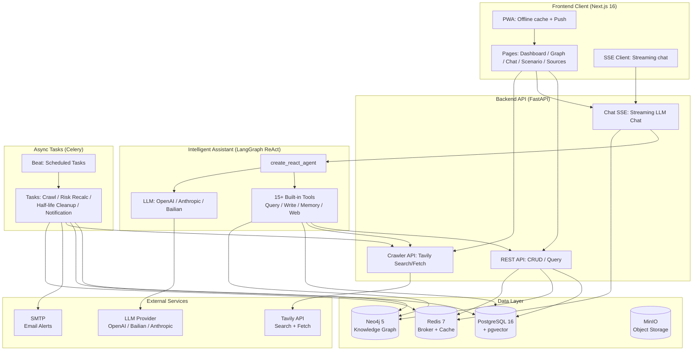
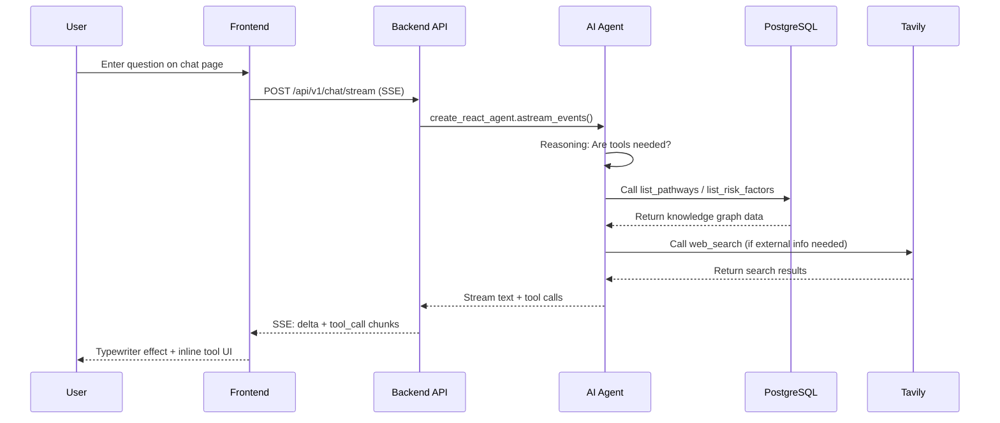

<h1 align="center">LifeTree · 人生树</h1>

<p align="center">
  <em>An intelligent information system focused on medium-to-long-term personal decision-making: aggregating public and private data, combining knowledge graphs with causal reasoning, providing a dynamic decision sandbox for major life choices.</em>
</p>

<p align="center">
  <a href="https://github.com/CaryK753/LifeTree/actions"></a>
  
  
  
  
  
  
  
  
  
</p>

<p align="center">
  <strong>Languages:</strong>
  <a href="README.zh-CN.md">简体中文</a> ·
  <a href="README.zh-TW.md">繁體中文</a> ·
  <a href="README.en.md">English</a> ·
  <a href="README.es.md">Español</a> ·
  <a href="README.de.md">Deutsch</a> ·
  <a href="README.fr.md">Français</a>
</p>

<p align="center">
  
</p>

---

## Table of Contents

- [Project Introduction](#project-introduction)
- [System Architecture](#system-architecture)
- [Tech Stack](#tech-stack)
- [Features](#features)
- [Quick Start](#quick-start)
- [Docker One-Click Deployment](#docker-one-click-deployment)
- [Local Development](#local-development)
- [Configuration](#configuration)
- [Plugin System](#plugin-system)
- [License](#license)

---

## Project Introduction

**LifeTree** is an intelligent information system focused on medium-to-long-term personal decision-making. It is not a simple to-do list or note-taking tool, but a dynamic decision sandbox that integrates knowledge graphs, causal reasoning, Bayesian networks, and Monte Carlo simulation.

### What Problem Does It Solve?

When facing major life choices — immigration paths, career transitions, education investments, family planning — we often:

- **Fragmented Information**: Relevant data is scattered across browser bookmarks, chat logs, and documents, hard to systematize
- **One-Sided Reasoning**: We only see short-term benefits, ignoring long-term risks and opportunity costs
- **Static Decisions**: Once a decision is made, it is not dynamically revised based on new information

LifeTree solves these problems through:

1. **Information Aggregation**: Automatically crawls public data (RSS / web / API), manually inputs private data (documents / images / notes), and uniformly structures them as knowledge graph nodes
2. **Causal Modeling**: Models goal → pathway → requirement → risk factor as a directed graph, using Bayesian networks to quantify uncertainty
3. **Scenario Simulation**: Monte Carlo simulates success probability, risk exposure, and time cost under different choice paths
4. **Dynamic Warning**: Celery scheduled tasks monitor information freshness (half-life model), automatically trigger risk recalculation and email alerts
5. **Intelligent Assistant**: LangGraph-based ReAct Agent that can call 15+ built-in tools to query the knowledge graph, create new nodes, search the web, and crawl page content

### Example Scenario

This repository includes built-in **Canadian Federal Skilled Worker (FSW)** example data, covering:

- Goal: Immigrate to Canada via the FSW channel
- Pathway: EE pool entry → ITA invitation → Document submission → Medical exam → Landing
- Requirements: CLB 9 / ECA credential / Work experience proof / Proof of funds
- Risk factors: Age point deductions, language score fluctuations, policy changes, quota competition

---

## System Architecture



### Data Flow



---

## Tech Stack

| Layer | Technology | Description |
|---|---|---|
| **Frontend** | Next.js 16 (App Router) | React 19, standalone output, PWA |
| | Vercel AI SDK | Streaming chat components (Thread / Message / Composer) |
| | Tailwind CSS + Radix UI | Theme system (light/dark/system) |
| | Cytoscape.js + React Flow | Knowledge graph + scenario tree visualization |
| | ECharts | Statistical charts |
| | SWR | Data fetching and caching |
| | i18n | 6 languages: zh-CN / zh-TW / EN / ES / DE / FR |
| **Backend** | FastAPI | REST + SSE + streaming AI |
| | SQLAlchemy + Alembic | ORM + migrations |
| | Pydantic v2 | Data validation |
| | Instructor | LLM structured output |
| | LangGraph | ReAct Agent + tool orchestration |
| | Celery + Beat | Async tasks + scheduled tasks |
| **Database** | PostgreSQL 16 + pgvector | Relational data + vector search |
| | Neo4j 5 | Knowledge graph (APOC) |
| | Redis 7 | Celery broker + cache |
| | MinIO | Object storage (file uploads) |
| **LLM** | OpenAI-compatible | Supports OpenAI / DeepSeek / Zhipu / vLLM |
| | Anthropic Claude | Native protocol |
| | Alibaba Cloud Bailian DashScope | Chat / Vision / Embedding / Rerank |
| **Deployment** | Docker Compose | One-click full-stack launch |
| | GitHub Actions | CI/CD multi-arch image build |
| | GHCR | Image Registry |

---

## Features

### Core Modules

- **Goal Compass**: Dashboard-style goal management, tracking progress, deadlines, and risk status
- **Knowledge Graph**: Cytoscape force-directed layout, nodes = entities, edges = relationships, click-to-explore
- **Intelligent Assistant**: Streaming chat, 15+ built-in tools, per-conversation model selection grouped by provider, and inline tool call UI
- **User Extensions**: Per-user MCP (HTTP / SSE / stdio) and Skills (text / archive / folder / GitHub)
- **Scenario Simulation**: React Flow + dagre tree layout, Monte Carlo simulation, branch probability rings + risk indicators
- **Source Management**: Credibility rating (high / medium / low / user-marked), information half-life management (exponential decay model)
- **Risk Warning**: Notification center, severity levels (urgent / warning / info), SMTP email delivery
- **Information Input**: Drag-and-drop upload (PDF / Word / Excel / PPT / images), Mineru parsing, AI structured extraction

### AI Built-in Tools

| Tool | Type | Description |
|---|---|---|
| `list_pathways` | Query | List all pathways for a goal |
| `list_requirements` | Query | List entry requirements for a pathway |
| `list_risk_factors` | Query | List risk factors |
| `list_recent_events` | Query | List recent events |
| `get_scenario_summary` | Query | Get scenario summary |
| `run_scenario_reasoning` | Reasoning | Execute Bayesian/Monte Carlo reasoning |
| `create_goal` / `create_pathway` / `create_requirement` / `create_risk_factor` | Write | Create knowledge graph nodes |
| `list_memories` / `remember` / `forget` | Memory | User long-term memory management |
| `web_search` | Web | Tavily web search |
| `web_fetch` | Web | Tavily web content fetch |

### PWA Features

- Offline cache (App Shell + static assets + API responses)
- Streaming chat bypasses cache (`/api/v1/chat/stream` connects directly to backend)
- Installable to desktop / mobile home screen
- Theme color adapts to light/dark mode
- Drawer-mode sidebar: in PWA mode or viewport < 1024px, the sidebar is hidden by default and slides in via the per-page `SidebarToggleButton` in the top-left corner. An inline script + `html.pwa` / `html.drawer-mode` classes prevent rail flash before hydration.
- iOS `navigator.standalone` detection covers cases the `display-mode` media query misses.
- Safe-area padding for notch / home indicator.

---

## Quick Start

### Prerequisites

- Docker + Docker Compose
- Or: Python 3.11+, Node.js 20+, pnpm/npm (only for local development)

### Option 1: Docker One-Click Launch (Recommended)

`docker-compose.yml` uses pre-built images from GHCR by default (`ghcr.io/caryk753/lifetree-backend`, `ghcr.io/caryk753/lifetree-frontend`), a single command spins up the full stack:

```bash
# 1. Clone the repository
git clone https://github.com/CaryK753/LifeTree.git
cd LifeTree

# 2. Configure environment variables
cp .env.example .env
# Edit .env, fill in at least one LLM API Key

# 3. One-click full-stack launch (infrastructure + backend + worker + frontend)
docker compose up -d

# 4. Initialize the database (first run)
docker compose exec backend python scripts/init_db.py

# 5. Load example data (optional)
docker compose exec backend python scripts/seed_fsw.py
```

> Want to pin to a specific version? Override the image tags via environment variables:
> ```bash
> BACKEND_IMAGE_TAG=0.1.0 FRONTEND_IMAGE_TAG=0.1.0 docker compose up -d
> ```

After launch, visit:
- Frontend: http://localhost:13000
- Backend API: http://localhost:18000
- API docs: http://localhost:18000/docs
- Flower (Celery monitor): http://localhost:15555
- MinIO console: http://localhost:19001
- Neo4j browser: http://localhost:17474

### Option 2: Build Images Locally

If you need to modify backend / frontend code or debug, pass `--build` so compose builds with the local Dockerfile:

```bash
cp .env.example .env
# Edit .env, fill in at least one LLM API Key
docker compose up -d --build
docker compose exec backend python scripts/init_db.py
```

### Option 3: Local Development

See the [Local Development](#local-development) section.

---

## Docker One-Click Deployment

The complete `docker-compose.yml` includes the following services:

| Service | Image | Port | Description |
|---|---|---|---|
| `postgres` | `pgvector/pgvector:pg16` | 15432 | PG + pgvector vector extension |
| `neo4j` | `neo4j:5.20` | 17687, 17474 | Knowledge graph + APOC |
| `redis` | `redis:7-alpine` | 16379 | Celery broker + cache |
| `minio` | `minio/minio:latest` | 19000, 19001 | Object storage |
| `backend` | `ghcr.io/caryk753/lifetree-backend` | 18000 | FastAPI application |
| `worker` | `ghcr.io/caryk753/lifetree-backend` | - | Celery Worker |
| `beat` | `ghcr.io/caryk753/lifetree-backend` | - | Celery Beat scheduler |
| `flower` | `mher/flower:latest` | 15555 | Celery monitor |
| `frontend` | `ghcr.io/caryk753/lifetree-frontend` | 13000 | Next.js standalone |

```bash
# Start all services (uses GHCR pre-built images by default)
docker compose up -d

# Force local build then start
docker compose up -d --build

# View logs
docker compose logs -f backend frontend

# Stop
docker compose down

# Stop and clear data volumes
docker compose down -v
```

### Image Tag Control

`latest` is used by default; a specific version can be pinned via environment variables:

```bash
BACKEND_IMAGE_TAG=0.1.0 FRONTEND_IMAGE_TAG=0.1.0 docker compose up -d
```

If you need to pull images manually (e.g. for an offline environment):

```bash
docker pull ghcr.io/caryk753/lifetree-backend:latest
docker pull ghcr.io/caryk753/lifetree-frontend:latest
```

---

## Local Development

### 1. Start Infrastructure

```bash
cp .env.example .env
# Edit .env, fill in LLM_API_KEY etc.

# Start only infrastructure services
docker compose up -d postgres neo4j redis minio
```

### 2. Start Backend

```bash
cd backend
python -m venv .venv && source .venv/bin/activate
pip install -e ".[dev]"

# Initialize tables (first run)
python scripts/init_db.py

# Start API
uvicorn app.main:app --reload --port 18000

# In another terminal: start Celery Worker + Beat
celery -A app.workers.celery_app worker -l info
celery -A app.workers.celery_app beat -l info
```

### 3. Start Frontend

```bash
cd frontend
npm install
npm run dev
```

### 4. Load Example Data

```bash
cd backend
python scripts/seed_fsw.py
```

Open http://localhost:13000 to see the Goal Compass dashboard.

---

## Configuration

### LLM Configuration

Admins configure platform providers on `/admin`; authorized users configure private providers on `/settings`:

1. **Add Provider**: Select protocol (OpenAI-compatible / Ollama / Anthropic / Alibaba Cloud Bailian), fill in baseURL and API Key
2. **Add Model**: Fill in model ID (e.g. `gpt-4o-mini`), check capabilities (chat / vision / embedding / rerank)
3. **Assign Roles**: Select a model for each role

Supported Providers:
- **OpenAI-compatible**: OpenAI / DeepSeek / Zhipu / OneAPI / vLLM
- **Ollama**: Local OpenAI-compatible endpoint for single-user desktop deployments
- **Anthropic**: Claude series (chat / vision)
- **Alibaba Cloud Bailian**: Qwen / gte-rerank / qwen3-rerank
  - Chat / Vision / Embedding via OpenAI-compatible protocol
  - Rerank auto-routed to native endpoint `/api/v1/services/rerank/text-rerank/text-rerank`
  - Embedding defaults to 1024 dimensions

### Tavily Search Configuration

Fill in Tavily API Key on the settings page to enable:
- Intelligent Assistant's `web_search` and `web_fetch` tools
- Source crawling (RSS / web crawling)

### SMTP Email Configuration

Configure SMTP on the settings page to enable risk warning email delivery. Supports sending test emails to verify configuration (permission is checked before sending). Configuration fields:

- SMTP server address, port
- Username, password
- Sender email, sender name
- Use TLS (STARTTLS, port 587) / Use SSL (port 465)

### Authentication & Multi-user Mode

LifeTree supports two use modes, controlled by the `LIFETREE_USE_MODE` environment variable (default `single`), persisted to the database `app_config.use_mode`, toggleable via `PUT /settings/use-mode`:

- **Single-user mode (`single`, default)**: registration and sign-in are required. The first account becomes admin; subsequent registration is automatically disabled.
- **Multi-user mode (`multi`)**: requires the full PostgreSQL, Neo4j, Redis, MinIO, and Celery deployment. The first account becomes admin; `LIFETREE_ADMIN_USER_IDS` may grant additional admin roles.

SQLite local storage is planned only for `single` mode and is not yet implemented. Both modes currently use PostgreSQL while transaction, vector-search, and graph-sync storage boundaries are extracted.

Supported login methods:

- Email + password (JWT access/refresh tokens), with optional email verification code registration flow (`send-code` / `register-with-code`)
- OAuth login: Google / GitHub / Microsoft, endpoints `/auth/oauth/{id}/start` and `/auth/oauth/{id}/callback`

Data isolation: events, sources, plugins, private models, role defaults, MCP, Skills, and chat conversations are isolated by `user_id`. Frontend chat data is partitioned by `lifetree.chat.conversations.v2.<userId>`.

### Admin Platform Configuration

In multi-user mode, admins can access a dedicated platform configuration page to manage:

- Model and service API keys (OpenAI / Anthropic / Alibaba Cloud Bailian / Tavily / SMTP, etc.)
- User management (`GET/PATCH/DELETE /admin/users`) and platform stats (`GET /admin/stats`)
- Whether regular users may configure private LLM, Tavily, and MinerU services

Non-admin users only see administrator model names, capabilities, and an “Admin provided” label. Admin base URLs and keys are never returned.

### MCP & Skills

- MCP supports HTTP, SSE, and stdio. stdio uses an executable plus argument array without a shell, with timeout and output limits.
- Skills support pasted text, ZIP/TAR archives, folders, and shallow HTTPS GitHub clones, with a 2 MiB import limit and path traversal checks.
- Enabled Skills become user-provided assistant context; enabled MCP servers become tools selected by the assistant when relevant.

### Environment Variables

For full list of variables, see [`.env.example`](.env.example).

---

## Plugin System

LifeTree's plugin system lets you connect to any data source (RSS, web scraper, API, etc.) via custom Python scripts, automatically structuring external information into events, metrics, assertions, and relationships in the knowledge graph. Both built-in and user-uploaded plugins are supported.

### Plugin Contract

Each plugin is a Python file that implements the following static methods:

```python
from app.services.plugins import Plugin, PluginManifest, PluginParam

class Plugin:
    @staticmethod
    def manifest() -> PluginManifest:
        """Return plugin metadata: name, description, parameter definitions."""

    @staticmethod
    def fetch(params: dict) -> str | bytes:
        """Fetch raw data, return text or bytes."""

    @staticmethod
    def transform(raw, llm) -> str:  # optional
        """Optional: preprocess raw data with an LLM before handing it to the structuring service."""
```

- **Built-in plugins**: placed in `backend/plugins/`, shipped with the image. See [`sample_rss_feed.py`](backend/plugins/sample_rss_feed.py) and [`sample_web_scraper.py`](backend/plugins/sample_web_scraper.py).
- **User-uploaded plugins**: uploaded via the `/plugins/upload` endpoint, stored at `backend/plugins/user_uploaded/{plugin_id}.py`, with metadata in the `user_plugins` table. Docker Compose configures a named volume for `/app/plugins/user_uploaded/` so custom plugins survive container restarts.

### Plugin Upload

The plugin page supports uploading `.py` files directly — no image rebuild needed to add custom plugins. Uploads go through multiple security checks:

1. **AST syntax check**: rejects source code that cannot be parsed.
2. **Import denylist**: blocks dangerous modules including `os` / `sys` / `subprocess` / `shutil` / `ctypes` / `socket` / `multiprocessing` / `importlib` / `pickle` / `marshal` / `pty` / `posix` / `nt` / `resource`.
3. **Dangerous builtins check**: intercepts `eval` / `exec` / `__import__` calls.
4. **Contract validation**: must expose a valid `Plugin` class with a `manifest()` method.
5. **Temp-module load verification**: imports the module from a temp path to ensure `manifest()` is callable.

API endpoints:

| Method | Path | Description |
|---|---|---|
| `POST` | `/plugins/upload` | Upload a user plugin (supports `overwrite=true`) |
| `DELETE` | `/plugins/{id}` | Soft-delete a user plugin (built-in plugins cannot be deleted) |
| `PATCH` | `/plugins/{id}/enabled` | Enable / disable a user plugin |
| `POST` | `/plugins/{id}/run` | Fetch + transform + ingest |

### Contributing Plugins

Pull requests for custom plugins are welcome:

1. Fork the repo and create the plugin file under `backend/plugins/` (filename must be lowercase snake_case, e.g. `my_feed.py`).
2. Implement the plugin contract — ensure `manifest()` and `fetch()` work correctly.
3. Describe the plugin's purpose, parameters, and testing approach in the PR description.
4. After review, it will be merged into the main branch and released with the next version.

---

## License

GNU Affero General Public License v3.0 — see [LICENSE](LICENSE) file for details.

---

<p align="center">
  <em>LifeTree · Making every major decision evidence-based</em>
</p>
