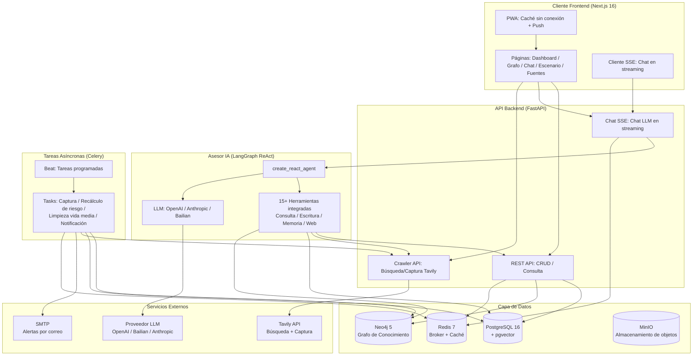
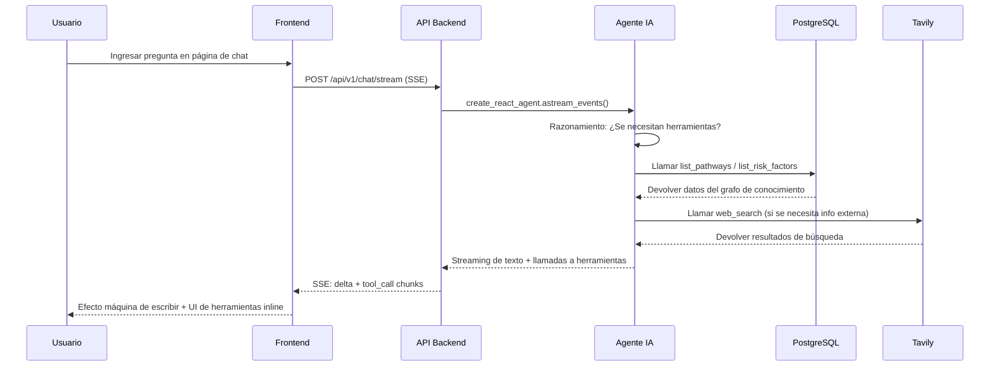

<h1 align="center">LifeTree · 人生树</h1>

<p align="center">
  <em>Un sistema de información inteligente enfocado en la toma de decisiones personales a medio y largo plazo: agrega datos públicos y privados, combina grafos de conocimiento con razonamiento causal, y proporciona un sandbox de decisión dinámica para las grandes elecciones de la vida.</em>
</p>

<p align="center">
  <a href="https://github.com/CaryK753/LifeTree/actions"></a>
  
  
  
  
  
  
  
  
  
</p>

<p align="center">
  <strong>Idiomas / Languages:</strong>
  <a href="README.zh-CN.md">简体中文</a> ·
  <a href="README.zh-TW.md">繁體中文</a> ·
  <a href="README.en.md">English</a> ·
  <a href="README.es.md">Español</a> ·
  <a href="README.de.md">Deutsch</a> ·
  <a href="README.fr.md">Français</a>
</p>

<p align="center">
  
</p>
---

## Tabla de Contenidos

- [Introducción del Proyecto](#introducción-del-proyecto)
- [Arquitectura del Sistema](#arquitectura-del-sistema)
- [Stack Tecnológico](#stack-tecnológico)
- [Características](#características)
- [Inicio Rápido](#inicio-rápido)
- [Despliegue Docker con Un Clic](#despliegue-docker-con-un-clic)
- [Desarrollo Local](#desarrollo-local)
- [Configuración](#configuración)
- [License](#license)

---

## Introducción del Proyecto

**LifeTree** es un sistema de información inteligente enfocado en la toma de decisiones personales a medio y largo plazo. No es una simple lista de tareas o herramienta de notas, sino un sandbox de decisión dinámica que integra grafos de conocimiento, razonamiento causal, redes bayesianas y simulación de Monte Carlo.

### ¿Qué Problema Resuelve?

Cuando enfrentamos grandes elecciones de vida — rutas de inmigración, transiciones profesionales, inversiones en educación, planificación familiar — a menudo:

- **Información Fragmentada**: Los datos relevantes están dispersos en marcadores del navegador, historiales de chat y documentos, difíciles de sistematizar
- **Razonamiento Unilateral**: Solo vemos los beneficios a corto plazo, ignorando los riesgos a largo plazo y los costos de oportunidad
- **Decisiones Estáticas**: Una vez tomada la decisión, no se revisa dinámicamente con base en nueva información

LifeTree resuelve estos problemas mediante:

1. **Agregación de Información**: Captura automáticamente datos públicos (RSS / web / API), ingresa manualmente información privada (documentos / imágenes / notas), y los estructura uniformemente como nodos del grafo de conocimiento
2. **Modelado Causal**: Modela objetivo → ruta → requisito → factor de riesgo como grafo dirigido, usando redes bayesianas para cuantificar la incertidumbre
3. **Simulación de Escenarios**: Simulación de Monte Carlo para probabilidad de éxito, exposición al riesgo y costo temporal bajo diferentes rutas de elección
4. **Alerta Dinámica**: Tareas programadas de Celery monitorean la frescura de la información (modelo de vida media), disparando automáticamente recálculo de riesgo y alertas por correo
5. **Asesor de IA**: ReAct Agent basado en LangGraph que puede invocar más de 15 herramientas integradas para consultar el grafo de conocimiento, crear nuevos nodos, buscar en la web y extraer contenido de páginas

### Escenario de Ejemplo

Este repositorio incluye datos de ejemplo del **Trabajador Calificado Federal (FSW) de Canadá**, cubriendo:

- Objetivo: Inmigrar a Canadá vía el canal FSW
- Ruta: Entrada al pool EE → Invitación ITA → Presentación de documentos → Examen médico → Desembarque
- Requisitos: CLB 9 / Credencial ECA / Prueba de experiencia laboral / Prueba de fondos
- Factores de riesgo: Deducción de puntos por edad, fluctuación de puntaje de idioma, cambios de política, competencia por cuotas

---

## Arquitectura del Sistema



### Flujo de Datos



---

## Stack Tecnológico

| Capa | Tecnología | Descripción |
|---|---|---|
| **Frontend** | Next.js 16 (App Router) | React 19, standalone output, PWA |
| | Vercel AI SDK | Componentes de chat en streaming (Thread / Message / Composer) |
| | Tailwind CSS + Radix UI | Sistema de temas (claro/oscuro/sistema) |
| | Cytoscape.js + React Flow | Visualización de grafo de conocimiento + árbol de escenarios |
| | ECharts | Gráficos estadísticos |
| | SWR | Obtención y caché de datos |
| | i18n | 6 idiomas: zh-CN / zh-TW / EN / ES / DE / FR |
| **Backend** | FastAPI | REST + SSE + IA en streaming |
| | SQLAlchemy + Alembic | ORM + migraciones |
| | Pydantic v2 | Validación de datos |
| | Instructor | Salida estructurada LLM |
| | LangGraph | ReAct Agent + orquestación de herramientas |
| | Celery + Beat | Tareas asíncronas + tareas programadas |
| **Base de Datos** | PostgreSQL 16 + pgvector | Datos relacionales + búsqueda vectorial |
| | Neo4j 5 | Grafo de conocimiento (APOC) |
| | Redis 7 | Celery broker + caché |
| | MinIO | Almacenamiento de objetos (carga de archivos) |
| **LLM** | Compatible con OpenAI | Soporta OpenAI / DeepSeek / Zhipu / vLLM |
| | Anthropic Claude | Protocolo nativo |
| | Alibaba Cloud Bailian DashScope | Chat / Vision / Embedding / Rerank |
| **Despliegue** | Docker Compose | Lanzamiento de pila completa con un clic |
| | GitHub Actions | CI/CD construcción de imágenes multi-arquitectura |
| | GHCR | Registro de imágenes |

---

## Características

### Módulos Centrales

- **Brújula de Objetivos**: Gestión de objetivos estilo dashboard, seguimiento de progreso, fechas límite y estado de riesgo
- **Grafo de Conocimiento**: Layout de fuerza dirigida Cytoscape, nodos = entidades, aristas = relaciones, exploración por clic
- **Asesor de IA**: Chat en streaming, más de 15 herramientas integradas (consulta / escritura / memoria / búsqueda web / captura web), renderizado inline de UI de llamadas a herramientas
- **Simulación de Escenarios**: React Flow + layout en árbol dagre, simulación Monte Carlo, anillos de probabilidad de ramas + indicadores de riesgo
- **Gestión de Fuentes**: Calificación de credibilidad (alta / media / baja / marcada por usuario), gestión de vida media de información (modelo de decaimiento exponencial)
- **Alerta de Riesgo**: Centro de notificaciones, niveles de severidad (urgente / advertencia / información), envío por correo SMTP
- **Entrada de Información**: Carga por arrastrar y soltar (PDF / Word / Excel / PPT / imágenes), análisis Mineru, extracción estructurada por IA

### Herramientas Integradas de IA

| Herramienta | Tipo | Descripción |
|---|---|---|
| `list_pathways` | Consulta | Listar todas las rutas de un objetivo |
| `list_requirements` | Consulta | Listar requisitos de entrada de una ruta |
| `list_risk_factors` | Consulta | Listar factores de riesgo |
| `list_recent_events` | Consulta | Listar eventos recientes |
| `get_scenario_summary` | Consulta | Obtener resumen de escenario |
| `run_scenario_reasoning` | Razonamiento | Ejecutar razonamiento Bayesiano/Monte Carlo |
| `create_goal` / `create_pathway` / `create_requirement` / `create_risk_factor` | Escritura | Crear nodos del grafo de conocimiento |
| `list_memories` / `remember` / `forget` | Memoria | Gestión de memoria a largo plazo del usuario |
| `web_search` | Web | Búsqueda web Tavily |
| `web_fetch` | Web | Captura de contenido web Tavily |

### Características PWA

- Caché sin conexión (App Shell + recursos estáticos + respuestas API)
- Chat en streaming omite caché (`/api/v1/chat/stream` directo al backend)
- Instalación en escritorio / pantalla de inicio móvil
- Color de tema se adapta a modo claro/oscuro

---

## Inicio Rápido

### Requisitos Previos

- Docker + Docker Compose
- O: Python 3.11+, Node.js 20+, pnpm/npm

### Opción 1: Lanzamiento con Un Clic Docker (Recomendado)

```bash
# 1. Clonar el repositorio
git clone https://github.com/CaryK753/LifeTree.git
cd LifeTree

# 2. Configurar variables de entorno
cp .env.example .env
# Editar .env, completar al menos una LLM API Key

# 3. Lanzamiento con un clic de pila completa (infraestructura + backend + worker + frontend)
docker compose up -d --build

# 4. Inicializar la base de datos (primera ejecución)
docker compose exec backend python scripts/init_db.py

# 5. Cargar datos de ejemplo (opcional)
docker compose exec backend python scripts/seed_fsw.py
```

Después del lanzamiento, visitar:
- Frontend: http://localhost:3000
- API Backend: http://localhost:8000
- Documentación API: http://localhost:8000/docs
- Flower (monitor Celery): http://localhost:5555
- Consola MinIO: http://localhost:9001
- Navegador Neo4j: http://localhost:7474

### Opción 2: Desarrollo Local

Consultar la sección [Desarrollo Local](#desarrollo-local).

---

## Despliegue Docker con Un Clic

El `docker-compose.yml` completo incluye los siguientes servicios:

| Servicio | Imagen | Puerto | Descripción |
|---|---|---|---|
| `postgres` | `pgvector/pgvector:pg16` | 5432 | PG + extensión vectorial pgvector |
| `neo4j` | `neo4j:5.20` | 7687, 7474 | Grafo de conocimiento + APOC |
| `redis` | `redis:7-alpine` | 6379 | Celery broker + caché |
| `minio` | `minio/minio:latest` | 9000, 9001 | Almacenamiento de objetos |
| `backend` | Build local | 8000 | Aplicación FastAPI |
| `worker` | Build local | - | Celery Worker |
| `beat` | Build local | - | Programador Celery Beat |
| `flower` | `mher/flower:latest` | 5555 | Monitor Celery |
| `frontend` | Build local | 3000 | Next.js standalone |

```bash
# Iniciar todos los servicios
docker compose up -d --build

# Ver logs
docker compose logs -f backend frontend

# Detener
docker compose down

# Detener y limpiar volúmenes de datos
docker compose down -v
```

### Usar Imágenes Pre-construidas (GHCR)

```bash
# Pull de las últimas imágenes
docker pull ghcr.io/caryk753/lifetree-backend:latest
docker pull ghcr.io/caryk753/lifetree-frontend:latest

# Reemplazar build con image en docker-compose.yml
# backend:
#   image: ghcr.io/caryk753/lifetree-backend:latest
# frontend:
#   image: ghcr.io/caryk753/lifetree-frontend:latest
```

---

## Desarrollo Local

### 1. Iniciar Infraestructura

```bash
cp .env.example .env
# Editar .env, completar LLM_API_KEY etc.

# Iniciar solo servicios de infraestructura
docker compose up -d postgres neo4j redis minio
```

### 2. Iniciar Backend

```bash
cd backend
python -m venv .venv && source .venv/bin/activate
pip install -e ".[dev]"

# Crear tablas (primera ejecución)
python scripts/init_db.py

# Iniciar API
uvicorn app.main:app --reload --port 8000

# En otra terminal: iniciar Celery Worker + Beat
celery -A app.workers.celery_app worker -l info
celery -A app.workers.celery_app beat -l info
```

### 3. Iniciar Frontend

```bash
cd frontend
npm install
npm run dev
```

### 4. Cargar Datos de Ejemplo

```bash
cd backend
python scripts/seed_fsw.py
```

Abrir http://localhost:3000 para ver el dashboard Brújula de Objetivos.

---

## Configuración

### Configuración LLM

Configurar el Proveedor LLM en la página de ajustes (`/settings`):

1. **Agregar Proveedor**: Seleccionar protocolo (compatible OpenAI / Anthropic / Alibaba Cloud Bailian), completar baseURL y API Key
2. **Agregar Modelo**: Completar ID del modelo (ej. `gpt-4o-mini`), marcar capacidades (chat / vision / embedding / rerank)
3. **Asignar Roles**: Seleccionar un modelo para cada rol

Proveedores Soportados:
- **Compatible OpenAI**: OpenAI / DeepSeek / Zhipu / OneAPI / vLLM
- **Anthropic**: Serie Claude (chat / vision)
- **Alibaba Cloud Bailian**: Qwen / gte-rerank / qwen3-rerank
  - Chat / Vision / Embedding vía protocolo compatible OpenAI
  - Rerank auto-enrutado al endpoint nativo `/api/v1/services/rerank/text-rerank/text-rerank`
  - Embedding por defecto 1024 dimensiones

### Configuración de Búsqueda Tavily

Completar Tavily API Key en la página de ajustes para habilitar:
- Herramientas `web_search` y `web_fetch` del Asesor IA
- Captura de fuentes (RSS / crawling web)

### Configuración de Correo SMTP

Configurar SMTP en la página de ajustes para habilitar el envío de alertas de riesgo por correo. Soporta envío de correos de prueba para verificar la configuración.

### Variables de Entorno

Para la lista completa de variables, consultar [`.env.example`](.env.example).

---

## License

GNU Affero General Public License v3.0 — see [LICENSE](LICENSE) file for details.

---

<p align="center">
  <em>LifeTree · Que cada decisión importante esté basada en evidencia</em>
</p>
