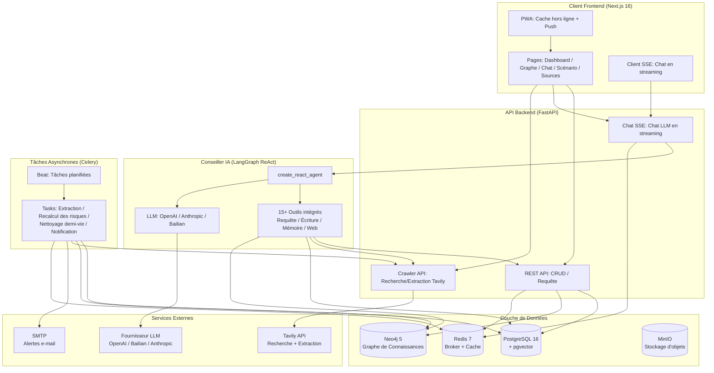
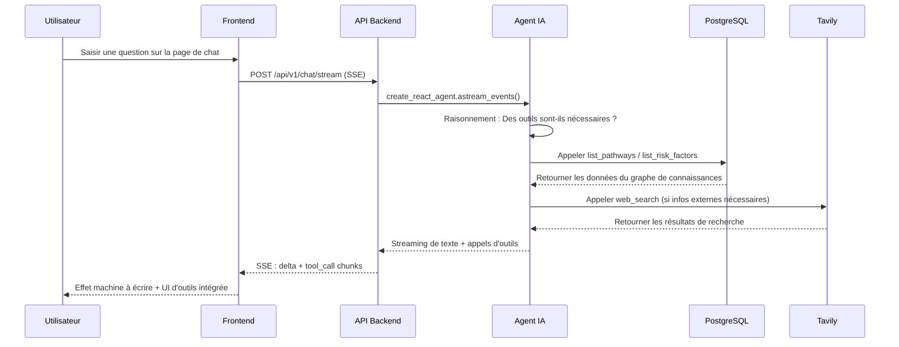

<h1 align="center">LifeTree · 人生树</h1>

<p align="center">
  <em>Un système d'information intelligent pour la prise de décision personnelle à moyen et long terme : agrège des données publiques et privées, combine des graphes de connaissances avec un raisonnement causal, et fournit un bac à sable de décision dynamique pour les grands choix de vie.</em>
</p>

<p align="center">
  <a href="https://github.com/CaryK753/LifeTree/actions"></a>
  
  
  
  
  
  
  
  
  
</p>

<p align="center">
  <strong>Langues / Languages:</strong>
  <a href="README.zh-CN.md">简体中文</a> ·
  <a href="README.zh-TW.md">繁體中文</a> ·
  <a href="README.en.md">English</a> ·
  <a href="README.es.md">Español</a> ·
  <a href="README.de.md">Deutsch</a> ·
  <a href="README.fr.md">Français</a>
</p>

<p align="center">
  
</p>
---

## Table des Matières

- [Présentation du Projet](#présentation-du-projet)
- [Architecture du Système](#architecture-du-système)
- [Stack Technique](#stack-technique)
- [Fonctionnalités](#fonctionnalités)
- [Démarrage Rapide](#démarrage-rapide)
- [Déploiement Docker en Un Clic](#déploiement-docker-en-un-clic)
- [Développement Local](#développement-local)
- [Configuration](#configuration)
- [Système de Plugins](#système-de-plugins)
- [License](#license)

---

## Présentation du Projet

**LifeTree** est un système d'information intelligent pour la prise de décision personnelle à moyen et long terme. Ce n'est pas une simple liste de tâches ou un outil de prise de notes, mais un bac à sable de décision dynamique qui intègre des graphes de connaissances, du raisonnement causal, des réseaux bayésiens et de la simulation de Monte Carlo.

### Quel Problème Résout-il ?

Face aux grands choix de vie — parcours d'immigration, transitions professionnelles, investissements éducatifs, planification familiale — nous avons souvent :

- **Information Fragmentée** : Les données pertinentes sont dispersées dans les signets du navigateur, l'historique des conversations et les documents, difficiles à systématiser
- **Raisonnement Unilatéral** : Nous ne voyons que les bénéfices à court terme, ignorant les risques à long terme et les coûts d'opportunité
- **Décisions Statiques** : Une fois la décision prise, elle n'est pas révisée dynamiquement en fonction des nouvelles informations

LifeTree résout ces problèmes par :

1. **Agrégation d'Information** : Capture automatique des données publiques (RSS / web / API), saisie manuelle des informations privées (documents / images / notes), structuration uniforme en nœuds de graphe de connaissances
2. **Modélisation Causale** : Modélise objectif → parcours → exigence → facteur de risque sous forme de graphe orienté, utilisant des réseaux bayésiens pour quantifier l'incertitude
3. **Simulation de Scénarios** : Simulation de Monte Carlo de la probabilité de succès, de l'exposition au risque et du coût temporel sous différents parcours de choix
4. **Alerte Dynamique** : Les tâches planifiées Celery surveillent la fraîcheur de l'information (modèle de demi-vie), déclenchant automatiquement le recalcul des risques et les alertes par e-mail
5. **Conseiller IA** : Agent ReAct basé sur LangGraph qui peut appeler plus de 15 outils intégrés pour interroger le graphe de connaissances, créer de nouveaux nœuds, rechercher sur le web et extraire le contenu des pages

### Scénario d'Exemple

Ce dépôt inclut des données d'exemple intégrées pour le **Travailleur Qualifié Fédéral (FSW) canadien**, couvrant :

- Objectif : Immigrer au Canada via le canal FSW
- Parcours : Entrée dans le pool EE → Invitation ITA → Soumission des documents → Examen médical → Débarquement
- Exigences : CLB 9 / Diplôme ECA / Preuve d'expérience professionnelle / Preuve de fonds
- Facteurs de risque : Déductions de points liées à l'âge, fluctuations des scores de langue, changements de politique, concurrence pour les quotas

---

## Architecture du Système



### Flux de Données



---

## Stack Technique

| Couche | Technologie | Description |
|---|---|---|
| **Frontend** | Next.js 16 (App Router) | React 19, standalone output, PWA |
| | Vercel AI SDK | Composants de chat en streaming (Thread / Message / Composer) |
| | Tailwind CSS + Radix UI | Système de thèmes (clair/sombre/système) |
| | Cytoscape.js + React Flow | Visualisation graphe de connaissances + arbre de scénarios |
| | ECharts | Graphiques statistiques |
| | SWR | Récupération et mise en cache des données |
| | i18n | 6 langues : zh-CN / zh-TW / EN / ES / DE / FR |
| **Backend** | FastAPI | REST + SSE + IA en streaming |
| | SQLAlchemy + Alembic | ORM + migrations |
| | Pydantic v2 | Validation des données |
| | Instructor | Sortie structurée LLM |
| | LangGraph | Agent ReAct + orchestration des outils |
| | Celery + Beat | Tâches asynchrones + tâches planifiées |
| **Base de Données** | PostgreSQL 16 + pgvector | Données relationnelles + recherche vectorielle |
| | Neo4j 5 | Graphe de connaissances (APOC) |
| | Redis 7 | Celery broker + cache |
| | MinIO | Stockage d'objets (téléchargement de fichiers) |
| **LLM** | Compatible OpenAI | Prend en charge OpenAI / DeepSeek / Zhipu / vLLM |
| | Anthropic Claude | Protocole natif |
| | Alibaba Cloud Bailian DashScope | Chat / Vision / Embedding / Rerank |
| **Déploiement** | Docker Compose | Lancement de la pile complète en un clic |
| | GitHub Actions | CI/CD construction d'images multi-architecture |
| | GHCR | Registre d'images |

---

## Fonctionnalités

### Modules Principaux

- **Boussole des Objectifs** : Gestion des objectifs de type tableau de bord, suivi de la progression, des échéances et du statut des risques
- **Graphe de Connaissances** : Layout force-dirigée Cytoscape, nœuds = entités, arêtes = relations, exploration par clic
- **Conseiller IA** : Chat en streaming, plus de 15 outils intégrés (requête / écriture / mémoire / recherche web / extraction web), rendu intégré de l'UI des appels d'outils
- **Simulation de Scénarios** : React Flow + layout en arbre dagre, simulation de Monte Carlo, anneaux de probabilité de branches + indicateurs de risque
- **Gestion des Sources** : Évaluation de la crédibilité (élevée / moyenne / basse / marquée par l'utilisateur), gestion de la demi-vie de l'information (modèle de décroissance exponentielle)
- **Alerte de Risque** : Centre de notifications, niveaux de gravité (urgent / avertissement / info), envoi par e-mail SMTP
- **Saisie d'Information** : Téléchargement par glisser-déposer (PDF / Word / Excel / PPT / images), analyse Mineru, extraction structurée par IA

### Outils IA Intégrés

| Outil | Type | Description |
|---|---|---|
| `list_pathways` | Requête | Lister tous les parcours d'un objectif |
| `list_requirements` | Requête | Lister les exigences d'entrée d'un parcours |
| `list_risk_factors` | Requête | Lister les facteurs de risque |
| `list_recent_events` | Requête | Lister les événements récents |
| `get_scenario_summary` | Requête | Obtenir le résumé du scénario |
| `run_scenario_reasoning` | Raisonnement | Exécuter le raisonnement bayésien/Monte Carlo |
| `create_goal` / `create_pathway` / `create_requirement` / `create_risk_factor` | Écriture | Créer des nœuds du graphe de connaissances |
| `list_memories` / `remember` / `forget` | Mémoire | Gestion de la mémoire à long terme de l'utilisateur |
| `web_search` | Web | Recherche web Tavily |
| `web_fetch` | Web | Extraction de contenu web Tavily |

### Fonctionnalités PWA

- Cache hors ligne (App Shell + ressources statiques + réponses API)
- Le chat en streaming contourne le cache (`/api/v1/chat/stream` direct vers le backend)
- Installation sur le bureau / écran d'accueil mobile
- Couleur du thème s'adapte au mode clair/sombre
- Barre latérale en mode tiroir : en mode PWA ou largeur de fenêtre < 1024px, la barre latérale est masquée par défaut et s'ouvre en glissant via le `SidebarToggleButton` en haut à gauche de chaque page. Un script inline + les classes `html.pwa` / `html.drawer-mode` évitent le clignotement avant l'hydration.
- Détection de `navigator.standalone` sur iOS, couvre les cas que la media query `display-mode` manque.
- Padding de zone de sécurité pour notch / indicateur d'accueil.

---

## Démarrage Rapide

### Prérequis

- Docker + Docker Compose
- Ou : Python 3.11+, Node.js 20+, pnpm/npm (uniquement pour le développement local)

### Option 1 : Lancement Docker en Un Clic (Recommandé)

`docker-compose.yml` utilise par défaut les images pré-construites de GHCR (`ghcr.io/caryk753/lifetree-backend`, `ghcr.io/caryk753/lifetree-frontend`) — une seule commande lance toute la pile :

```bash
# 1. Cloner le dépôt
git clone https://github.com/CaryK753/LifeTree.git
cd LifeTree

# 2. Configurer les variables d'environnement
cp .env.example .env
# Éditer .env, remplir au moins une clé API LLM

# 3. Lancement de la pile complète en un clic (infrastructure + backend + worker + frontend)
docker compose up -d

# 4. Initialiser la base de données (première exécution)
docker compose exec backend python scripts/init_db.py

# 5. Charger les données d'exemple (optionnel)
docker compose exec backend python scripts/seed_fsw.py
```

> Tu veux fixer une version ? Surcharge le tag d'image via une variable d'environnement :
> ```bash
> BACKEND_IMAGE_TAG=0.1.0 FRONTEND_IMAGE_TAG=0.1.0 docker compose up -d
> ```

Après le lancement, visiter :
- Frontend : http://localhost:3000
- API Backend : http://localhost:8000
- Documentation API : http://localhost:8000/docs
- Flower (monitoring Celery) : http://localhost:5555
- Console MinIO : http://localhost:9001
- Navigateur Neo4j : http://localhost:7474

### Option 2 : Construire les Images Localement

Si tu dois modifier le code backend / frontend ou déboguer, passe `--build` pour que compose construise avec le Dockerfile local :

```bash
cp .env.example .env
# Éditer .env, remplir au moins une clé API LLM
docker compose up -d --build
docker compose exec backend python scripts/init_db.py
```

### Option 3 : Développement Local

Voir la section [Développement Local](#développement-local).

---

## Déploiement Docker en Un Clic

Le `docker-compose.yml` complet inclut les services suivants :

| Service | Image | Port | Description |
|---|---|---|---|
| `postgres` | `pgvector/pgvector:pg16` | 5432 | PG + extension vectorielle pgvector |
| `neo4j` | `neo4j:5.20` | 7687, 7474 | Graphe de connaissances + APOC |
| `redis` | `redis:7-alpine` | 6379 | Celery broker + cache |
| `minio` | `minio/minio:latest` | 9000, 9001 | Stockage d'objets |
| `backend` | `ghcr.io/caryk753/lifetree-backend` | 8000 | Application FastAPI |
| `worker` | `ghcr.io/caryk753/lifetree-backend` | - | Celery Worker |
| `beat` | `ghcr.io/caryk753/lifetree-backend` | - | Planificateur Celery Beat |
| `flower` | `mher/flower:latest` | 5555 | Monitoring Celery |
| `frontend` | `ghcr.io/caryk753/lifetree-frontend` | 3000 | Next.js standalone |

```bash
# Démarrer tous les services (utilise par défaut les images GHCR pré-construites)
docker compose up -d

# Forcer la construction locale puis démarrer
docker compose up -d --build

# Voir les logs
docker compose logs -f backend frontend

# Arrêter
docker compose down

# Arrêter et effacer les volumes de données
docker compose down -v
```

### Contrôle du Tag d'Image

`latest` est utilisé par défaut ; une version peut être fixée via des variables d'environnement :

```bash
BACKEND_IMAGE_TAG=0.1.0 FRONTEND_IMAGE_TAG=0.1.0 docker compose up -d
```

Si tu dois puller les images manuellement (par exemple pour un environnement offline) :

```bash
docker pull ghcr.io/caryk753/lifetree-backend:latest
docker pull ghcr.io/caryk753/lifetree-frontend:latest
```

---

## Développement Local

### 1. Démarrer l'Infrastructure

```bash
cp .env.example .env
# Éditer .env, remplir LLM_API_KEY etc.

# Démarrer uniquement les services d'infrastructure
docker compose up -d postgres neo4j redis minio
```

### 2. Démarrer le Backend

```bash
cd backend
python -m venv .venv && source .venv/bin/activate
pip install -e ".[dev]"

# Créer les tables (première exécution)
python scripts/init_db.py

# Démarrer l'API
uvicorn app.main:app --reload --port 8000

# Dans un autre terminal : démarrer Celery Worker + Beat
celery -A app.workers.celery_app worker -l info
celery -A app.workers.celery_app beat -l info
```

### 3. Démarrer le Frontend

```bash
cd frontend
npm install
npm run dev
```

### 4. Charger les Données d'Exemple

```bash
cd backend
python scripts/seed_fsw.py
```

Ouvrir http://localhost:3000 pour voir le tableau de bord Boussole des Objectifs.

---

## Configuration

### Configuration LLM

Configurer le Fournisseur LLM sur la page des paramètres (`/settings`) :

1. **Ajouter un Fournisseur** : Sélectionner le protocole (compatible OpenAI / Anthropic / Alibaba Cloud Bailian), remplir baseURL et API Key
2. **Ajouter un Modèle** : Remplir l'ID du modèle (ex. `gpt-4o-mini`), cocher les capacités (chat / vision / embedding / rerank)
3. **Assigner les Rôles** : Sélectionner un modèle pour chaque rôle

Fournisseurs pris en charge :
- **Compatible OpenAI** : OpenAI / DeepSeek / Zhipu / OneAPI / vLLM
- **Anthropic** : Série Claude (chat / vision)
- **Alibaba Cloud Bailian** : Qwen / gte-rerank / qwen3-rerank
  - Chat / Vision / Embedding via le protocole compatible OpenAI
  - Rerank routé automatiquement vers l'endpoint natif `/api/v1/services/rerank/text-rerank/text-rerank`
  - Embedding par défaut 1024 dimensions

### Configuration de Recherche Tavily

Remplir la Tavily API Key sur la page des paramètres pour activer :
- Les outils `web_search` et `web_fetch` du Conseiller IA
- L'extraction des sources (RSS / crawling web)

### Configuration E-mail SMTP

Configurer SMTP sur la page des paramètres pour activer l'envoi d'e-mails d'alerte de risque. Prend en charge l'envoi d'e-mails de test pour vérifier la configuration (la vérification des permissions est effectuée avant l'envoi). Champs de configuration :

- Adresse du serveur SMTP, port
- Nom d'utilisateur, mot de passe
- E-mail de l'expéditeur, nom de l'expéditeur
- Utiliser TLS (STARTTLS, port 587) / Utiliser SSL (port 465)

### Authentification & Mode Multi-utilisateur

LifeTree prend en charge deux modes d'utilisation, contrôlés par la variable d'environnement `LIFETREE_USE_MODE` (par défaut `single`), persistés dans la base de données `app_config.use_mode`, basculables via `PUT /settings/use-mode` :

- **Mode mono-utilisateur (`single`, par défaut)** : aucune connexion requise — le backend sert les données via le fallback default-user. Les utilisateurs souhaitant un périmètre de données personnel peuvent toujours se connecter manuellement via le menu utilisateur. AuthGate n'affiche pas de boîte de dialogue de connexion.
- **Mode multi-utilisateur (`multi`)** : connexion requise — la boîte de dialogue AuthGate ne peut pas être fermée. Le rôle administrateur est contrôlé par la variable d'environnement `LIFETREE_ADMIN_USER_IDS`.

Méthodes de connexion prises en charge :

- E-mail + mot de passe (tokens JWT access/refresh), avec flux optionnel d'inscription par code de vérification e-mail (`send-code` / `register-with-code`)
- OAuth : Google / GitHub / Microsoft, endpoints `/auth/oauth/{id}/start` et `/auth/oauth/{id}/callback`

Isolation des données : events / sources / plugins / conversations de chat sont isolés par `user_id`. Les données de chat frontend sont partitionnées par `lifetree.chat.conversations.v2.<userId>` dans le localStorage ; les utilisateurs non authentifiés utilisent la portée `default`.

### Configuration de la Plateforme Admin

En mode multi-utilisateur, les administrateurs ont accès à une page dédiée de configuration de la plateforme pour gérer :

- Clés API de modèles et de services (OpenAI / Anthropic / Alibaba Cloud Bailian / Tavily / SMTP, etc.)
- Gestion des utilisateurs (`GET/PATCH/DELETE /admin/users`) et statistiques de la plateforme (`GET /admin/stats`)

Les utilisateurs non-admin ne peuvent pas voir les clés API configurées par l'administrateur sur la page des paramètres.

### Variables d'Environnement

Pour la liste complète des variables, voir [`.env.example`](.env.example).

---

## Système de Plugins

Le système de plugins de LifeTree permet de se connecter à n'importe quelle source de données (RSS, scraper web, API, etc.) via des scripts Python personnalisés, en structurant automatiquement les informations externes en événements, métriques, assertions et relations du graphe de connaissances. Tant les plugins intégrés que les plugins téléchargés par l'utilisateur sont pris en charge.

### Contrat de Plugin

Chaque plugin est un fichier Python qui implémente les méthodes statiques suivantes :

```python
from app.services.plugins import Plugin, PluginManifest, PluginParam

class Plugin:
    @staticmethod
    def manifest() -> PluginManifest:
        """Renvoie les métadonnées du plugin : nom, description, définitions des paramètres."""

    @staticmethod
    def fetch(params: dict) -> str | bytes:
        """Récupère les données brutes, renvoie du texte ou des octets."""

    @staticmethod
    def transform(raw, llm) -> str:  # optionnel
        """Optionnel : prétraite les données brutes avec un LLM avant de les transmettre au service de structuration."""
```

- **Plugins intégrés** : placés dans `backend/plugins/`, livrés avec l'image. Voir [`sample_rss_feed.py`](backend/plugins/sample_rss_feed.py) et [`sample_web_scraper.py`](backend/plugins/sample_web_scraper.py).
- **Plugins téléchargés par l'utilisateur** : téléchargés via l'endpoint `/plugins/upload`, stockés sous `backend/plugins/user_uploaded/{plugin_id}.py`, avec des métadonnées dans la table `user_plugins`. Docker Compose configure un named volume pour `/app/plugins/user_uploaded/` afin que les plugins personnalisés survivent aux redémarrages du conteneur.

### Téléchargement de Plugins

La page des plugins prend en charge le téléchargement direct de fichiers `.py` — pas besoin de reconstruire l'image pour ajouter des plugins personnalisés. Les téléchargements passent par plusieurs vérifications de sécurité :

1. **Vérification de syntaxe AST** : rejette le code source qui ne peut pas être analysé.
2. **Liste d'importations interdites** : bloque les modules dangereux notamment `os` / `sys` / `subprocess` / `shutil` / `ctypes` / `socket` / `multiprocessing` / `importlib` / `pickle` / `marshal` / `pty` / `posix` / `nt` / `resource`.
3. **Vérification des builtins dangereux** : intercepte les appels `eval` / `exec` / `__import__`.
4. **Validation du contrat** : doit exposer une classe `Plugin` valide avec une méthode `manifest()`.
5. **Vérification de chargement de module temporaire** : importe le module depuis un chemin temporaire pour s'assurer que `manifest()` est appelable.

Endpoints de l'API :

| Méthode | Chemin | Description |
|---|---|---|
| `POST` | `/plugins/upload` | Télécharge un plugin utilisateur (prend en charge `overwrite=true`) |
| `DELETE` | `/plugins/{id}` | Suppression logicielle d'un plugin utilisateur (les plugins intégrés ne peuvent pas être supprimés) |
| `PATCH` | `/plugins/{id}/enabled` | Activer / désactiver un plugin utilisateur |
| `POST` | `/plugins/{id}/run` | Fetch + transform + ingest |

### Contribuer des Plugins

Les Pull Requests pour des plugins personnalisés sont les bienvenues :

1. Forkez le dépôt et créez le fichier du plugin sous `backend/plugins/` (le nom doit être en snake_case minuscules, par ex. `my_feed.py`).
2. Implémentez le contrat du plugin — assurez-vous que `manifest()` et `fetch()` fonctionnent correctement.
3. Décrivez l'objectif, les paramètres et la méthode de test du plugin dans la description du PR.
4. Après revue, il sera fusionné dans la branche principale et publié avec la prochaine version.

---

## License

GNU Affero General Public License v3.0 — see [LICENSE](LICENSE) file for details.

---

<p align="center">
  <em>LifeTree · Que chaque décision importante soit fondée sur des preuves</em>
</p>
