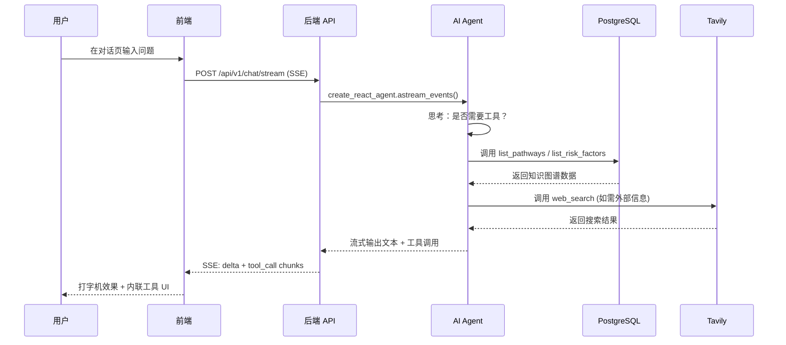

<h1 align="center">LifeTree · 人生树</h1>

<p align="center">
  <em>一款专注于中长期个人决策的智能信息系统：聚合公开与私域信息，结合知识图谱与因果推理，为重大人生选择提供动态决策沙盘。</em>
</p>

<p align="center">
  <a href="https://github.com/CaryK753/LifeTree/actions"></a>
  
  
  
  
  
  
  
  
  
</p>

<p align="center">
  <strong>语言 / Languages:</strong>
  <a href="README.zh-CN.md">简体中文</a> ·
  <a href="README.zh-TW.md">繁體中文</a> ·
  <a href="README.en.md">English</a> ·
  <a href="README.es.md">Español</a> ·
  <a href="README.de.md">Deutsch</a> ·
  <a href="README.fr.md">Français</a>
</p>

<p align="center">
  
</p>

---

## 目录

- [项目介绍](#项目介绍)
- [系统架构](#系统架构)
- [技术栈](#技术栈)
- [功能特性](#功能特性)
- [快速开始](#快速开始)
- [Docker 一键部署](#docker-一键部署)
- [本地开发](#本地开发)
- [配置说明](#配置说明)
- [插件系统](#插件系统)
- [License](#license)

---

## 项目介绍

**LifeTree（人生树）** 是一款专注于中长期个人决策的智能信息系统。它不是简单的待办清单或笔记工具，而是一个融合了知识图谱、因果推理、贝叶斯网络与蒙特卡洛模拟的动态决策沙盘。

### 解决什么问题？

面对人生的重大选择——移民路径、职业转型、教育投资、家庭规划——我们常常：

- **信息碎片化**：相关数据散落在浏览器书签、聊天记录、文档中，难以系统化
- **推理片面化**：只看到眼前利益，忽视长期风险与机会成本
- **决策静态化**：做出决定后不再根据新信息动态修正

LifeTree 通过以下方式解决这些问题：

1. **信息聚合**：自动抓取公开数据（RSS / 网页 / API），手动录入私域信息（文档 / 图片 / 笔记），统一结构化为知识图谱节点
2. **因果建模**：将目标→路径→要求→风险因素建模为有向图，用贝叶斯网络量化不确定性
3. **情景推演**：蒙特卡洛模拟不同选择路径下的成功概率、风险敞口与时间成本
4. **动态预警**：Celery 定时任务监控信息新鲜度（半衰期模型），自动触发风险重算与邮件预警
5. **智能助手**：基于 LangGraph 的 ReAct Agent，可调用 15+ 内置工具查询知识图谱、创建新节点、搜索网页、抓取页面内容

### 示例场景

本仓库内置 **加拿大联邦技术移民（FSW）** 示例数据，涵盖：

- 目标：通过 FSW 通道移民加拿大
- 路径：EE 入池 → ITA 邀请 → 文档提交 → 体检 → 登陆
- 要求：CLB 9 / 学历 ECA / 工作经验证明 / 资金证明
- 风险因素：年龄扣分、语言成绩波动、政策变化、配额竞争

---

## 系统架构


### 数据流



---

## 技术栈

| 层 | 技术 | 说明 |
|---|---|---|
| **前端** | Next.js 16 (App Router) | React 19, standalone output, PWA |
| | Vercel AI SDK | 流式对话组件 (Thread / Message / Composer) |
| | Tailwind CSS + Radix UI | 主题系统 (亮/暗/跟随系统) |
| | Cytoscape.js + React Flow | 知识图谱 + 情景树可视化 |
| | ECharts | 统计图表 |
| | SWR | 数据获取与缓存 |
| | i18n | 6 语言: 简中 / 繁中 / EN / ES / DE / FR |
| **后端** | FastAPI | REST + SSE + 流式 AI |
| | SQLAlchemy + Alembic | ORM + 迁移 |
| | Pydantic v2 | 数据校验 |
| | Instructor | LLM 结构化输出 |
| | LangGraph | ReAct Agent + 工具编排 |
| | Celery + Beat | 异步任务 + 定时调度 |
| **数据库** | PostgreSQL 16 + pgvector | 关系数据 + 向量检索 |
| | Neo4j 5 | 知识图谱 (APOC) |
| | Redis 7 | Celery broker + 缓存 |
| | MinIO | 对象存储 (文件上传) |
| **LLM** | OpenAI 兼容 / Ollama | 支持 OpenAI / DeepSeek / 智谱 / vLLM / 本地 Ollama |
| | Anthropic Claude | 原生协议 |
| | 阿里云百炼 DashScope | Chat / Vision / Embedding / Rerank |
| **部署** | Docker Compose | 一键启动全栈 |
| | GitHub Actions | CI/CD 多架构镜像构建 |
| | GHCR | 镜像 Registry |

---

## 功能特性

### 核心模块

- **目标罗盘**：仪表盘式目标管理，跟踪进度、截止日期、风险状态
- **知识图谱**：Cytoscape 力导向布局，节点 = 实体，边 = 关系，支持点击探索
- **智能助手**：流式对话，15+ 内置工具，按供应商分组选择当前对话模型，工具调用 UI 内联渲染
- **用户扩展**：每位用户可独立配置 MCP（HTTP / SSE / stdio）与 Skills（文本 / 压缩包 / 文件夹 / GitHub）
- **情景推演**：React Flow + dagre 树形布局，蒙特卡洛模拟，分支概率环 + 风险指示
- **信源管理**：可信度评级（高 / 中 / 低 / 用户标记），信息半衰期管理（指数衰减模型）
- **风险预警**：通知中心，严重度分级（紧急 / 警告 / 信息），SMTP 邮件推送
- **信息录入**：拖拽上传（PDF / Word / Excel / PPT / 图片），Mineru 解析，AI 结构化提取

### AI 内置工具

| 工具 | 类型 | 说明 |
|---|---|---|
| `list_pathways` | 查询 | 列出目标的所有路径 |
| `list_requirements` | 查询 | 列出路径的准入要求 |
| `list_risk_factors` | 查询 | 列出风险因素 |
| `list_recent_events` | 查询 | 列出最近事件 |
| `get_scenario_summary` | 查询 | 获取情景摘要 |
| `run_scenario_reasoning` | 推理 | 执行贝叶斯/蒙特卡洛推理 |
| `create_goal` / `create_pathway` / `create_requirement` / `create_risk_factor` | 写入 | 创建知识图谱节点 |
| `list_memories` / `remember` / `forget` | 记忆 | 用户长期记忆管理 |
| `web_search` | Web | Tavily 网络搜索 |
| `web_fetch` | Web | Tavily 网页内容抓取 |

### PWA 特性

- 离线缓存（App Shell + 静态资源 + API 响应）
- 流式对话绕过缓存（`/api/v1/chat/stream` 直连后端）
- 安装到桌面 / 移动主屏
- 主题色适配亮/暗模式
- 抽屉式侧边栏：在 PWA 模式或视口宽度 < 1024px 时，左侧栏默认隐藏，通过页面左上角的 `SidebarToggleButton` 滑入式唤起；通过内联脚本 + `html.pwa` / `html.drawer-mode` 类在水合前避免侧边栏闪烁
- iOS `navigator.standalone` 检测，覆盖 `display-mode` 媒体查询遗漏的场景
- 适配刘海屏 / Home Indicator 的安全区内边距

---

## 快速开始

### 前置条件

- Docker + Docker Compose
- 或者：Python 3.11+、Node.js 20+、pnpm/npm（仅本地开发时需要）

### 方式一：Docker 一键启动（推荐）

`docker-compose.yml` 默认使用 GHCR 上的预构建镜像（`ghcr.io/caryk753/lifetree-backend`、`ghcr.io/caryk753/lifetree-frontend`），一条命令即可拉起全栈：

```bash
# 1. 克隆仓库
git clone https://github.com/CaryK753/LifeTree.git
cd LifeTree

# 2. 配置环境变量
cp .env.example .env
# 编辑 .env，至少填写一个 LLM API Key

# 3. 一键启动全栈（基础设施 + 后端 + Worker + 前端）
docker compose up -d

# 4. 初始化数据库（首次运行）
docker compose exec backend python scripts/init_db.py

# 5. 灌入示例数据（可选）
docker compose exec backend python scripts/seed_fsw.py
```

> 想固定到某个版本？通过环境变量覆盖镜像 tag：
> ```bash
> BACKEND_IMAGE_TAG=0.1.0 FRONTEND_IMAGE_TAG=0.1.0 docker compose up -d
> ```

启动后访问：
- 前端：http://localhost:13000
- 后端 API：http://localhost:18000
- API 文档：http://localhost:18000/docs
- Flower（Celery 监控）：http://localhost:15555
- MinIO 控制台：http://localhost:19001
- Neo4j 浏览器：http://localhost:17474

### 方式二：本地构建镜像启动

如果你需要修改后端 / 前端代码或临时调试，传 `--build` 让 compose 用本地 Dockerfile 构建：

```bash
cp .env.example .env
# 编辑 .env，至少填写一个 LLM API Key
docker compose up -d --build
docker compose exec backend python scripts/init_db.py
```

### 方式三：本地开发

详见 [本地开发](#本地开发) 章节。

---

## Docker 一键部署

完整的 `docker-compose.yml` 包含以下服务：

| 服务 | 镜像 | 端口 | 说明 |
|---|---|---|---|
| `postgres` | `pgvector/pgvector:pg16` | 15432 | PG + pgvector 向量扩展 |
| `neo4j` | `neo4j:5.20` | 17687, 17474 | 知识图谱 + APOC |
| `redis` | `redis:7-alpine` | 16379 | Celery broker + 缓存 |
| `minio` | `minio/minio:latest` | 19000, 19001 | 对象存储 |
| `backend` | `ghcr.io/caryk753/lifetree-backend` | 18000 | FastAPI 应用 |
| `worker` | `ghcr.io/caryk753/lifetree-backend` | - | Celery Worker |
| `beat` | `ghcr.io/caryk753/lifetree-backend` | - | Celery Beat 调度器 |
| `flower` | `mher/flower:latest` | 15555 | Celery 监控 |
| `frontend` | `ghcr.io/caryk753/lifetree-frontend` | 13000 | Next.js standalone |

```bash
# 启动所有服务（默认拉取 GHCR 预构建镜像）
docker compose up -d

# 强制本地构建后启动
docker compose up -d --build

# 查看日志
docker compose logs -f backend frontend

# 停止
docker compose down

# 停止并清除数据卷
docker compose down -v
```

### 镜像 tag 控制

默认拉取 `latest`，可通过环境变量固定版本：

```bash
BACKEND_IMAGE_TAG=0.1.0 FRONTEND_IMAGE_TAG=0.1.0 docker compose up -d
```

如需手动拉取镜像（如离线环境预下载）：

```bash
docker pull ghcr.io/caryk753/lifetree-backend:latest
docker pull ghcr.io/caryk753/lifetree-frontend:latest
```

---

## 本地开发

### 1. 启动基础设施

```bash
cp .env.example .env
# 编辑 .env，填写 LLM_API_KEY 等

# 仅启动基础设施服务
docker compose up -d postgres neo4j redis minio
```

### 2. 启动后端

```bash
cd backend
python -m venv .venv && source .venv/bin/activate
pip install -e ".[dev]"

# 首次建表
python scripts/init_db.py

# 启动 API
uvicorn app.main:app --reload --port 18000

# 另开终端：启动 Celery Worker + Beat
celery -A app.workers.celery_app worker -l info
celery -A app.workers.celery_app beat -l info
```

### 3. 启动前端

```bash
cd frontend
npm install
npm run dev
```

### 4. 灌入示例数据

```bash
cd backend
python scripts/seed_fsw.py
```

打开 http://localhost:13000 即可看到目标罗盘仪表盘。

---

## 配置说明

### LLM 配置

管理员在管理页面（`/admin`）配置平台 LLM Provider；获授权的普通用户可在设置页面（`/settings`）配置私有服务：

1. **添加 Provider**：选择协议（OpenAI 兼容 / Ollama / Anthropic / 阿里云百炼），填写 baseURL 和 API Key
2. **添加模型**：填写模型 ID（如 `gpt-4o-mini`），勾选能力（chat / vision / embedding / rerank）
3. **分配角色**：为每个角色选择一个模型

支持的 Provider：
- **OpenAI 兼容**：OpenAI / DeepSeek / 智谱 / OneAPI / vLLM
- **Ollama**：本地 OpenAI 兼容端点，适合单用户桌面部署
- **Anthropic**：Claude 系列（chat / vision）
- **阿里云百炼**：通义千问 / gte-rerank / qwen3-rerank
  - Chat / Vision / Embedding 走 OpenAI 兼容协议
  - Rerank 自动路由到原生端点 `/api/v1/services/rerank/text-rerank/text-rerank`
  - Embedding 默认 1024 维

### Tavily 搜索配置

在设置页面填写 Tavily API Key，启用：
- 智能助手的 `web_search` 和 `web_fetch` 工具
- 信源抓取（RSS / 网页爬取）

### SMTP 邮件配置

在设置页面配置 SMTP，启用风险预警邮件推送。支持发送测试邮件验证配置（发送前先做权限校验）。配置项包括：

- SMTP 服务器地址、端口
- 用户名、密码
- 发件人邮箱、发件人名称
- 使用 TLS（STARTTLS，端口 587）/ 使用 SSL（端口 465）

### 认证与多用户模式

LifeTree 支持两种使用模式，由环境变量 `LIFETREE_USE_MODE` 控制（默认 `single`），并持久化到数据库 `app_config.use_mode`，可通过 `PUT /settings/use-mode` 切换：

- **单用户模式（`single`，默认）**：仍需注册和登录。首个账号自动成为管理员；首个账号创建后，服务端自动禁止新增注册。它等价于开启“禁止注册”的单账号实例。
- **多用户模式（`multi`）**：必须使用 PostgreSQL、Neo4j、Redis、MinIO、Celery 等全量服务部署。首个注册账号自动成为管理员；管理员也可通过 `LIFETREE_ADMIN_USER_IDS` 补充提权。

本地 SQLite 存储只规划用于 `single` 模式，不能用于 `multi`。当前版本已经完成模式认证边界和用户数据模型，但 SQLite 仓储适配器尚未完成；现阶段两种模式仍使用 PostgreSQL。这样可以避免在事务、向量检索和知识图谱同步尚未抽象完成时制造“看似本地、实际仍依赖远端组件”的混合模式。

支持的登录方式：

- 邮箱 + 密码（JWT access/refresh token），可选邮件验证码注册流程（`send-code` / `register-with-code`）
- OAuth 登录：Google / GitHub / Microsoft，端点 `/auth/oauth/{id}/start` 与 `/auth/oauth/{id}/callback`

数据隔离：events / sources / plugins / 私有模型 / 默认角色 / MCP / Skills / chat 对话均按 `user_id` 隔离。前端聊天数据按 `lifetree.chat.conversations.v2.<userId>` 分区存储到 localStorage。

### 管理员平台配置

多用户模式下，管理员可见独立的平台配置页面，集中管理：

- 模型与服务 API 密钥（OpenAI / Anthropic / 阿里云百炼 / Tavily / SMTP 等）
- 用户管理（`GET/PATCH/DELETE /admin/users`）与平台统计（`GET /admin/stats`）
- “允许普通用户自己配置服务”开关；关闭时普通用户只能使用管理员提供的模型

非管理员用户只能看到管理员模型的公开名称、能力与“管理员提供”标签，不能查看管理员 Base URL 或 API Key。用户自己的 LLM、Tavily、MinerU 和四类默认模型独立存储。

### MCP 与 Skills

- MCP 支持 HTTP、SSE 与 stdio。stdio 使用“命令 + 参数数组”执行，不经过 shell，并限制超时与输出大小；multi 模式阻止访问私有网段地址。
- Skills 支持直接粘贴文本、上传 ZIP/TAR、选择文件夹、填写 GitHub HTTPS 地址浅克隆。导入过程限制 2 MiB，过滤路径穿越和符号链接。
- 启用的 Skills 会作为用户提供的上下文注入智能助手，不能覆盖系统安全规则；启用的 MCP 会按用途描述成为可自动调用工具。

### 环境变量

完整变量见 [`.env.example`](.env.example)。

---

## 插件系统

LifeTree 的插件系统允许通过自定义 Python 脚本接入任意数据源（RSS、网页爬虫、API 等），将外部信息自动结构化为知识图谱中的事件、指标、断言和关系。支持内置插件和用户上传插件两种来源。

### 插件契约

每个插件是一个 Python 文件，需实现以下静态方法：

```python
from app.services.plugins import Plugin, PluginManifest, PluginParam

class Plugin:
    @staticmethod
    def manifest() -> PluginManifest:
        """返回插件元数据：名称、描述、参数定义"""

    @staticmethod
    def fetch(params: dict) -> str | bytes:
        """抓取原始数据，返回文本或二进制"""

    @staticmethod
    def transform(raw, llm) -> str:  # 可选
        """可选：用 LLM 预处理原始数据后再交给结构化服务"""
```

- **内置插件**：放在 `backend/plugins/` 目录下，随镜像发布。参考示例：[`sample_rss_feed.py`](backend/plugins/sample_rss_feed.py)、[`sample_web_scraper.py`](backend/plugins/sample_web_scraper.py)。
- **用户上传插件**：通过 `/plugins/upload` 接口上传，存储在 `backend/plugins/user_uploaded/{plugin_id}.py`，元数据记录在 `user_plugins` 表中。Docker Compose 已为 `/app/plugins/user_uploaded/` 配置 named volume，重启容器后自定义插件不会丢失。

### 插件上传

插件页面支持直接上传 `.py` 文件，无需重新构建镜像即可添加自定义插件。上传流程经过多重安全校验：

1. **AST 语法检查**：拒绝无法解析的源码
2. **导入黑名单**：禁止 `os` / `sys` / `subprocess` / `shutil` / `ctypes` / `socket` / `multiprocessing` / `importlib` / `pickle` / `marshal` / `pty` / `posix` / `nt` / `resource` 等危险模块
3. **危险内建调用检查**：拦截 `eval` / `exec` / `__import__` 等调用
4. **契约校验**：必须暴露有效的 `Plugin` 类与 `manifest()` 方法
5. **临时模块加载验证**：在临时路径中导入模块，确保 `manifest()` 可正常调用

接口列表：

| 方法 | 路径 | 说明 |
|---|---|---|
| `POST` | `/plugins/upload` | 上传用户插件（支持 `overwrite=true` 覆盖） |
| `DELETE` | `/plugins/{id}` | 软删除用户插件（内置插件不可删除） |
| `PATCH` | `/plugins/{id}/enabled` | 启用 / 禁用用户插件 |
| `POST` | `/plugins/{id}/run` | 抓取 + 转换 + 入库 |

### 贡献插件

欢迎通过 Pull Request 提交自定义插件：

1. Fork 仓库并在 `backend/plugins/` 下创建插件文件（文件名须为小写蛇形，如 `my_feed.py`）
2. 实现插件契约，确保 `manifest()` 和 `fetch()` 正常工作
3. 在 PR 描述中说明插件用途、参数说明和测试方式
4. 通过审核后合并到主线版本，随正式版本发布

---

## License

GNU Affero General Public License v3.0 — see [LICENSE](LICENSE) file for details.

---

<p align="center">
  <em>LifeTree · 让每一个重大决定都有据可依</em>
</p>
