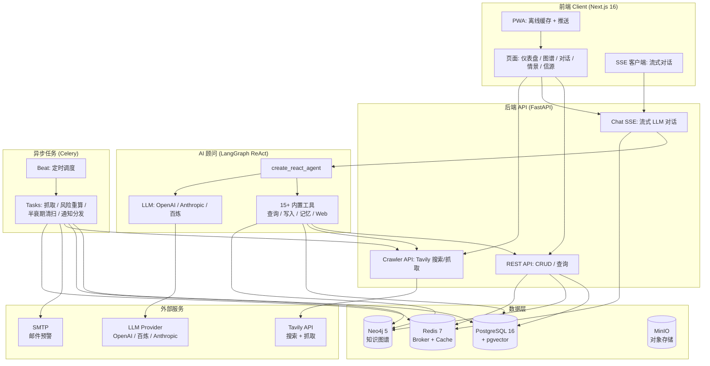
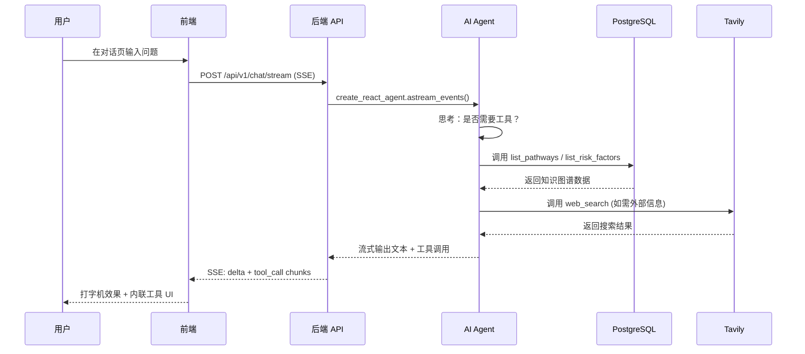

<p align="center">
  
</p>

<h1 align="center">LifeTree · 人生树</h1>

<p align="center">
  <em>一款专注于中长期个人决策的智能信息系统：聚合公开与私域信息，结合知识图谱与因果推理，为重大人生选择提供动态决策沙盘。</em>
</p>

<p align="center">
  <a href="https://github.com/CaryK753/LifeTree/actions"></a>
  
  
  
  
  
  
  
  
  
</p>

<p align="center">
  <a href="#快速开始">中文</a> ·
  <a href="#quick-start">English</a> ·
  <a href="#démarrage-rapide">Français</a> ·
  <a href="#inicio-rápido">Español</a> ·
  <a href="#schnellstart">Deutsch</a>
</p>

---

## 目录 / Table of Contents

- [项目介绍](#项目介绍)
- [系统架构](#系统架构)
- [技术栈](#技术栈)
- [功能特性](#功能特性)
- [快速开始](#快速开始)
- [Docker 一键部署](#docker-一键部署)
- [本地开发](#本地开发)
- [配置说明](#配置说明)
- [Quick Start](#quick-start)
- [Démarrage Rapide](#démarrage-rapide)
- [Inicio Rápido](#inicio-rápido)
- [Schnellstart](#schnellstart)
- [License](#license)

---

## 项目介绍

**LifeTree（人生树）** 是一款专注于中长期个人决策的智能信息系统。它不是简单的待办清单或笔记工具，而是一个融合了知识图谱、因果推理、贝叶斯网络与蒙特卡洛模拟的动态决策沙盘。

### 解决什么问题？

面对人生的重大选择——移民路径、职业转型、教育投资、家庭规划——我们常常：

- **信息碎片化**：相关数据散落在浏览器书签、聊天记录、文档中，难以系统化
- **推理片面化**：只看到眼前利益，忽视长期风险与机会成本
- **决策静态化**：做出决定后不再根据新信息动态修正

LifeTree 通过以下方式解决这些问题：

1. **信息聚合**：自动抓取公开数据（RSS / 网页 / API），手动录入私域信息（文档 / 图片 / 笔记），统一结构化为知识图谱节点
2. **因果建模**：将目标→路径→要求→风险因素建模为有向图，用贝叶斯网络量化不确定性
3. **情景推演**：蒙特卡洛模拟不同选择路径下的成功概率、风险敞口与时间成本
4. **动态预警**：Celery 定时任务监控信息新鲜度（半衰期模型），自动触发风险重算与邮件预警
5. **AI 顾问**：基于 LangGraph 的 ReAct Agent，可调用 15+ 内置工具查询知识图谱、创建新节点、搜索网页、抓取页面内容

### 示例场景

本仓库内置 **加拿大联邦技术移民（FSW）** 示例数据，涵盖：

- 目标：通过 FSW 通道移民加拿大
- 路径：EE 入池 → ITA 邀请 → 文档提交 → 体检 → 登陆
- 要求：CLB 9 / 学历 ECA / 工作经验证明 / 资金证明
- 风险因素：年龄扣分、语言成绩波动、政策变化、配额竞争

---

## 系统架构



### 数据流



---

## 技术栈

| 层 | 技术 | 说明 |
|---|---|---|
| **前端** | Next.js 16 (App Router) | React 19, standalone output, PWA |
| | Vercel AI SDK | 流式对话组件 (Thread / Message / Composer) |
| | Tailwind CSS + Radix UI | 主题系统 (亮/暗/跟随系统) |
| | Cytoscape.js + React Flow | 知识图谱 + 情景树可视化 |
| | ECharts | 统计图表 |
| | SWR | 数据获取与缓存 |
| | i18n | 6 语言: 简中 / 繁中 / EN / ES / DE / FR |
| **后端** | FastAPI | REST + SSE + 流式 AI |
| | SQLAlchemy + Alembic | ORM + 迁移 |
| | Pydantic v2 | 数据校验 |
| | Instructor | LLM 结构化输出 |
| | LangGraph | ReAct Agent + 工具编排 |
| | Celery + Beat | 异步任务 + 定时调度 |
| **数据库** | PostgreSQL 16 + pgvector | 关系数据 + 向量检索 |
| | Neo4j 5 | 知识图谱 (APOC) |
| | Redis 7 | Celery broker + 缓存 |
| | MinIO | 对象存储 (文件上传) |
| **LLM** | OpenAI 兼容 | 支持 OpenAI / DeepSeek / 智谱 / vLLM |
| | Anthropic Claude | 原生协议 |
| | 阿里云百炼 DashScope | Chat / Vision / Embedding / Rerank |
| **部署** | Docker Compose | 一键启动全栈 |
| | GitHub Actions | CI/CD 多架构镜像构建 |
| | GHCR | 镜像 Registry |

---

## 功能特性

### 核心模块

- **目标罗盘**：仪表盘式目标管理，跟踪进度、截止日期、风险状态
- **知识图谱**：Cytoscape 力导向布局，节点 = 实体，边 = 关系，支持点击探索
- **AI 顾问**：流式对话，15+ 内置工具（查询 / 写入 / 记忆 / Web 搜索 / 网页抓取），工具调用 UI 内联渲染
- **情景推演**：React Flow + dagre 树形布局，蒙特卡洛模拟，分支概率环 + 风险指示
- **信源管理**：可信度评级（高 / 中 / 低 / 用户标记），信息半衰期管理（指数衰减模型）
- **风险预警**：通知中心，严重度分级（紧急 / 警告 / 信息），SMTP 邮件推送
- **信息录入**：拖拽上传（PDF / Word / Excel / PPT / 图片），Mineru 解析，AI 结构化提取

### AI 内置工具

| 工具 | 类型 | 说明 |
|---|---|---|
| `list_pathways` | 查询 | 列出目标的所有路径 |
| `list_requirements` | 查询 | 列出路径的准入要求 |
| `list_risk_factors` | 查询 | 列出风险因素 |
| `list_recent_events` | 查询 | 列出最近事件 |
| `get_scenario_summary` | 查询 | 获取情景摘要 |
| `run_scenario_reasoning` | 推理 | 执行贝叶斯/蒙特卡洛推理 |
| `create_goal` / `create_pathway` / `create_requirement` / `create_risk_factor` | 写入 | 创建知识图谱节点 |
| `list_memories` / `remember` / `forget` | 记忆 | 用户长期记忆管理 |
| `web_search` | Web | Tavily 网络搜索 |
| `web_fetch` | Web | Tavily 网页内容抓取 |

### PWA 特性

- 离线缓存（App Shell + 静态资源 + API 响应）
- 流式对话绕过缓存（`/api/v1/chat/stream` 直连后端）
- 安装到桌面 / 移动主屏
- 主题色适配亮/暗模式

---

## 快速开始

### 前置条件

- Docker + Docker Compose
- 或者：Python 3.11+、Node.js 20+、pnpm/npm

### 方式一：Docker 一键启动（推荐）

```bash
# 1. 克隆仓库
git clone https://github.com/CaryK753/LifeTree.git
cd LifeTree

# 2. 配置环境变量
cp .env.example .env
# 编辑 .env，至少填写一个 LLM API Key

# 3. 一键启动全栈（基础设施 + 后端 + Worker + 前端）
docker compose up -d --build

# 4. 初始化数据库（首次运行）
docker compose exec backend python scripts/init_db.py

# 5. 灌入示例数据（可选）
docker compose exec backend python scripts/seed_fsw.py
```

启动后访问：
- 前端：http://localhost:3000
- 后端 API：http://localhost:8000
- API 文档：http://localhost:8000/docs
- Flower（Celery 监控）：http://localhost:5555
- MinIO 控制台：http://localhost:9001
- Neo4j 浏览器：http://localhost:7474

### 方式二：本地开发

详见 [本地开发](#本地开发) 章节。

---

## Docker 一键部署

完整的 `docker-compose.yml` 包含以下服务：

| 服务 | 镜像 | 端口 | 说明 |
|---|---|---|---|
| `postgres` | `pgvector/pgvector:pg16` | 5432 | PG + pgvector 向量扩展 |
| `neo4j` | `neo4j:5.20` | 7687, 7474 | 知识图谱 + APOC |
| `redis` | `redis:7-alpine` | 6379 | Celery broker + 缓存 |
| `minio` | `minio/minio:latest` | 9000, 9001 | 对象存储 |
| `backend` | 本地构建 | 8000 | FastAPI 应用 |
| `worker` | 本地构建 | - | Celery Worker |
| `beat` | 本地构建 | - | Celery Beat 调度器 |
| `flower` | `mher/flower:latest` | 5555 | Celery 监控 |
| `frontend` | 本地构建 | 3000 | Next.js standalone |

```bash
# 启动所有服务
docker compose up -d --build

# 查看日志
docker compose logs -f backend frontend

# 停止
docker compose down

# 停止并清除数据卷
docker compose down -v
```

### 使用预构建镜像（GHCR）

```bash
# 拉取最新镜像
docker pull ghcr.io/caryk753/lifetree-backend:latest
docker pull ghcr.io/caryk753/lifetree-frontend:latest

# 在 docker-compose.yml 中替换 build 为 image
# backend:
#   image: ghcr.io/caryk753/lifetree-backend:latest
# frontend:
#   image: ghcr.io/caryk753/lifetree-frontend:latest
```

---

## 本地开发

### 1. 启动基础设施

```bash
cp .env.example .env
# 编辑 .env，填写 LLM_API_KEY 等

# 仅启动基础设施服务
docker compose up -d postgres neo4j redis minio
```

### 2. 启动后端

```bash
cd backend
python -m venv .venv && source .venv/bin/activate
pip install -e ".[dev]"

# 首次建表
python scripts/init_db.py

# 启动 API
uvicorn app.main:app --reload --port 8000

# 另开终端：启动 Celery Worker + Beat
celery -A app.workers.celery_app worker -l info
celery -A app.workers.celery_app beat -l info
```

### 3. 启动前端

```bash
cd frontend
npm install
npm run dev
```

### 4. 灌入示例数据

```bash
cd backend
python scripts/seed_fsw.py
```

打开 http://localhost:3000 即可看到目标罗盘仪表盘。

---

## 配置说明

### LLM 配置

在设置页面（`/settings`）配置 LLM Provider：

1. **添加 Provider**：选择协议（OpenAI 兼容 / Anthropic / 阿里云百炼），填写 baseURL 和 API Key
2. **添加模型**：填写模型 ID（如 `gpt-4o-mini`），勾选能力（chat / vision / embedding / rerank）
3. **分配角色**：为每个角色选择一个模型

支持的 Provider：
- **OpenAI 兼容**：OpenAI / DeepSeek / 智谱 / OneAPI / vLLM
- **Anthropic**：Claude 系列（chat / vision）
- **阿里云百炼**：通义千问 / gte-rerank / qwen3-rerank
  - Chat / Vision / Embedding 走 OpenAI 兼容协议
  - Rerank 自动路由到原生端点 `/api/v1/services/rerank/text-rerank/text-rerank`
  - Embedding 默认 1024 维

### Tavily 搜索配置

在设置页面填写 Tavily API Key，启用：
- AI 顾问的 `web_search` 和 `web_fetch` 工具
- 信源抓取（RSS / 网页爬取）

### SMTP 邮件配置

在设置页面配置 SMTP，启用风险预警邮件推送。支持发送测试邮件验证配置。

### 环境变量

完整变量见 [`.env.example`](.env.example)。

---

## Quick Start

**LifeTree** is an intelligent information system for medium-to-long-term personal decision-making. It aggregates public and private data, builds a knowledge graph, and uses Bayesian networks + Monte Carlo simulation to provide a dynamic decision sandbox for major life choices.

### Docker Deployment (Recommended)

```bash
git clone https://github.com/CaryK753/LifeTree.git
cd LifeTree
cp .env.example .env  # Edit: fill in at least one LLM API key
docker compose up -d --build
docker compose exec backend python scripts/init_db.py
```

- Frontend: http://localhost:3000
- API docs: http://localhost:8000/docs
- Flower (Celery monitor): http://localhost:5555

### Local Development

```bash
# Infrastructure
docker compose up -d postgres neo4j redis minio

# Backend
cd backend && python -m venv .venv && source .venv/bin/activate
pip install -e ".[dev]"
python scripts/init_db.py
uvicorn app.main:app --reload --port 8000
# In another terminal:
celery -A app.workers.celery_app worker -l info
celery -A app.workers.celery_app beat -l info

# Frontend
cd frontend && npm install && npm run dev
```

**Built-in example**: Canadian Federal Skilled Worker (FSW) immigration pathway with sample data.

---

## Démarrage Rapide

**LifeTree** est un système d'information intelligent pour la prise de décision personnelle à moyen et long terme. Il agrège des données publiques et privées, construit un graphe de connaissances, et utilise des réseaux bayésiens + simulation de Monte Carlo pour fournir un bac à sable de décision dynamique.

### Déploiement Docker (Recommandé)

```bash
git clone https://github.com/CaryK753/LifeTree.git
cd LifeTree
cp .env.example .env  # Modifier : renseigner au moins une clé API LLM
docker compose up -d --build
docker compose exec backend python scripts/init_db.py
```

- Frontend : http://localhost:3000
- Documentation API : http://localhost:8000/docs

### Développement Local

```bash
# Infrastructure
docker compose up -d postgres neo4j redis minio

# Backend
cd backend && python -m venv .venv && source .venv/bin/activate
pip install -e ".[dev]"
python scripts/init_db.py
uvicorn app.main:app --reload --port 8000
# Dans un autre terminal :
celery -A app.workers.celery_app worker -l info
celery -A app.workers.celery_app beat -l info

# Frontend
cd frontend && npm install && npm run dev
```

---

## Inicio Rápido

**LifeTree** es un sistema de información inteligente para la toma de decisiones personales a medio y largo plazo. Agrega datos públicos y privados, construye un grafo de conocimiento y utiliza redes bayesianas + simulación de Monte Carlo para proporcionar un sandbox de decisión dinámica.

### Despliegue con Docker (Recomendado)

```bash
git clone https://github.com/CaryK753/LifeTree.git
cd LifeTree
cp .env.example .env  # Editar: rellenar al menos una clave API de LLM
docker compose up -d --build
docker compose exec backend python scripts/init_db.py
```

- Frontend: http://localhost:3000
- Documentación API: http://localhost:8000/docs

### Desarrollo Local

```bash
# Infraestructura
docker compose up -d postgres neo4j redis minio

# Backend
cd backend && python -m venv .venv && source .venv/bin/activate
pip install -e ".[dev]"
python scripts/init_db.py
uvicorn app.main:app --reload --port 8000
# En otra terminal:
celery -A app.workers.celery_app worker -l info
celery -A app.workers.celery_app beat -l info

# Frontend
cd frontend && npm install && npm run dev
```

---

## Schnellstart

**LifeTree** ist ein intelligentes Informationssystem für mittel- bis langfristige persönliche Entscheidungsfindung. Es aggregiert öffentliche und private Daten, baut einen Wissensgraphen auf und nutzt Bayes'sche Netzwerke + Monte-Carlo-Simulation für ein dynamisches Entscheidungs-Sandbox.

### Docker-Bereitstellung (Empfohlen)

```bash
git clone https://github.com/CaryK753/LifeTree.git
cd LifeTree
cp .env.example .env  # Bearbeiten: mindestens einen LLM-API-Key eintragen
docker compose up -d --build
docker compose exec backend python scripts/init_db.py
```

- Frontend: http://localhost:3000
- API-Dokumentation: http://localhost:8000/docs

### Lokale Entwicklung

```bash
# Infrastruktur
docker compose up -d postgres neo4j redis minio

# Backend
cd backend && python -m venv .venv && source .venv/bin/activate
pip install -e ".[dev]"
python scripts/init_db.py
uvicorn app.main:app --reload --port 8000
# In einem anderen Terminal:
celery -A app.workers.celery_app worker -l info
celery -A app.workers.celery_app beat -l info

# Frontend
cd frontend && npm install && npm run dev
```

---

## License

MIT License — see [LICENSE](LICENSE) file for details.

---

<p align="center">
  <em>LifeTree · 让每一个重大决定都有据可依</em>
</p>
