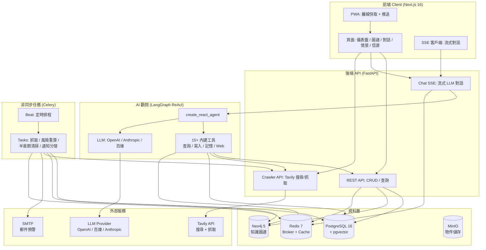
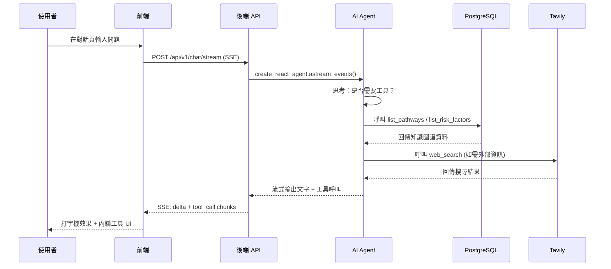

<h1 align="center">LifeTree · 人生樹</h1>

<p align="center">
  <em>一款專注於中長期個人決策的智慧資訊系統：聚合公開與私域資訊，結合知識圖譜與因果推理，為重大人生選擇提供動態決策沙盤。</em>
</p>

<p align="center">
  <a href="https://github.com/CaryK753/LifeTree/actions"></a>
  
  
  
  
  
  
  
  
  
</p>

<p align="center">
  <strong>語言 / Languages:</strong>
  <a href="README.zh-CN.md">简体中文</a> ·
  <a href="README.zh-TW.md">繁體中文</a> ·
  <a href="README.en.md">English</a> ·
  <a href="README.es.md">Español</a> ·
  <a href="README.de.md">Deutsch</a> ·
  <a href="README.fr.md">Français</a>
</p>

<p align="center">
  
</p>

---

## 目錄

- [專案介紹](#專案介紹)
- [系統架構](#系統架構)
- [技術棧](#技術棧)
- [功能特性](#功能特性)
- [快速開始](#快速開始)
- [Docker 一鍵部署](#docker-一鍵部署)
- [本地開發](#本地開發)
- [配置說明](#配置說明)
- [插件系統](#插件系統)
- [License](#license)

---

## 專案介紹

**LifeTree（人生樹）** 是一款專注於中長期個人決策的智慧資訊系統。它不是簡單的待辦清單或筆記工具，而是一個融合了知識圖譜、因果推理、貝氏網路與蒙特卡洛模擬的動態決策沙盤。

### 解決什麼問題？

面對人生的重大選擇——移民路徑、職業轉型、教育投資、家庭規劃——我們常常：

- **資訊碎片化**：相關資料散落在瀏覽器書籤、聊天記錄、文件中，難以系統化
- **推理片面化**：只看到眼前利益，忽視長期風險與機會成本
- **決策靜態化**：做出決定後不再根據新資訊動態修正

LifeTree 透過以下方式解決這些問題：

1. **資訊聚合**：自動抓取公開資料（RSS / 網頁 / API），手動錄入私域資訊（文件 / 圖片 / 筆記），統一結構化為知識圖譜節點
2. **因果建模**：將目標→路徑→要求→風險因素建模為有向圖，用貝氏網路量化不確定性
3. **情景推演**：蒙特卡洛模擬不同選擇路徑下的成功機率、風險敞口與時間成本
4. **動態預警**：Celery 定時任務監控資訊新鮮度（半衰期模型），自動觸發風險重算與郵件預警
5. **AI 顧問**：基於 LangGraph 的 ReAct Agent，可呼叫 15+ 內建工具查詢知識圖譜、建立新節點、搜尋網頁、抓取頁面內容

### 範例場景

本倉庫內建 **加拿大聯邦技術移民（FSW）** 範例資料，涵蓋：

- 目標：透過 FSW 通道移民加拿大
- 路徑：EE 入池 → ITA 邀請 → 文件提交 → 體檢 → 登陸
- 要求：CLB 9 / 學歷 ECA / 工作經驗證明 / 資金證明
- 風險因素：年齡扣分、語言成績波動、政策變化、配額競爭

---

## 系統架構



### 資料流



---

## 技術棧

| 層 | 技術 | 說明 |
|---|---|---|
| **前端** | Next.js 16 (App Router) | React 19, standalone output, PWA |
| | Vercel AI SDK | 流式對話元件 (Thread / Message / Composer) |
| | Tailwind CSS + Radix UI | 主題系統 (亮/暗/跟隨系統) |
| | Cytoscape.js + React Flow | 知識圖譜 + 情景樹視覺化 |
| | ECharts | 統計圖表 |
| | SWR | 資料獲取與快取 |
| | i18n | 6 語言: 簡中 / 繁中 / EN / ES / DE / FR |
| **後端** | FastAPI | REST + SSE + 流式 AI |
| | SQLAlchemy + Alembic | ORM + 遷移 |
| | Pydantic v2 | 資料校驗 |
| | Instructor | LLM 結構化輸出 |
| | LangGraph | ReAct Agent + 工具編排 |
| | Celery + Beat | 非同步任務 + 定時排程 |
| **資料庫** | PostgreSQL 16 + pgvector | 關聯資料 + 向量檢索 |
| | Neo4j 5 | 知識圖譜 (APOC) |
| | Redis 7 | Celery broker + 快取 |
| | MinIO | 物件儲存 (檔案上傳) |
| **LLM** | OpenAI 相容 | 支援 OpenAI / DeepSeek / 智譜 / vLLM |
| | Anthropic Claude | 原生協議 |
| | 阿里雲百煉 DashScope | Chat / Vision / Embedding / Rerank |
| **部署** | Docker Compose | 一鍵啟動全棧 |
| | GitHub Actions | CI/CD 多架構映像建置 |
| | GHCR | 映像 Registry |

---

## 功能特性

### 核心模組

- **目標羅盤**：儀表盤式目標管理，追蹤進度、截止日期、風險狀態
- **知識圖譜**：Cytoscape 力導向布局，節點 = 實體，邊 = 關係，支援點擊探索
- **AI 顧問**：流式對話，15+ 內建工具（查詢 / 寫入 / 記憶 / Web 搜尋 / 網頁抓取），工具呼叫 UI 內聯渲染
- **情景推演**：React Flow + dagre 樹形布局，蒙特卡洛模擬，分支機率環 + 風險指示
- **信源管理**：可信度評級（高 / 中 / 低 / 使用者標記），資訊半衰期管理（指數衰減模型）
- **風險預警**：通知中心，嚴重度分級（緊急 / 警告 / 資訊），SMTP 郵件推送
- **資訊錄入**：拖曳上傳（PDF / Word / Excel / PPT / 圖片），Mineru 解析，AI 結構化提取

### AI 內建工具

| 工具 | 類型 | 說明 |
|---|---|---|
| `list_pathways` | 查詢 | 列出目標的所有路徑 |
| `list_requirements` | 查詢 | 列出路徑的準入要求 |
| `list_risk_factors` | 查詢 | 列出風險因素 |
| `list_recent_events` | 查詢 | 列出最近事件 |
| `get_scenario_summary` | 查詢 | 取得情景摘要 |
| `run_scenario_reasoning` | 推理 | 執行貝氏/蒙特卡洛推理 |
| `create_goal` / `create_pathway` / `create_requirement` / `create_risk_factor` | 寫入 | 建立知識圖譜節點 |
| `list_memories` / `remember` / `forget` | 記憶 | 使用者長期記憶管理 |
| `web_search` | Web | Tavily 網路搜尋 |
| `web_fetch` | Web | Tavily 網頁內容抓取 |

### PWA 特性

- 離線快取（App Shell + 靜態資源 + API 回應）
- 流式對話繞過快取（`/api/v1/chat/stream` 直連後端）
- 安裝到桌面 / 行動主畫面
- 主題色適配亮/暗模式
- 抽屜式側邊欄：在 PWA 模式或視窗寬度 < 1024px 時，左側欄預設隱藏，透過頁面左上角的 `SidebarToggleButton` 滑入式喚起；透過內嵌指令稿 + `html.pwa` / `html.drawer-mode` class 在 hydration 前避免側邊欄閃爍
- iOS `navigator.standalone` 偵測，覆蓋 `display-mode` media query 遺漏的情境
- 適配瀏海 / Home Indicator 的安全區域內邊距

---

## 快速開始

### 前置條件

- Docker + Docker Compose
- 或者：Python 3.11+、Node.js 20+、pnpm/npm（僅本地開發時需要）

### 方式一：Docker 一鍵啟動（推薦）

`docker-compose.yml` 預設使用 GHCR 上的預建置映像（`ghcr.io/caryk753/lifetree-backend`、`ghcr.io/caryk753/lifetree-frontend`），一條命令即可拉起全棧：

```bash
# 1. 複製倉庫
git clone https://github.com/CaryK753/LifeTree.git
cd LifeTree

# 2. 配置環境變數
cp .env.example .env
# 編輯 .env，至少填寫一個 LLM API Key

# 3. 一鍵啟動全棧（基礎設施 + 後端 + Worker + 前端）
docker compose up -d

# 4. 初始化資料庫（首次執行）
docker compose exec backend python scripts/init_db.py

# 5. 灌入範例資料（可選）
docker compose exec backend python scripts/seed_fsw.py
```

> 想固定到某個版本？透過環境變數覆蓋映像 tag：
> ```bash
> BACKEND_IMAGE_TAG=0.1.0 FRONTEND_IMAGE_TAG=0.1.0 docker compose up -d
> ```

啟動後造訪：
- 前端：http://localhost:13000
- 後端 API：http://localhost:18000
- API 文件：http://localhost:18000/docs
- Flower（Celery 監控）：http://localhost:15555
- MinIO 控制台：http://localhost:19001
- Neo4j 瀏覽器：http://localhost:17474

### 方式二：本地建置映像啟動

如果你需要修改後端 / 前端程式碼或臨時除錯，傳 `--build` 讓 compose 用本地 Dockerfile 建置：

```bash
cp .env.example .env
# 編輯 .env，至少填寫一個 LLM API Key
docker compose up -d --build
docker compose exec backend python scripts/init_db.py
```

### 方式三：本地開發

詳見 [本地開發](#本地開發) 章節。

---

## Docker 一鍵部署

完整的 `docker-compose.yml` 包含以下服務：

| 服務 | 映像 | 連接埠 | 說明 |
|---|---|---|---|
| `postgres` | `pgvector/pgvector:pg16` | 15432 | PG + pgvector 向量擴展 |
| `neo4j` | `neo4j:5.20` | 17687, 17474 | 知識圖譜 + APOC |
| `redis` | `redis:7-alpine` | 16379 | Celery broker + 快取 |
| `minio` | `minio/minio:latest` | 19000, 19001 | 物件儲存 |
| `backend` | `ghcr.io/caryk753/lifetree-backend` | 18000 | FastAPI 應用 |
| `worker` | `ghcr.io/caryk753/lifetree-backend` | - | Celery Worker |
| `beat` | `ghcr.io/caryk753/lifetree-backend` | - | Celery Beat 排程器 |
| `flower` | `mher/flower:latest` | 15555 | Celery 監控 |
| `frontend` | `ghcr.io/caryk753/lifetree-frontend` | 13000 | Next.js standalone |

```bash
# 啟動所有服務（預設拉取 GHCR 預建置映像）
docker compose up -d

# 強制本地建置後啟動
docker compose up -d --build

# 檢視日誌
docker compose logs -f backend frontend

# 停止
docker compose down

# 停止並清除資料卷
docker compose down -v
```

### 映像 Tag 控制

預設拉取 `latest`，可透過環境變數固定版本：

```bash
BACKEND_IMAGE_TAG=0.1.0 FRONTEND_IMAGE_TAG=0.1.0 docker compose up -d
```

如需手動拉取映像（如離線環境預下載）：

```bash
docker pull ghcr.io/caryk753/lifetree-backend:latest
docker pull ghcr.io/caryk753/lifetree-frontend:latest
```

---

## 本地開發

### 1. 啟動基礎設施

```bash
cp .env.example .env
# 編輯 .env，填寫 LLM_API_KEY 等

# 僅啟動基礎設施服務
docker compose up -d postgres neo4j redis minio
```

### 2. 啟動後端

```bash
cd backend
python -m venv .venv && source .venv/bin/activate
pip install -e ".[dev]"

# 首次建表
python scripts/init_db.py

# 啟動 API
uvicorn app.main:app --reload --port 18000

# 另開終端：啟動 Celery Worker + Beat
celery -A app.workers.celery_app worker -l info
celery -A app.workers.celery_app beat -l info
```

### 3. 啟動前端

```bash
cd frontend
npm install
npm run dev
```

### 4. 灌入範例資料

```bash
cd backend
python scripts/seed_fsw.py
```

打開 http://localhost:13000 即可看到目標羅盤儀表盤。

---

## 配置說明

### LLM 配置

在設定頁面（`/settings`）配置 LLM Provider：

1. **新增 Provider**：選擇協議（OpenAI 相容 / Anthropic / 阿里雲百煉），填寫 baseURL 和 API Key
2. **新增模型**：填寫模型 ID（如 `gpt-4o-mini`），勾選能力（chat / vision / embedding / rerank）
3. **分配角色**：為每個角色選擇一個模型

支援的 Provider：
- **OpenAI 相容**：OpenAI / DeepSeek / 智譜 / OneAPI / vLLM
- **Anthropic**：Claude 系列（chat / vision）
- **阿里雲百煉**：通義千問 / gte-rerank / qwen3-rerank
  - Chat / Vision / Embedding 走 OpenAI 相容協議
  - Rerank 自動路由到原生端點 `/api/v1/services/rerank/text-rerank/text-rerank`
  - Embedding 預設 1024 維

### Tavily 搜尋配置

在設定頁面填寫 Tavily API Key，啟用：
- AI 顧問的 `web_search` 和 `web_fetch` 工具
- 信源抓取（RSS / 網頁爬取）

### SMTP 郵件配置

在設定頁面配置 SMTP，啟用風險預警郵件推送。支援發送測試郵件驗證配置（發送前先做權限校驗）。配置項包括：

- SMTP 伺服器位址、連接埠
- 帳號、密碼
- 寄件人信箱、寄件人名稱
- 使用 TLS（STARTTLS，連接埠 587）/ 使用 SSL（連接埠 465）

### 認證與多使用者模式

LifeTree 支援兩種使用模式，由環境變數 `LIFETREE_USE_MODE` 控制（預設 `single`），並持久化到資料庫 `app_config.use_mode`，可透過 `PUT /settings/use-mode` 切換：

- **單使用者模式（`single`，預設）**：無需登入即可使用，後端透過 default-user 兜底服務資料。使用者若希望擁有個人資料範圍，仍可透過使用者選單手動登入。AuthGate 不會彈出登入對話框。
- **多使用者模式（`multi`）**：必須登入才能使用，AuthGate 彈出的登入對話框不可關閉。管理員角色由 `LIFETREE_ADMIN_USER_IDS` 環境變數指定。

支援的登入方式：

- 信箱 + 密碼（JWT access/refresh token），可選郵件驗證碼註冊流程（`send-code` / `register-with-code`）
- OAuth 登入：Google / GitHub / Microsoft，端點 `/auth/oauth/{id}/start` 與 `/auth/oauth/{id}/callback`

資料隔離：events / sources / plugins / chat 對話按 `user_id` 隔離。前端聊天資料按 `lifetree.chat.conversations.v2.<userId>` 分區儲存到 localStorage，未登入使用者使用 `default` 作用域。

### 管理員平台配置

多使用者模式下，管理員可見獨立的平台配置頁面，集中管理：

- 模型與服務 API 金鑰（OpenAI / Anthropic / 阿里雲百鍊 / Tavily / SMTP 等）
- 使用者管理（`GET/PATCH/DELETE /admin/users`）與平台統計（`GET /admin/stats`）

非管理員使用者在設定頁面看不到管理員配置的 API 金鑰。

### 環境變數

完整變數見 [`.env.example`](.env.example)。

---

## 插件系統

LifeTree 的插件系統允許透過自訂 Python 腳本接入任意資料源（RSS、網頁爬蟲、API 等），將外部資訊自動結構化為知識圖譜中的事件、指標、斷言和關係。支援內建插件和使用者上傳插件兩種來源。

### 插件契約

每個插件是一個 Python 檔案，需實作以下靜態方法：

```python
from app.services.plugins import Plugin, PluginManifest, PluginParam

class Plugin:
    @staticmethod
    def manifest() -> PluginManifest:
        """回傳插件元資料：名稱、描述、參數定義"""

    @staticmethod
    def fetch(params: dict) -> str | bytes:
        """抓取原始資料，回傳文字或二進位"""

    @staticmethod
    def transform(raw, llm) -> str:  # 可選
        """可選：用 LLM 預處理原始資料後再交給結構化服務"""
```

- **內建插件**：放在 `backend/plugins/` 目錄下，隨映像發布。參考範例：[`sample_rss_feed.py`](backend/plugins/sample_rss_feed.py)、[`sample_web_scraper.py`](backend/plugins/sample_web_scraper.py)。
- **使用者上傳插件**：透過 `/plugins/upload` 端點上傳，儲存在 `backend/plugins/user_uploaded/{plugin_id}.py`，元資料記錄在 `user_plugins` 資料表。Docker Compose 已為 `/app/plugins/user_uploaded/` 配置 named volume，重啟容器後自訂插件不會遺失。

### 插件上傳

插件頁面支援直接上傳 `.py` 檔案，無需重新建置映像即可新增自訂插件。上傳流程經過多重安全校驗：

1. **AST 語法檢查**：拒絕無法解析的原始碼
2. **匯入黑名單**：禁止 `os` / `sys` / `subprocess` / `shutil` / `ctypes` / `socket` / `multiprocessing` / `importlib` / `pickle` / `marshal` / `pty` / `posix` / `nt` / `resource` 等危險模組
3. **危險內建呼叫檢查**：攔截 `eval` / `exec` / `__import__` 等呼叫
4. **契約校驗**：必須暴露有效的 `Plugin` 類別與 `manifest()` 方法
5. **臨時模組載入驗證**：在臨時路徑中匯入模組，確保 `manifest()` 可正常呼叫

端點列表：

| 方法 | 路徑 | 說明 |
|---|---|---|
| `POST` | `/plugins/upload` | 上傳使用者插件（支援 `overwrite=true` 覆蓋） |
| `DELETE` | `/plugins/{id}` | 軟刪除使用者插件（內建插件不可刪除） |
| `PATCH` | `/plugins/{id}/enabled` | 啟用 / 停用使用者插件 |
| `POST` | `/plugins/{id}/run` | 抓取 + 轉換 + 入庫 |

### 貢獻插件

歡迎透過 Pull Request 提交自訂插件：

1. Fork 倉庫並在 `backend/plugins/` 下建立插件檔案（檔名須為小寫蛇形，如 `my_feed.py`）
2. 實作插件契約，確保 `manifest()` 和 `fetch()` 正常運作
3. 在 PR 描述中說明插件用途、參數說明和測試方式
4. 通過審核後合併到主線版本，隨正式版本發布

---

## License

GNU Affero General Public License v3.0 — see [LICENSE](LICENSE) file for details.

---

<p align="center">
  <em>LifeTree · 讓每一個重大決定都有據可依</em>
</p>
