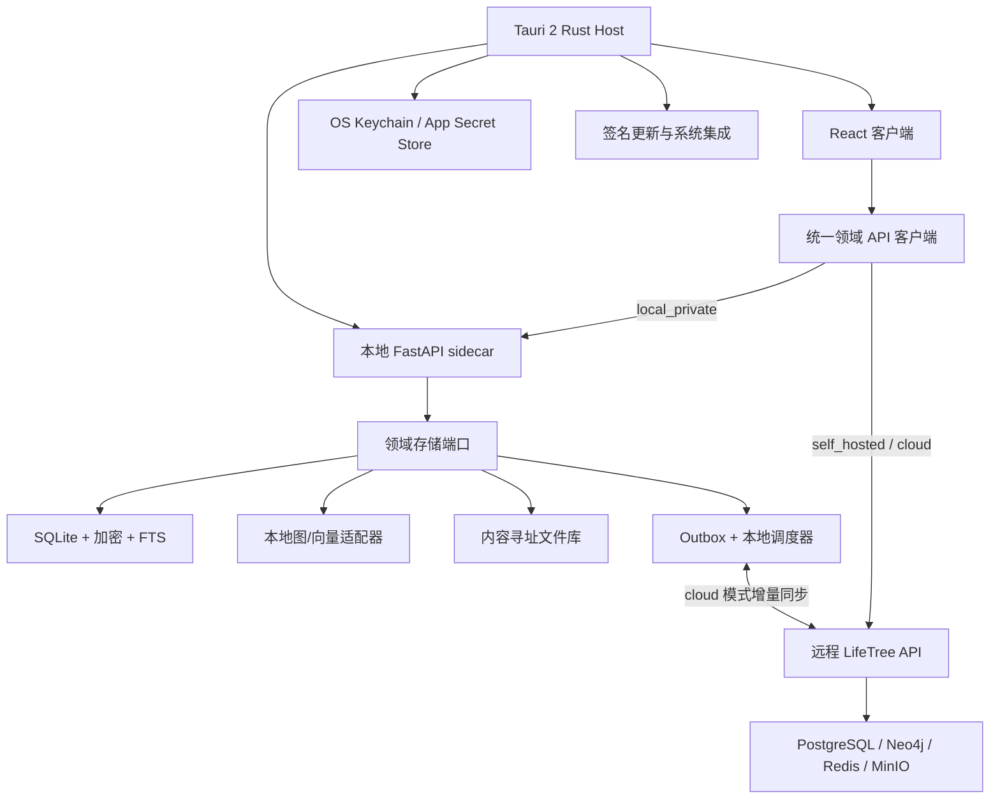

# LifeTree 项目书

**版本**：1.3
**最后更新**：2026-07-29  
**作者**：wwj
**密级**：内部

---

## 目录

1. [项目愿景与使命](#1-项目愿景与使命)  
2. [问题域与市场痛点](#2-问题域与市场痛点)  
3. [产品定位与核心价值](#3-产品定位与核心价值)  
4. [核心功能与机制详解](#4-核心功能与机制详解)  
   - 4.1 [长周期多源信息聚合与结构化](#41-长周期多源信息聚合与结构化)  
   - 4.2 [知识图谱与因果推理引擎](#42-知识图谱与因果推理引擎)  
   - 4.3 [分支推演与情景规划](#43-分支推演与情景规划)  
   - 4.4 [用户画像与个性化决策](#44-用户画像与个性化决策)  
   - 4.5 [即时风险预警与通知](#45-即时风险预警与通知)  
   - 4.6 [可能性预测与数学模型](#46-可能性预测与数学模型)  
   - 4.7 [用户私有信息集成与可信度管理](#47-用户私有信息集成与可信度管理)  
   - 4.8 [去重、合并与信息生命周期管理](#48-去重合并与信息生命周期管理)  
5. [用户体验与交互设计](#5-用户体验与交互设计)  
6. [产品盲点与应对策略](#6-产品盲点与应对策略)  
7. [技术架构](#7-技术架构)  
   - 7.1 [整体架构概览](#71-整体架构概览)  
   - 7.2 [前端架构设计](#72-前端架构设计)  
   - 7.3 [后端架构设计](#73-后端架构设计)  
   - 7.4 [数据存储设计](#74-数据存储设计)  
   - 7.5 [关键数据流](#75-关键数据流)  
   - 7.6 [部署与运维架构](#76-部署与运维架构)  
   - 7.7 [安全与权限模型](#77-安全与权限模型)  
   - 7.8 [插件系统](#78-插件系统)  
8. [开源与商业化策略](#8-开源与商业化策略)  
9. [实施路线图](#9-实施路线图)  
10. [实施现状与已落地能力](#10-实施现状与已落地能力)  
11. [愿景差距分析与下一阶段路线图](#11-愿景差距分析与下一阶段路线图)  
12. [桌面端、离线优先与云端协同架构](#12-桌面端离线优先与云端协同架构)

---

## 1. 项目愿景与使命

**愿景**：成为每个认真规划人生的人手中的“决策罗盘”，在不确定的世界中持续提供清晰、可信、个性化的中长期决策洞察。

**使命**：通过聚合公开与私域信息，结合知识图谱与因果推理模型，为用户构建一个动态、可演进的决策沙盘，帮助他们提前感知风险、评估路径、推演未来，做出更有信心的重大人生选择。

---

## 2. 问题域与市场痛点

人生中的重大决策（移民、留学、海外置业、职业转型、退休养老等）通常具有以下特征：

- **周期长**：往往需要提前 2-5 年准备，涉及资金、语言、资格等多个慢变量。
- **信息多源且碎片化**：政策、经济、治安、国际关系等信息分散在政府网站、新闻媒体、专业论坛、付费报告、私域社群中。
- **依赖趋势跟踪而非快照**：仅靠单次搜索无法理解一个事件在时间轴上的演变，也无法感知多个因素的交叉影响。
- **缺失风险预警**：传统搜索引擎只能被动响应查询，无法主动告知“某个长期酝酿的风险正在接近你的目标”。
- **通用信息与个人条件脱节**：同样的政策变化，对不同背景和进度的用户，影响截然不同，但现有工具无法做出个性化推演。

**现有解决方案的局限**：
- 搜索引擎（Google, Bing）：只给切片，不给趋势和关联。
- 移民留学中介：依赖人力，信息更新滞后，利益相关，且无法提供透明推演。
- 普通笔记/表格软件：无法自动化监控和分析外部变化。

---

## 3. 产品定位与核心价值

LifeTree 是 **一款专注于中长期个人决策的智能信息系统**。它并非简单的工具，而是一个 **“决策操作系统”**。

它为用户提供的核心价值是：

- **一个持续更新的个人化知识图谱**：融合公开与私域信息，围绕用户目标自动生长。
- **一个动态的因果推理与风险预警引擎**：识别事件之间的关联，提前量化风险。
- **一套可控的“多重未来”沙盘**：在信息冲突或决策犹豫时，分叉出多种情景并平行推演，供用户对比。
- **一位伴随全周期的 AI 决策顾问**：能读懂用户的个人背景、偏好和进度，给出具有可执行性的建议。

---

## 4. 核心功能与机制详解

### 4.1 长周期多源信息聚合与结构化

**痛点**：信息存在于搜索引擎、政府 API、付费墙后、用户邮箱/社群里，格式多样，缺少统一整合。

**解决方案**：
- **公开信息源**：使用 Tavily 等搜索代理引擎进行周期性抓取，原始爬虫和维护不自己做。
- **私域信息源**：允许用户通过文本粘贴、文件上传、邮件转发等方式提交自己的信源（如顾问邮件、论坛内部消息、PDF 报告等）。
- **结构化管道**：所有流入的非结构化文本，均通过 LLM 提取为统一的“信息原子”：
  - **事件**：主体、动作、对象、时间、旧值、新值
  - **指标快照**：数值型数据点，含区域、时间、单位
  - **断言**：未完全证实的声明，带可信度标记
  - **关系声明**：因果或相关关系
- **LLM 抽取控制**：使用 Instructor 或 LangChain 的 Structured Output 确保输出符合 Pydantic Schema；引入抽取置信度评分，低分进入人工审核队列。

### 4.2 知识图谱与因果推理引擎

**理念**：借鉴 Palantir 的“本体驱动的知识图谱”，构建人生决策专用本体。

**核心实体**：
- **Goal**：用户目标（如“2029年前获得加拿大 PR”）
- **Pathway**：实现路径（如“联邦技术移民”）
- **Requirement**：要求节点（语言成绩、资金证明、学历认证）
- **RiskFactor**：外部风险（政策突变、治安恶化、汇率波动）
- **InformationSource**：每条数据的来源与可信度

**关系类型**：`影响`、`要求`、`替代`、`预警`、`等同于`、`导致` 等。

**图谱生长机制**：
- 当结构化管道输出新事件时，图谱自动挂载到相关实体上。
- 因果推理层在图谱上执行**风险传播算法**：当一个政策节点发生变化，顺着影响边更新所有关联路径和目标的风险评分。
- 存储于 Neo4j，利用 Cypher 进行深度路径查询和影响范围计算。

### 4.3 分支推演与情景规划

**痛点**：信息冲突、信源质量不一、用户自身也可能存在多种假设。线性预测无法应对真实世界的模糊性。

**解决方案**：引入“情景分叉”机制。
- 当系统检测到对同一实体存在冲突断言（如官方金额 vs 用户情报金额），自动创建**主分支和子分支**。
- 用户可手动触发“禁用存疑信息开启推演”，或在决策顾问中提问“如果 X 会发生什么？”来新建情景。
- 每个情景独立进行计算和模拟，互不污染。
- 用户界面呈现**情景矩阵**：横轴为不同假设分支，纵轴为时间线，每个情景显示风险评分和关键里程碑。
- **分支防爆炸**：设置影响力阈值，仅保留对目标达成影响显著的分支；当存疑信息被证实或证伪时，分支自动合并或关闭；长期未更新且低影响的分支进入休眠。

### 4.4 用户画像、对话驱动图谱生长与动态决策

**对话驱动生长机制（Conversational Graph Building）**：
- **替代繁重表单**：彻底摒弃传统“坐下来填完 50 个表单”的冰冷交互。用户只需像与真实决策顾问聊天一样交流（如：“我今年30，在考虑去加拿大还是日本”、“我上周雅思听力考了7.5”、“中介说这个配额好像缩减了”）。
- **后台实时抽取与 Tool Calling**：AI 在对话过程中利用 Tool Calling 静默提取结构化原子，自动完成：
  1. `update_user_profile`（更新年龄、语言、资金、生命周期）
  2. `create_scenario_branch`（创建“加拿大分支”与“日本分支”）
  3. `add_user_source`（记录中介情报或个人凭证）
  4. `update_requirement_status`（点亮已达标节点）
- **透明卡片反馈（Chat-to-Graph Loop）**：对话界面侧边/下方随聊随弹“为您同步更新了沙盘：【雅思听力: 7.5】”，用户可一键确认或纠偏，既无填表负荷，又能随时把控。

**画像结构**：
- **基础属性**：年龄、国籍、学历、语言成绩、资金范围等（支持聊天自然提取、简历/文档解析与渐进式补充）。
- **申请生命周期状态（Lifecycle Stage）**：明确标注用户所处阶段（`planning`筹备中, `submitted`已递交, `in_review`审理中, `waiting_eoi`等邀），用于精准匹配新旧政策“祖父条款/过渡期”豁免。
- **家庭与主副申请人（Joint Profile）**：支持家庭多角色属性合并（如配偶语言成绩、资金共享池）。
- **目标与偏好**：主目标、倾向路径、优先因素（成本、速度、气候）、风险容忍度。
- **行为与进度**：当前考试计划、资金积累进度、已完成步骤。可通过对话自然提取与更新。
- **隐式标签**：从聊天交互中推测的治安敏感度、子女教育重视度等，用于信息过滤。

**画像驱动**：
- 路径匹配：自动筛选符合画像条件的路径并计算差距。
- 个性化预警：同一政策变化，基于生命周期状态（如已递交用户豁免新规）做精准差异化预警。
- 进度洞察：语言达标但资金落后，系统自动调高资金类政策变动的提醒优先级。

### 4.5 即时风险预警与巡航/静眠模式（Cruising Mode）

- **风险识别层**：cron 抓取后，LLM 额外输出 `risk_flag`（高风险/中/低，类型，紧迫度）。
- **巡航/静眠模式（Cruising Mode）**：
  - 在长期等待期（如递交材料后 6-12 个月审理期），允许用户开启巡航态。
  - 巡航态下屏蔽中低风险日常推送，仅当检测到对关键路径有 `CRITICAL` 影响或涉及祖父条款变动时，方激活唤醒预警，防止“预警疲劳（Alert Fatigue）”。
- **波及扫描**：根据风险类型，在图谱中查找所有受影响用户，结合用户画像生成个性化影响摘要。
- **多渠道推送**：Email、站内信、SMS（用户可选），App 推送。严重事件可触发 SMS。
- **推送节制**：单用户同类型事件冷却期、免打扰时段设置。

### 4.6 可能性预测、数学模型与风险可控度（Risk Controllability Grade）

采用多层融合的预测体系，并重构输出形式：

- **贝叶斯网络与蒙特卡洛模拟**：考虑外部事件概率分布和用户行动选择，运行数千次模拟，计算置信区间。
- **风险可控度等级（Risk Controllability Grade）**：
  - 不再单纯给用户展示易引发生理焦虑的单一点胜率（如“68%”）。
  - 转化为三级“风险可控度”（**稳健 / 中等风险 / 高风险脆弱**）及**核心瓶颈消除卡片**（如：“消除该扣分项仅需提高雅思单项0.5分”）。
- **输出形式**：呈现为置信区间、风险可控度等级与因子分解归因瀑布图。

### 4.7 用户私有信息集成与可信度管理及隐私防线

- 所有私有上传信息打上 `source=user_upload`，并默认设为“可信度：待用户评定”。
- **端侧脱敏预览**：解析前在前端自动对姓名、身份证号、资产具体账号进行遮蔽脱敏，消除隐私顾虑。
- 用户可手动标记“可靠”或“存疑”。
- 分析报告明确区分“基于公开信息”和“混入私密信息”的结论，并标注可能的风险。
- 法律免责：上传流程强制确认“我知道这些信息未经平台验证，后果自负”。

### 4.8 去重、合并与信息生命周期管理

- **去重**：基于语义指纹（主体+动作+对象+时间窗）和跨源实体对齐（LLM 辅助判定）进行合并。
- **更新 vs 新事件**：更新旧节点并记录历史版本，而非新建节点。
- **知识半衰期**：政策信息默认有效期 2 年，到期需刷新；新闻事件影响力定期衰减。
- **图谱健康巡检**：自动任务定期标记并清理孤立、过时节点。

### 4.9 信息审核收件箱（Review Inbox）与后台沉降验真

**痛点**：若要求普通用户在收件箱中逐条卡片审核抓取的互联网传闻或解析原子，会甩给用户极高的数据把关负荷与验真焦虑。

**解决方案**：重构 Review Inbox 为“分层自动沉降与高影响度留存”。
- **智能置信度分层**：
  - 高置信度官方源事件：自动挂载主图谱，免人工干预。
  - 中低置信度传闻：后台自动创建轻量级“存疑子分支”，计算其对用户目标的潜在影响度。
  - 仅当存疑事件对用户关键路径产生 `HIGH` 或 `CRITICAL` 影响时，才推送到 Review Inbox 提醒用户关注。
- **卡片式极简快捷 UI**：仅展示必要的高影响待办，提供一键 `采纳` / `忽略` / `保持低权重沉降`。

---

## 5. 用户体验与交互设计

围绕“降低冷启动门槛”、“建立算法信任”、“消除长周期焦虑”三大目标，重构 UX 交互体系：

### 5.1 场景模板市场与渐进式向导（Scenario Marketplace & Progressive Wizard）
- **场景模板库**：官方与社区提供热门人生场景模板（如“新西兰技术移民”、“日本 IT 转型”）。一键导入基础图谱框架。
- **渐进式立项向导（Progressive Wizard）**：
  - 首次使用仅需 3 个极简问题（目标国家/领域、预计时间、大概预算），先生成粗粒度预测。
  - 随着用户深入使用，在触及关键分支时才提示补充工作细节或成绩单，彻底解决冷启动填表疲劳。
  - 支持直接拖入 PDF 简历/成绩单自动智能提取。

### 5.2 多视窗交互与关键路径高亮（Timeline/Gantt & Critical Path）
- **时间线/甘特图主视图**：默认以时间轴为主视图，清晰呈现“当前阶段重点”、“未来里程碑”与“关键窗口期”。
- **关键路径高亮**：提供“聚焦模式”，自动收起非关键分支，高亮“短板要求节点”（如语言未达标）与“致命风险节点”。

### 5.3 白盒化推理与因子归因瀑布图（Attribution Waterfall）
- **归因瀑布图**：点击风险可控度等级，弹窗展示透明的因子分解：
  - `+85%` 基础符合度（学历与工作年限满足基本要求）
  - `-12%` [致命风险] 资金准备存在 $20,000 缺口
  - `-5%` [存疑事件] 社区传闻 2027 年配额缩减
- **信源溯源下钻**：任何扣分因子均可一键下钻查看原始文件或新闻网页。

### 5.4 无悔微行动与巡航抗焦虑设计（No-Regret Micro Actions & Cruising Mode）
- **解焦微行动**：推理引擎结合短板自动收敛输出 1~2 项无悔微行动（如：“距离语言审核窗口仅剩 90 天，提高单项 0.5 分可消除资金波动风险”）。
- **巡航免打扰态**：在漫长等待期开启巡航模式，隐藏琐碎通知，保护用户免受无谓焦虑打扰。

### 5.5 多情景活跃限制与家庭/多角色协同（Active Branch Limits & Family Sandbox）
- **并发活跃分支限制**：限制界面同时激活的核心对比分支最多 3 个，超出的分支自动沉降归档，有效消除决策瘫痪。
- **家庭/多角色联合协同**：除了加密只读/评论链接外，支持主副申请人（如夫妻）共同构建联合画像，在同一个沙盘中并排测算不同主申方案的风险可控度。

---

## 6. 产品盲点与应对策略矩阵

结合真实用户全流程视角，汇总系统 16 大核心痛点与优化策略矩阵：

| 痛点/盲点类别 | 具体风险与痛点 | 深度应对与优化策略 |
| :--- | :--- | :--- |
| **1. 冷启动门槛** | 空白画布无从下手，首次填表成本极高 | 提供模板套用，配套 3 步渐进式立项向导与简历/PDF 智能提取 |
| **2. 节点意面图** | 节点>20 后拓扑图变成混乱蛛网 | 以“时间线/甘特图”为主视图，增加“关键路径”聚焦高亮 |
| **3. 算法胜率焦虑** | 单一胜率数字（如 68%）引发精算焦虑 | 转为“风险可控度等级”（稳健/中等/脆弱）与瓶颈消除指导 |
| **4. 分支瘫痪负荷** | 多分支组合爆炸导致决策瘫痪 | 限制最多 3 个活跃并发分支，超出的自动化沉降归档 |
| **5. 长周期等待断崖** | 6-12个月等待期无动作，导致用户流失 | 引入“巡航/静眠免打扰态”，降频防打扰，仅关键突变唤醒 |
| **6. 验真包袱倒置** | 强制用户审核 Review Inbox 增加把关负担 | 置信度自动分层与后台权重化沉降，仅高影响度触达用户 |
| **7. 政策过渡期割裂** | 新旧政策变动未区分已递交/未递交用户 | 画像中引入生命周期状态（Submitted/EOI），精准匹配祖父条款 |
| **8. 协同能力局限** | 单人只读/评论分享无法满足家庭共同决策 | 支持家庭联合画像（主副申请人合并测算）与共享沙盘 |
| **9. 隐私保护信任墙** | 上传敏感凭证/文档担心数据泄露 | 前端本地端侧敏感字段自动遮蔽脱敏 + 白盒安全提示 |
| **10. 信息数据污染** | 自动抓取或解析的脏数据污染图谱 | 隔离缓冲队列 + 后台概率权重衰减，避免直挂主图谱 |
| **11. 工程与计算成本** | LLM 结构化抽取与模拟计算成本过高 | 分层模型（轻量 NLP 预处理 + LLM 结构化），置信度过滤 |
| **12. 知识熵增** | 信息过时导致图谱失效 | 引入知识半衰期衰减模型、自动巡检与到期提示机制 |

---

## 7. 技术架构

### 7.1 整体架构概览

- **前端**：React/Next.js 16（App Router）+ Tailwind CSS + Radix UI，构建为 PWA，支持 standalone / minimal-ui 显示模式
- **后端 API**：Python FastAPI，SSE 实时推送，LangGraph ReAct Agent 编排
- **任务队列与调度**：Celery Worker + Celery Beat + Flower 监控
- **主数据库**：PostgreSQL 16（开启 pgvector 扩展，存放事件嵌入向量）
- **图数据库**：Neo4j 5.20（含 APOC），存储本体实例与关系
- **缓存与消息**：Redis 7（Celery broker + SSE pub/sub）
- **对象存储**：MinIO（用户上传原始文件 + LLM 中间结果）
- **反向代理**：Nginx（统一入口，SSE 流式转发，无 CORS）
- **LLM 编排**：前端 Vercel AI SDK 流式 + 后端 LangGraph ReAct Agent + Instructor 结构化输出；多供应商适配（OpenAI / Anthropic / AlibabaCloud / Google / DeepSeek / Zhipu / ByteDance / Microsoft / AWS / Mistral / Cohere / Meta 等通过 `@lobehub/icons` 显示品牌头像）
- **国际化**：内置 6 语言（zh-CN / zh-TW / en / es / de / fr），cookie 驱动 + 自动检测
- **监控与日志**：Flower（Celery 任务监控）+ Docker healthcheck + Sentry（规划中）
- **CI/CD**：GitHub Actions（构建并推送 GHCR 镜像，linux/amd64）

### 7.2 前端架构设计

- **框架**：Next.js 16，App Router，SSR/SSG/ISR 混合，Turbopack 构建。
- **AI 集成**：Vercel AI SDK 实现与 FastAPI 后端的流式对话（SSE 直连后端，绕过 Next.js dev proxy 缓冲），支持工具调用（触发推演、添加监控）。
- **状态管理**：React Context + SWR 做服务端状态同步；`useSyncExternalStore` 实现聊天会话本地持久化（按 user ID 分区存储）。
- **可视化**：ECharts（概率曲线、归因瀑布图）；Cytoscape.js（知识图谱拓扑图，支持节点点击下钻原始事件）；Recharts（时间线甘特图）。
- **样式**：Tailwind CSS + Radix UI 构建无障碍组件，支持亮色/暗色/系统三种主题，遵循 `prefers-reduced-motion` 媒体查询。
- **国际化**：自研 i18n provider，6 语言完整翻译（zh-CN 基准 / zh-TW / en / es / de / fr），cookie 驱动 + `navigator.language` 自动检测，缺失 key 回退 zh-CN。
- **PWA**：manifest.webmanifest（standalone 显示 + maskable 图标 + 3 个 shortcuts：罗盘/对话/预警）+ Service Worker + 内联 PWA 检测脚本（hydration 前注入 `html.pwa` 类避免闪烁）+ 抽屉式侧边栏（viewport < 1024px 触发）。
- **多用户模式**：AuthGate 组件在 multi-user 模式下未认证不渲染 children（避免 SWR 误触发 API 请求）；单用户模式回退到默认用户（Alex Chen）。
- **移动端**：已通过 PWA 完整支持 iOS/iPadOS（apple-touch-icon + apple-mobile-web-app-capable），后续可探索 SwiftUI 原生体验。

### 7.3 后端架构设计

- **API 层**：FastAPI 提供 19 个路由模块的 RESTful API 和 SSE 端点（实时风险推送 + 模拟进度 + 聊天流）。
- **智能助手（chat）**：基于 LangGraph `create_react_agent` 的 ReAct Agent，通过 `astream_events` v2 流式输出。注册 14 个工具：
  - **读取**：`list_pathways` / `list_requirements` / `list_risk_factors` / `list_recent_events` / `get_scenario_summary` / `list_memories`
  - **写入**：`create_goal` / `create_pathway` / `create_requirement` / `update_requirement_status` / `create_risk_factor` / `create_scenario_branch` / `remember` / `forget` / `update_user_profile` / `add_user_source`
  - **执行**：`run_scenario_reasoning`
  - **网络**：`web_search` / `web_fetch`
  - **上下文构建**：`_build_context_block` 注入用户/目标/路径/要求/风险因子/情景 + 多样性记忆选取（15 条，per-category cap）；100k token 历史截断（原子分组，首条用户消息保留）。
- **服务模块**：
  - `crawler_service`：调度 Tavily API 和用户自定义源抓取。
  - `structuring_service`：LLM 管道（Instructor + Pydantic），非结构化文本到结构化原子，输出 events/metrics/assertions/relationships。
  - `dedup_service`：sha256 语义指纹（subject|action|object|time_window）去重。
  - `review_inbox_service`：信息审核队列，按置信度自动分层（approved≥0.8 / pending_review<0.8 且 impact≥high / sunk_low_weight 其他）。
  - `graph_service`：Neo4j 交互层，7 类节点（Goal/Pathway/Requirement/RiskFactor/Event/InformationSource/Scenario）+ 7 类关系，含 `PROPAGATE_RISK_FROM_EVENT` 多跳风险传播遍历。双存储策略：PG 为真相源，Neo4j 镜像用于路径查询。
  - `user_profiling_service`：用户画像构建与更新，每次 PATCH 后自动 refresh。
  - `reasoning_engine`：风险传播算法、贝叶斯网络更新、蒙特卡洛模拟调度、因子归因瀑布与无悔行动计算（由 Celery 异步执行）。
  - `notification_service`：多通道分发（email / in_app / sms(stub) / push），含 6 小时冷却 + 安静时段 + Cruising Mode 抑制规则。SMTP 支持 SSL(465)/STARTTLS(587)，HTML 模板。
  - `lifecycle_service`：知识半衰期管理（policy=730d / economic=180d / security=90d 等），自动巡检与归档。
  - `plugin_upload_service` / `plugin_runner`：用户插件 AST 检查、契约验证、运行时加载（详见 7.8）。
  - `webauthn_service`：Passkey 注册/认证/管理（discoverable credentials + sign_count 防 replay）。
- **SSE 实时推送**：Redis pub/sub channel `lifetree:risk:{user_id}` + `lifetree:scenario:{scenario_id}`，best-effort publish。
- **任务队列**：Celery Worker 处理长耗时预测任务；Celery Beat 定时触发 cron 抓取（`--schedule /tmp/celerybeat-schedule` 避免非 root 容器权限错误）；Flower 监控。

### 7.4 数据存储设计

- **PostgreSQL 16（pgvector）**：约 22 张核心表，覆盖以下域：
  - **用户与认证**：`user_profiles`（含 demographics/priority_factors/risk_tolerance/progress/implicit_tags/notify_channels/quiet_hours 等 JSONB 字段）/ `user_uploads`（含 user_credibility 状态机）/ `user_oauth_links` / `user_passkeys` / `user_plugins` / `user_memories`
  - **目标本体**：`goals` / `pathways`（含 milestones/eligibility）/ `requirements`（含 gap_status/gap_delta/weight）/ `risk_factors`（含 half_life_days）
  - **信息原子**：`information_sources` / `events`（含 `embedding Vector(1536)` + extraction_confidence + status 三态）/ `event_fingerprints`（sha256 去重）/ `metric_snapshots` / `assertions` / `relationships`
  - **情景与推理**：`scenarios`（含 success_probability/key_risk_factors/impact_threshold）/ `scenario_runs`（含 engine 类型与 iterations）
  - **通知与风险**：`notification_logs` / `risk_assessments` / `risk_propagation_logs`
  - **LLM 与平台配置**：`llm_providers` / `llm_models`（capabilities JSONB）/ `app_config`（key-value 存储 tavily/mineru/smtp/oauth_providers/use_mode 等）
  - 向量扩展：`events.embedding` 列支持 RAG 式“相似事件检索”和个性化知识库问答。
- **Neo4j 5.20**：
  - 核心本体实例：Goal / Pathway / Requirement / RiskFactor / Event / InformationSource / Scenario（7 类节点）。
  - 关系：`HAS_PATHWAY` / `REQUIRES` / `AFFECTS` / `EMITTED` / `BELONGS_TO` / `BRANCHES_FROM` / `SUPERSEDES`（7 类）。
  - 每个情景（Scenario）是独立的子图或带标签的分支，查询时按情景 ID 过滤。
  - `PROPAGATE_RISK_FROM_EVENT` Cypher 查询：从 Event 沿 `AFFECTS*0..4` 跳遍历到 Pathway/Goal，量化风险传播。
- **MinIO**：
  - 用户上传的原始文件（PDF，截图）。
  - LLM 中间处理结果备份。
- **Alembic 迁移**：8 个版本，从初始 schema 到 Passkey 设备类型字段扩容（VARCHAR(64)），entrypoint 脚本自动创建 pgvector 扩展后再运行迁移。

### 7.5 关键数据流

**信息流入与图谱更新流**：
1. Cron 触发 → `crawler_service` 调 Tavily/用户源 → 获取新文本。
2. 文本入 `structuring_service` → LLM 输出结构化事件（Pydantic）。
3. 事件推入 `Review Inbox` 暂存队列 → 用户收到审核通知或符合自动通过策略。
4. 用户确认后去重模块比对已存事件 → 写入 Neo4j 对应节点，建立关联。
5. 若事件带高风险标签，立刻触发 `notification_service` 扫描受影响用户并推送。
6. 异步触发 `reasoning_engine` 重算受影响目标的风险分与归因瀑布。

**用户互动与推演流**：
1. 用户通过 智能助手提问或点击“推演” → 请求到 FastAPI。
2. API 创建情景分支 → 在 Neo4j 中复制并修改相关节点。
3. 发送任务到 Celery 执行蒙特卡洛/贝叶斯推理。
4. 前端通过 SSE 或轮询获取计算进度和结果 → 在情景面板中对比（Diff View）。

### 7.6 部署与运维架构

**容器化部署**：Docker Compose 单栈编排，9 个服务 + 5 个命名卷。

| 服务 | 镜像 | 端口 | 说明 |
| :--- | :--- | :--- | :--- |
| postgres | pgvector/pgvector:pg16 | 15432:5432 | 主数据库，含 pgvector 扩展 |
| neo4j | neo4j:5.20 | 17687:7687 / 17474:7474 | 图数据库，含 APOC |
| redis | redis:7-alpine | 16379:16379 | Celery broker + SSE pub/sub（非默认端口避免冲突） |
| minio | minio/minio:latest | 19000:9000 / 19001:9001 | 对象存储 |
| backend | ghcr.io/caryk753/lifetree-backend | 18000:18000 | FastAPI + Uvicorn |
| worker | 同 backend | — | Celery Worker |
| beat | 同 backend | — | Celery Beat（`--schedule /tmp/celerybeat-schedule`） |
| flower | mher/flower:latest | 15555:5555 | Celery 任务监控 |
| frontend | ghcr.io/caryk753/lifetree-frontend | 13000（仅 expose） | Next.js 16 生产构建 |
| nginx | nginx:alpine | 80 → 统一入口 | 反向代理，SSE 流式转发 |

- **非默认端口策略**：所有暴露服务使用非默认端口（15432/17687/17474/16379/19000/19001/18000/13000/15555），避免共享服务器端口冲突。
- **GHCR 预构建镜像**：默认从 GitHub Container Registry 拉取，`docker compose up -d` 即可启动；本地构建需 `--build` 标志。
- **CI/CD 工作流**：
  - `build-and-push.yml`：push 到 main 或 `v*` tag 触发，构建 linux/amd64 镜像并推送 GHCR，GHA 缓存加速。
  - `release.yml`：`v*` tag 触发，从 `CHANGELOG.md` 提取对应版本段落作为 GitHub Release notes。
- **Healthcheck**：PostgreSQL/Neo4j/Redis/MinIO/Backend/Frontend 均配置 healthcheck；前端使用 `wget -q -O /dev/null` 避免 alpine 镜像 `--spider` 误报。
- **数据持久化**：5 个命名卷（postgres_data / neo4j_data / redis_data / minio_data / backend_plugins），跨重启保留。插件目录 `backend_plugins:/app/plugins/user_uploaded/` 持久化用户自定义脚本。

### 7.7 安全与权限模型

**服务器部署双模式**：通过 `LIFETREE_USE_MODE` 环境变量 + DB `app_config.use_mode`（DB 优先）切换。两种模式目前都要求登录，不等同于 §12 规划的无云账号 `local_private` 桌面模式。

- **单用户模式（默认）**：只允许一个管理员账户，首个账户建立后限制后续注册，适合个人自部署。
- **多用户模式**：强制登录，AuthGate 组件未认证不渲染 children；第一注册用户自动晋升 admin（`_should_promote_first_admin`）。

**Admin 权限**：
- 通过 `LIFETREE_ADMIN_USER_IDS` 环境变量配置，运行时 `_apply_admin_override` 动态注入（DB role 字段始终为 'user'，避免持久化敏感角色）。
- Admin 专属端点：`/admin/stats` / `/admin/users` CRUD + role/is_enabled/password 管理。
- 防自降级：最后一个 admin 不能自我降级、禁用或删除。
- 多用户模式下，普通用户无法查看 admin 配置的 API Key（设置页只读）。

**认证方式**：
- **邮箱+密码**：注册 + 验证码（admin 启用 `email_verification` 后强制）。
- **OAuth**：8 个预设供应商（GitHub / Google / Microsoft / GitLab / Discord / LinkedIn / Facebook / Apple）+ 自定义任意 OAuth2 供应商。state 防 CSRF（Redis 10 分钟 TTL），支持 login/register/bind 三模式。OAuth 头像不覆盖用户自定义字段（仅空时填充）。
- **Passkey（WebAuthn）**：discoverable credentials 免登录认证，多设备绑定，sign_count 单调递增防 replay。admin 启用 `passkey_login` 后用户可在 /profile 绑定。
- **JWT**：access token + refresh token，Bearer 模式。

**数据隔离**：所有业务表含 `user_id` 字段，按用户 ID 隔离；聊天会话本地存储按 `lifetree.chat.conversations.v2.<userId>` 分区。

**隐私防线**：
- 私有上传信息默认 `source=user_upload` + `user_credibility=pending`。
- 前端端侧脱敏预览（姓名、身份证号、账号遮蔽）。
- 法律免责强制确认。

### 7.8 插件系统

**定位**：允许用户上传自定义 Python 脚本扩展信源适配器（如 RSS 抓取、特定网站爬虫），无需修改主代码。

**安全沙箱**：
- **AST 语法检查**：`ast.parse` + 顶层 `class Plugin:` 识别 + `manifest`/`fetch` 静态方法校验。
- **导入黑名单**：`os` / `sys` / `subprocess` / `shutil` / `ctypes` / `socket` / `multiprocessing` / `importlib` / `pickle` / `marshal` / `pty` / `posix` / `nt` / `resource` 等。
- **危险调用检查**：`eval` / `exec` / `compile` / `__import__`。
- **契约验证**：`safe_import_for_validation` 临时文件加载 + 调用 `Plugin.manifest()` 验证返回 `PluginManifest` 类型。

**API 端点**：
- `POST /plugins/upload`：上传 + AST 检查 + 契约验证，文件名小写 snake_case `.py`，256 KiB 上限。
- `PATCH /plugins/{id}/enabled`：启停。
- `DELETE /plugins/{id}`：软删除（文件 + DB row + sys.modules 缓存）。
- `POST /plugins/{id}/run`：运行插件 `fetch()` 方法。

**持久化**：Docker named volume `backend_plugins:/app/plugins/user_uploaded/` 跨重启保留用户插件。

**内置示例**：`plugins/sample_rss_feed.py` + `plugins/sample_web_scraper.py`。

---

## 8. 开源与商业化策略

**核心理念**：开放核心，服务收费。用透明赢得信任，用服务赢得生意。

**开源部分（AGPLv3）**：
- 核心推理引擎（贝叶斯网络、蒙特卡洛模拟、分支管理、归因瀑布）
- 知识图谱本体与图谱构建工具
- 信源适配器框架
- LLM 结构化抽取管道与 Review Inbox
- 前端基础组件库（MIT）

**闭源部分（商业许可）**：
- 托管平台和自动运维
- 高级协作功能（家庭/顾问多用户协作）
- 场景模板市场官方认证付费模板
- 自研领域微调模型权重
- 官方信源可信度评级数据
- 企业级控制台与 API

**许可证选择**：核心仓库采用 **GNU AGPLv3**，防止云厂商直接封装成 SaaS 而不回馈代码。同时提供商业双授权，闭源需求单独购买。

---

## 9. 实施路线图

**第一阶段：核心原型与零门槛冷启动（MVP+）**
- 聚焦场景：**加拿大联邦技术移民（FSW）** 官方 Demo 模板。
- 实现基础信息抓取与结构化管道。
- 引入 **信息审核收件箱（Review Inbox）**，解决数据污染问题。
- 搭建基础知识图谱，实现 **时间线/甘特图主视图**。
- 提供基础风险预警（邮件通知）。
- **目标**：跑通数据闭环与开箱即用冷启动体验。

**第二阶段：白盒归因、分支推演与用户画像**
- 完成用户画像系统，实现个性化风险评分。
- 集成 **归因瀑布图（Attribution Waterfall）**，实现透明化推理因子解读。
- 实现 **情景差异对比看板（Diff View）** 与分支管理。
- 引入私域信息上传与 **场景模板市场** 框架。
- **目标**：实现多情景智能决策对比与白盒算法信任。

**第三阶段：预测引擎、无悔行动与协作生态**
- 集成贝叶斯网络和蒙特卡洛模拟，输出概率区间。
- 自动收敛输出 **“每周无悔微行动”**，增加里程碑点亮与打卡激励。
- 支持 **家庭/顾问加密只读与评论协同**。
- 推出 iOS/iPadOS 原生应用（PWA/Native），实现移动端推送。
- **目标**：产品走向成熟，形成抗焦虑的陪伴式决策系统。

**第四阶段：多场景扩展与商业化**
- 扩展官方模板：澳洲移民、英国留学、美国 H1B、数字游民规划、职业转型。
- 推出 B2B 顾问面板，赋能移民留学中介与规划师。
- 引入匿名社区洞察与模板共享生态，形成数据网络效应。
- 探索企业级许可证和国际市场。
- **目标**：成为个人中长期决策领域的标准平台。

---

## 10. 实施现状与已落地能力

**截至 2026-07-28**，LifeTree 已完成第一阶段全部目标与第二、三阶段主体能力，可投入实际使用。以下为对照路线图的实际进度盘点。

### 10.1 后端 API（核心路由）

| 模块 | 关键端点 | 状态 |
| :--- | :--- | :--- |
| auth | register / login / refresh / me / config / oauth start/callback/bind / send-code / register-with-code | ✅ |
| passkey | registration/options/verify + auth/options/verify + list/delete | ✅ |
| admin | stats / users CRUD + role/is_enabled/password | ✅ |
| users | CRUD + 画像字段更新 | ✅ |
| goals | Goal/Pathway/Requirement/RiskFactor CRUD | ✅ |
| scenarios | CRUD + run/branch/merge/prune | ✅ |
| ingest | /ingest/text + /ingest/upload（Mineru 解析 + MinIO 存储） | ✅ |
| graph | /graph/{goal_id} 知识图谱快照 | ✅ |
| chat | /chat/stream SSE 流式 + LangGraph ReAct + 14 工具 | ✅ |
| notifications | list + unread-count + bulk-read + {id}/read | ✅ |
| dashboard | /dashboard/{goal_id} 目标罗盘聚合 | ✅ |
| sse | /sse Redis pub/sub 实时推送 | ✅ |
| settings | providers/models/roles/tavily/mineru/smtp/oauth/use-mode/email-verification/disable-registration/passkey-login/service-address/test 全套 | ✅ |
| plugins | /plugins + /plugins/upload + /plugins/{id} DELETE/PATCH/run | ✅ |
| memories | 用户记忆 CRUD | ✅ |
| lifecycle | distribution/events/refresh/archive/half-life/sweep | ✅ |
| events / risk_factors / crawler / system | 查询与管理端点 | ✅ |

### 10.2 前端页面（主要路由）

| 路由 | 功能 | 状态 |
| :--- | :--- | :--- |
| / | 首页 | ✅ |
| /dashboard | 目标罗盘（含风险热力图/生存曲线/因子分解/无悔行动/里程碑） | ✅ |
| /goals + /goals/[id] | 目标管理 + 详情 | ✅ |
| /scenarios | 情景对比（树/网格/对比三视图 + 概率曲线 overlay） | ✅ |
| /chat | 智能助手对话（SSE 流式 + Tool Call UI + 历史侧边栏） | ✅ |
| /sources | 信息源管理（含 DELETE + 确认弹窗） | ✅ |
| /notifications | 通知中心（severity/read 筛选） | ✅ |
| /profile | 用户画像（含 MemoryBoard + Passkey 绑定 + OAuth 绑定） | ✅ |
| /settings | 系统组件 + OAuth 绑定 + 主题 + 语言 + 关于 + 管理员快捷入口 | ✅ |
| /admin | 平台配置（供应商/模型/API Key/SMTP/OAuth providers/Auth settings + UseMode） | ✅ |
| /plugins | 插件管理（上传 + 启停 + 删除） | ✅ |
| /ingest | 信息录入 | ✅ |
| /graph | 知识图谱可视化（Cytoscape，节点可点击下钻） | ✅ |
| /auth + /auth/callback/[provider] | 登录注册（ASCII 动态树木背景 + 流星动画） | ✅ |

### 10.3 核心引擎落地状态

| 引擎 | 关键能力 | 状态 |
| :--- | :--- | :--- |
| 知识图谱 | 7 类节点 + 7 类关系 + PROPAGATE_RISK_FROM_EVENT 多跳遍历 + 双存储（PG 真相源 + Neo4j 镜像） | ✅ |
| 情景分支 | CRUD + branch/merge/prune + 概率曲线 overlay + 3 活跃分支限制 + 自动休眠 | ✅ |
| 风险预警 | email/in_app/sms(stub)/push + SSE + SMTP(SSL/STARTTLS) + 6h 冷却 + 安静时段 + Cruising Mode | ✅ |
| 结构化管道 | Instructor + Pydantic + sha256 去重 + 三态置信度分层 + Vector(1536) 嵌入 + 半衰期管理 | ✅ |
| 用户画像 | 完整字段 + ProfilingService 自动 refresh + 记忆板 + lifecycle_stage + joint_profiles | ✅ |
| 智能助手 | LangGraph ReAct + 14 工具 + 100k token 截断 + 多样性记忆选取 + Tool Call 透明卡片 | ✅ |
| 蒙特卡洛/贝叶斯 | scenario_runs 表 + engine 类型字段（已搭骨架，深度模拟算法待业务校准） | 🟡 部分实现 |

### 10.4 部署与运维落地状态

| 能力 | 详情 | 状态 |
| :--- | :--- | :--- |
| Docker Compose | 9 服务 + 5 卷 + 非默认端口 + Nginx 统一入口 | ✅ |
| GitHub Actions | build-and-push.yml（GHCR 镜像）+ release.yml（CHANGELOG Release notes） | ✅ |
| GHCR 预构建镜像 | ghcr.io/caryk753/lifetree-backend / lifetree-frontend | ✅ |
| Healthcheck | 全服务配置 + 前端 wget -q -O /dev/null | ✅ |
| 数据持久化 | 5 命名卷 + 插件目录持久化 | ✅ |
| Alembic 迁移 | 8 个版本 + entrypoint 自动创建 pgvector 扩展 | ✅ |

### 10.5 安全与权限落地状态

| 能力 | 详情 | 状态 |
| :--- | :--- | :--- |
| 双模式 | single（默认用户回退）/ multi（强制登录） | ✅ |
| Admin 权限 | LIFETREE_ADMIN_USER_IDS 动态注入 + 防自降级 + 第一注册自动晋升 | ✅ |
| 邮箱+密码 | 注册 + 验证码（admin 启用后强制） | ✅ |
| OAuth | 8 预设（GitHub/Google/Microsoft/GitLab/Discord/LinkedIn/Facebook/Apple）+ 自定义 + 绑定/解绑 | ✅ |
| Passkey | WebAuthn discoverable credentials + 多设备 + sign_count 防 replay | ✅ |
| JWT | access + refresh token，Bearer 模式 | ✅ |
| 数据隔离 | user_id 字段 + 聊天分区存储 | ✅ |
| 隐私防线 | 端侧脱敏 + 法律免责 + user_credibility 状态机 | ✅ |

### 10.6 国际化与无障碍落地状态

| 能力 | 详情 | 状态 |
| :--- | :--- | :--- |
| i18n | 6 语言（zh-CN/zh-TW/en/es/de/fr），cookie 驱动 + 自动检测 + zh-CN 回退 | ✅ |
| PWA | manifest + Service Worker + 抽屉式侧边栏 + shortcuts + iOS 适配 | ✅ |
| 主题 | 亮色/暗色/系统三态 + prefers-reduced-motion 支持 | ✅ |
| 无障碍 | ECharts/Cytoscape aria-label + 键盘导航 + 焦点管理 | ✅ |

### 10.7 待完善项

- **SMS 通道**：目前为 stub，需接入真实网关（如 Twilio / 阿里云短信）。
- **移动端原生**：当前依赖 PWA，SwiftUI 原生 iOS/iPadOS 待规划。
- **B2B 顾问面板**：尚未启动。
- **匿名社区洞察**：尚未启动。
- **深度模拟算法**：scenario_runs 表与 engine 类型已搭骨架，蒙特卡洛/贝叶斯参数校准需结合真实场景迭代。
- **场景模板市场**：框架已就绪，官方模板仅 FSW + OINP/PNP/CEC 多路径种子，待扩展。

---

## 11. 愿景差距分析与下一阶段路线图

> **背景**：LifeTree 的终局目标是成为一款类 Palantir 的中长期决策信息系统——能根据用户实际情况长期跟踪信息、交叉验证、自动发现/添加并评估信源、自动感知风险领域并纳入追踪、多可能性自演化、基于知识图谱做信息收集与分析、支持插件自定义信源、规划阶段性/每日任务、估算行为 ROI 与成功率、并提供 AI 一站式问答咨询（可调用所有内置服务与工具）。适用于几乎所有需要中长期观察的决策项目，只要有公开透明信源即可成功，再不济也提供私域信源收录与插件接入。
>
> 截至 2026-07-29，对照该愿景盘点实际能力与缺口如下，并据此规划第五、六阶段路线图。本节口径优先诚实，标记与 §10 的"已实现"存在张力时以本节为准。

### 11.0 总体判断与成熟度口径

LifeTree 已经不是概念原型：目标、路径、事件、信源、图谱、情景、推理、行动、助手与插件都已有可运行的产品骨架。它最接近的是一个**个人决策情报工作台的早期完整版本**，而不是已经达到 Palantir 式可靠性的通用决策平台。当前优势是纵向功能覆盖很宽；主要风险是横向闭环、证据治理、模型校准和运行可靠性还没有达到同等深度。

后续不再以“有页面、有 API、有表”为完成标准，统一使用以下成熟度口径：

| 等级 | 定义 | 验收要求 |
| :--- | :--- | :--- |
| L0 概念 | 只存在文档或 prompt | 不计入可用能力 |
| L1 骨架 | 有模型/API/UI，可完成演示路径 | 允许人工介入，尚无完整异常与审计闭环 |
| L2 可用 | 主流程、权限、幂等、错误态和回归测试完整 | 可供真实单用户持续使用 |
| L3 可信 | 有溯源、校准、监控、数据质量指标和失败恢复 | 可支撑重要决策，但仍要求用户最终裁决 |
| L4 平台 | 多领域、多租户、插件隔离、同步和运维 SLA 成熟 | 可规模化交付 |

目前整体约处于 **L1-L2 之间**：产品闭环雏形已经形成，但预测与自动化能力多数尚未达到 L3。项目不应宣传“预测未来”，而应强调“持续收集证据、显式管理不确定性、比较方案并推动行动”。

### 11.1 能力盘点（对照 Palantir 式愿景）

| 愿景能力 | 当前状态 | 关键缺口 |
| :--- | :--- | :--- |
| 长期跟踪信息 | 🟡 L2 前期 | 已有事件、半衰期、定时刷新与双存储；仍缺抓取 SLA、失败补偿、覆盖率与图谱新鲜度指标 |
| 基于知识图谱的信息收集与分析 | 🟡 L1-L2 | 已有图谱与风险传播；仍缺实体消歧、时态事实、完整溯源、冲突版本和本体迁移治理 |
| 插件自定义信源 | 🟡 L1 | 已有上传、校验、启停与运行；同进程 AST 黑名单不等于安全沙箱，桌面与云端都需能力授权和进程隔离 |
| AI 一站式问答（可调用所有服务/工具） | 🟡 L1-L2 | 已有 LangGraph、MCP、Skills 和大量内置工具；缺统一权限、写操作确认、事务/幂等、预算、审计和失败恢复协议 |
| 交叉验证 | 🟡 L1 骨架 | 当前工作树已有冲突检测与裁决服务；仍需把事实建模为带时间和溯源的 assertion，并验证领域语义、投票偏差与反馈闭环 |
| 多可能性自演化 | 🟡 部分 | 有 `evolution.py` LLM 时间线投影（24 个月，5-15 事件）+ 情景 branch/merge/prune + 概率曲线 overlay；**缺**自动从冲突/不确定性中分叉新分支、演化结果回流影响主图谱、按真实结果反馈校准演化模型 |
| 成功率估算 | 🟡 L1 骨架 | 当前工作树已外置部分参数并记录预测结果，但仍以启发式先验为主；缺真实样本校准、Brier Score、可靠性曲线、分组漂移和样本外验证 |
| 信源自动发现/添加/评估 | 🟡 L1 骨架 | 当前工作树已有候选源提案、探针与采纳流程；缺长期准确率、覆盖率、抓取稳定性评分及来源所有权/授权审计 |
| 风险领域自动感知/发现 | 🟡 L1 骨架 | 当前工作树已有事件聚类、LLM 风险提案与采纳服务；缺稳定基线、异常检测评估集、误报治理和跨目标影响验证 |
| 规划阶段性任务/每日任务 | 🟡 L1-L2 | 当前工作树已有 Action、行动日历、状态回写和 AI 日历工具；缺可靠的循环任务实例化、提醒策略、外部日历互通与长期完成率反馈 |
| 估算行为 ROI 和成功率 | 🟡 L1 骨架 | 已能按预期概率提升/成本排序，但概率提升仍继承未校准模型，只能作为启发式优先级，不能作为财务意义上的 ROI |
| 普通用户日常闭环 | 🟡 L1-L2 | 当前工作树已有变更摘要、行动页、搜索与备份接口；仍需完成端到端验收、首次使用引导、统一收件箱和长期可用性验证 |

### 11.2 关键能力缺口详述

以下条目既是差距说明，也是达到 L2/L3 的验收目标。当前工作树已开始实现 A、B、C、E、G 的部分代码，因此“已有骨架”不再等于“缺少文件”；真正的完成条件是契约稳定、端到端验证、可观测、可恢复并有真实数据反馈。

#### 缺口 A：信源自动发现与可信度自适应（Source Auto-Discovery）

**问题**：候选源提案与探针已有骨架，但信源质量仍主要来自初始启发式值。中长期决策的痛点不仅是“我不知道该盯哪里”，还包括“系统如何证明它没有漏掉关键源、错误信源为何会被降权”。

**目标能力**：
1. **LLM 信源推荐**：根据 Goal + Pathway + region + 已有事件主题，调用 LLM 生成候选信源清单（官方公报、权威媒体、专业论坛、统计 API），按领域可信度排序后进入 Review Inbox 待用户采纳。
2. **候选源探针**：对推荐源做一次 Tavily Extract 试抓，评估内容稳定性、更新频率、与目标相关性，过滤死链/低质源。
3. **可信度自适应**：记录每个源历史事件的"被证实/被证伪"次数，源 credibility 随时间从初始启发式值向真实准确率收敛（贝叶斯更新）。
4. **风险预警联动**：新源接入即触发首轮抓取，若发现 high risk_flag 立即走现有通知链路。

**落地要点**：复用现有 `InformationSource` 模型 + `refresh_due_sources` Celery 任务；新增 `source_proposal` 表（提案态）+ `source_accuracy_log` 表（准确率追踪）；LLM 推荐作为 LangGraph Agent 的新工具 `propose_sources`。

#### 缺口 B：风险领域自动感知（Risk Area Auto-Sensing）

**问题**：事件聚类与 RiskFactor 提案已有骨架，但尚未用固定评估集衡量召回率、误报率和重复提案率。真实世界中新兴风险应能被系统识别，也必须允许用户理解、否决和纠正发现依据。

**目标能力**：
1. **事件聚类**：对最近 N 天的 events 做向量聚类（pgvector 已就绪），找出主题集中但未被现有 RiskFactor 覆盖的事件簇。
2. **LLM 风险主题抽取**：对每个聚类调用 LLM 提取 risk theme（名称、类型、影响地区、紧迫度、影响路径假设），生成 RiskFactor 提案。
3. **影响范围预演**：在 Neo4j 上模拟"如果新增此 RiskFactor 并 AFFECTS 某 Pathway"的风险传播路径，给出预估受影响目标数。
4. **用户采纳闭环**：提案进入 Review Inbox，用户一键采纳即写入 RiskFactor 表并接入现有风险传播与通知链路。

**落地要点**：新增 Celery 任务 `discover_emerging_risks`（每日/触发式）；复用 `RiskPropagationEngine` 做假设性传播；前端在 /review 页面增加"风险提案"分区。

#### 缺口 C：Action 实体与任务规划（Actionable Task Planning）

**问题**：Action、行动页面与 AI 日历工具已有骨架，但尚需证明循环任务、跨时区、提醒、状态回写和概率重算在长期运行中一致。当前 ROI 字段也仍是估算值，不能把排序分数误称为真实收益。

**目标能力**：
1. **Action 实体**：新增 `actions` 表（id, goal_id, scenario_id, requirement_id, title, description, cost_estimate, expected_prob_lift, status, due_at, completed_at, user_id），并迁移 `optimal_action_sequence` 为结构化 Action 行。
2. **阶段任务与每日任务**：Action 支持 `stage`（阶段分组）+ `recurrence`（每日/每周）字段；前端新增"行动日历"页面，按时间轴展示阶段里程碑 + 每日待办。
3. **进度回写**：用户标记 Action 完成后，自动更新关联 Requirement 的 gap_status、重算情景概率、记录到事件流。
4. **ROI 排序**：每个 Action 估算 `cost`（时间/金钱/精力，归一化）与 `expected_prob_lift`，前端按 ROI = lift/cost 降序展示"最高杠杆动作"。
5. **Agent 工具**：新增 `create_action` / `complete_action` / `list_today_actions` 工具，AI 可在对话中直接派发任务。

**落地要点**：Alembic 迁移新增 `actions` 表；新增 `/actions` API + 前端 `/actions` 页面；推理引擎输出 Action 而非纯文本建议。

#### 缺口 D：行为 ROI 与成功率估算（Action ROI Estimation）

**问题**：系统已能生成和排序行为级估计，但尚不能可靠回答“我这周花 10 小时备考，成功率提升多少”。行为效果存在延迟、选择偏差和共同原因，不能仅用 Requirement 权重反推因果提升。

**目标能力**：
1. **行为-概率弹性模型**：对每个 Action 估算 `expected_prob_lift`（基于 Requirement 的 weight 与 gap_delta，反推达标后的概率提升）。
2. **成本归一化**：用户在画像中配置时间/金钱/精力的相对权重，系统将 Action 成本归一化到 0-1。
3. **ROI 排序与推荐**：ROI = expected_prob_lift / cost，按降序输出"本周最高杠杆 3 个动作"。
4. **反事实推演**：用户可问 Agent"如果我不做 X，成功率掉多少"，触发去掉某 Action 的反事实情景重算。
5. **真实结果回流**：Action 完成后记录实际成本与实际概率变化，校准弹性模型。

**落地要点**：扩展 `reasoning_engine` 输出 `action_rois`；新增 `/actions/roi` 端点；前端在行动日历与对话中暴露 ROI 排序。

#### 缺口 E：交叉验证与冲突管理（Cross-Source Validation）

**问题**：当前多源信息靠"最高可信度源胜出"的单点策略，缺乏显式冲突检测、多源投票与冲突关系标注。

**目标能力**：
1. **冲突检测**：结构化管道输出后，对同一 (subject, predicate, time_window) 的多个 assertion 做值差异检测，超阈值则标记 `conflict`。
2. **多源投票**：对冲突 assertion 按源 credibility 加权投票，胜出值进入主图谱，落败值挂入"存疑子分支"。
3. **冲突关系标注**：Relationship 增加 `conflicts_with` 类型，UI 在图谱上用特殊边样式展示冲突。
4. **用户裁决**：冲突进入 Review Inbox，用户裁决后回写 credibility 权重，影响该源未来投票力。

**落地要点**：扩展 `Relationship` 模型增加 `conflicts_with_id`；新增 `conflict_resolution_service`；结构化管道增加冲突检测阶段。

#### 缺口 F：自演化闭环（Self-Evolution Loop）

**问题**：`evolution.py` 当前是单向 LLM 投影，结果仅缓存到 `scenario.meta`，不回流影响主图谱，也不从真实结果中校准。

**目标能力**：
1. **自动分叉**：当演化投影中发现 probability < 阈值的"风险事件"且无对应情景分支时，自动 `create_scenario_branch` 做反事实推演。
2. **回流主图谱**：演化投影的"里程碑事件"可作为预期 Event 写入图谱，到达预期时间后与真实 Event 比对。
3. **校准演化模型**：记录预测 vs. 真实，按目标类型计算演化模型的 Brier Score，反馈到 prompt 中做 few-shot 校准。
4. **多路径并行演化**：对同一 Goal 的多条 Pathway 并行演化，输出"路径对比轨迹图"。

**落地要点**：新增 Celery 任务 `evolve_all_active_scenarios`（每周）；扩展 `ScenarioRun` 增加 `prediction_vs_actual` 字段；前端 /scenarios 增加"演化轨迹对比"视图。

#### 缺口 G：模型参数数据驱动化（Data-Driven Model Parameters）—— 当前为硬编码启发式

**问题（最严重的可信度隐患）**：当前推理引擎的数学形式虽已从 noise-OR 修正为加权几何准备度 + 相关性折减生存项，且工作树已开始将参数外置并记录预测结果，但**默认值仍来自无真实样本支撑的启发式常数**：

- `bayesian.py::_req_success_prob` 基础概率 `{"met": 0.92, "partial": 0.60, "missing": 0.40, "unknown": 0.50}` 纯靠经验拍定
- `bayesian.py::_risk_failure_prob` 的 `level_to_p = {"low": 0.08, "medium": 0.20, "high": 0.40}` 同样硬编码
- `factor_model.py::correlated_risk_survival` 的相关性折减权重 `alpha = 0.3`（30% 独立 + 70% 几何平均）是魔法数字
- 权重混合公式里的 `* 0.2` 系数、impact 乘子的 `max(0.1, min(1.0, ...))` 边界都是写死的

后果：系统会输出 `P50=0.623` 这样看似精确的数字，但底层先验仍缺数据支撑，是审计文档警告的“伪精确”。**在真实结果采集、样本外验证和校准完成之前，行为 ROI 估算（缺口 D）和自演化结果都只能标为探索性估计，不应呈现为可信预测。**

**目标能力**：
1. **参数外置化**：将所有硬编码常数抽取为 `model_params` 配置表（或 JSONB 字段），按 `goal_type` / `region` 维度分组，支持 admin 在 UI 调参并版本化。
2. **真实结果回流**：新增 `prediction_outcomes` 表，记录每次 ScenarioRun 的预测快照（P50、因子贡献）与最终真实结果（goal 达成/失败、关键 Requirement 状态）。
3. **参数标定**：积累足够样本后（每 goal_type ≥ 50 条），用最大似然 / 贝叶斯更新拟合参数，替换硬编码值；样本不足时回退启发式但明确标注"未校准"。
4. **校准监控**：按 goal_type / region / 时间窗计算 Brier Score 与可靠性曲线，参数漂移超阈值时告警。
5. **UI 诚实标注**：在前端预测结果处明确展示"模型版本 + 是否已校准 + 样本量 + 置信度"，未校准时显示"探索性估计"而非精确百分比。

**落地要点**：
- 新增 `model_params` 表 + Alembic 迁移；重构 `bayesian.py` / `factor_model.py` / `survival.py` 从 DB 读取参数而非硬编码。
- 新增 `prediction_outcomes` 表 + Celery 任务 `calibrate_model_params`（每周）。
- 前端在风险可控度等级与归因瀑布处增加"校准状态"徽标。
- **过渡期诚实策略**：在数据回流完成前，所有预测结果必须标注"基于启发式参数，未经历史数据校准"，避免伪精确误导用户。

**与其他缺口的关系**：本缺口是缺口 D（行为 ROI）与缺口 F（自演化校准）的前提——后两者的可信度直接继承自模型参数的可信度。必须先做参数外置化与回流管道，再谈 ROI 弹性模型与演化校准，否则是"在沙堆上盖楼"。

### 11.3 下一阶段路线图（第五、六阶段）

**第五阶段：主动感知与可执行任务闭环（进行中）**

目标：从"被动响应查询"升级为"主动发现 + 可执行任务"，让系统能自己找到该盯的信源、该管的风险、该做的动作。

| 工作项 | 依赖 | 优先级 |
| :--- | :--- | :--- |
| **模型参数外置化 + 过渡期诚实标注**（缺口 G）：硬编码常数抽到 `model_params` 表，前端预测结果标注"未校准" | 无 | **P0** |
| **预测结果回流管道**（缺口 G）：`prediction_outcomes` 表记录预测快照与真实结果 | 参数外置化 | **P0** |
| Action 实体 + Alembic 迁移 + API + 前端 /actions 行动日历页面 | 无 | P0 |
| 推理引擎输出结构化 Action（替代纯文本 optimal_action_sequence） + ROI 排序 | Action 实体 | P0 |
| Agent 新增 create_action / complete_action / list_today_actions 工具 | Action 实体 | P0 |
| 信源自动发现（LLM propose_sources 工具 + source_proposal 表 + Review Inbox 采纳） | 无 | P1 |
| 风险领域自动感知（事件聚类 + LLM 风险主题抽取 + 假设性传播 + 提案采纳） | pgvector 已就绪 | P1 |
| 交叉验证（冲突检测 + 多源投票 + conflicts_with 关系 + 用户裁决回写） | Relationship 模型扩展 | P1 |
| 全局搜索（跨目标/信源/事件/记忆/对话） | 无 | P1 |
| 变更摘要（"自上次访问以来"聚合视图） | 无 | P2 |
| 整库备份/恢复/导出迁移 | 无 | P2 |
| 统一错误态 + 重试 + 组件健康入口 | 无 | P2 |

> 2026-07-29 的工作树已经覆盖本阶段多个工作项的第一版实现。合并前仍需按 L2 标准逐项验收，尤其是数据库迁移、租户隔离、重复执行幂等、失败回滚、前端空态与真实服务联调；不能因文件存在而提前关闭里程碑。

**第六阶段：自演化闭环与校准**

目标：让系统从"工具"变成"会学习的决策伙伴"，预测-行动-结果形成闭环。

| 工作项 | 依赖 | 优先级 |
| :--- | :--- | :--- |
| **参数标定**（缺口 G）：样本量足够后用最大似然/贝叶斯更新拟合参数，替换启发式 | `prediction_outcomes` 累积 ≥50 条/goal_type | **P1** |
| **校准监控**（缺口 G）：Brier Score + 可靠性曲线 + 漂移告警 | 参数标定 | **P1** |
| 演化结果回流主图谱（里程碑预期 Event + 真实比对） | 第五阶段 Action 实体 | P1 |
| 自动分叉（从演化投影的低概率风险事件自动创建反事实分支） | 演化服务 | P1 |
| 预测校准（演化模型 Brier Score + few-shot 反馈） | 真实结果回流 | P1 |
| 行为 ROI 弹性模型 + 反事实推演（"如果我不做 X"） | Action 实体 + 真实结果 + 参数标定 | P2 |
| 源可信度自适应（历史准确率贝叶斯更新） | 交叉验证 + 真实结果 | P2 |
| 多路径并行演化 + 路径对比轨迹图 | 演化服务 | P2 |
| 真实 SMS / Web Push 通道 | 无 | P2 |
| single → multi 数据认领与切换 preflight | 无 | P2 |
| 桌面本地运行时与云同步协议（详见 §12） | 领域端口 + 归档协议 + outbox | P1 |

### 11.4 优先级判断

- **P0（先做，两条并行线）**：
  - **线 A — 可信度地基**：模型参数外置化 + 预测结果回流管道 + 过渡期诚实标注（缺口 G）。这是整个预测系统的可信度前提，不做则 ROI 估算与演化校准都是"在沙堆上盖楼"。过渡期必须在前端明确标注"未校准"，停止伪精确输出。
  - **线 B — 可执行性**：Action 实体 + 任务规划。这是把"分析系统"变成"可执行系统"的关键一跃，也是用户日常留存的核心抓手。没有它，再准的预测也只是"看完关掉"。
- **P1（紧跟）**：信源自动发现 + 风险自动感知 + 交叉验证 + 演化回流 + 参数标定。这些是把"被动工具"变成"主动伙伴"的核心，直接对应你设想中"自动发现/添加并评估信源、自动感知发现风险领域、多种可能性自演化"；参数标定则在样本累积后让预测从"启发式"升级为"数据驱动"。
- **P2（补齐）**：ROI 弹性模型、源可信度自适应、全局搜索、变更摘要、备份恢复、真实通知通道。这些是深化信任与日常可用性的工程项；注意 ROI 弹性模型依赖参数标定完成，否则 ROI 排序本身不可信。
- **平台基础（与 P0/P1 并行）**：领域存储端口、版本化归档、变更日志/outbox 和模型运行时抽象。这些既服务桌面端，也会降低云端测试、备份和部署耦合，不应等到最后再补。
- **P3（长线）**：原生移动端、模板市场与匿名社区洞察。它们属于产品形态和生态扩展，应晚于证据闭环与平台可靠性。

### 11.5 适用性扩展说明

本系统适用于几乎所有需要中长期观察的决策项目，只要存在公开透明信源即可成功落地。对于信源不公开的领域（如私人关系、内部职场动态），系统提供两条退路：
1. **私域信源收录**：用户通过文本粘贴、文件上传、邮件转发提交私域信息，经 Review Inbox 可信度评定后进入主图谱。
2. **插件接入**：用户上传自定义 Python 抓取脚本（RSS、特定网站爬虫、私有 API 适配器），通过 AST 检查 + 契约验证后纳入 cron 调度。

领域扩展原则上不应重写核心架构，但也不能只更换 prompt。每个领域需要提供场景模板（Goal + Pathway + Requirement + RiskFactor 种子数据）、本体约束、信源策略、先验参数、合规规则与评估集。当前有种子数据的方向包括移民（FSW/OINP/PNP/CEC）；留学、海外置业、职业转型、退休养老、数字游民规划仍需分别验证。

### 11.6 距离通用决策平台仍缺的系统能力

| 系统能力 | 当前核心问题 | 下一验收点 |
| :--- | :--- | :--- |
| 证据账本 | Event/Relationship 尚不足以表达同一事实的多版本、有效时间、来源片段与撤回 | 引入 Assertion/Claim，记录 `valid_from/to`、抓取时间、原文定位、哈希、支持/反对关系和裁决历史 |
| 实体解析与本体治理 | 同名实体、跨源别名、领域 schema 演进可能污染图谱 | 实体合并/拆分可逆，本体版本化，关系约束与迁移可审计 |
| 自动化策略 | “AI 能调用工具”不等于“AI 可以安全自治” | 按读取/提案/低风险写入/高风险写入分级授权，统一幂等键、预算、审批、补偿与审计 |
| 发现质量评估 | 自动发现容易产生重复、噪声和提示注入 | 固定评估集衡量 precision/recall、重复率、覆盖率；外部内容进入模型前隔离指令与数据 |
| 决策科学 | 成功率与 ROI 尚未形成可验证的因果模型 | 显示先验、样本量、区间与敏感性；回测、校准、样本外验证，允许输出“证据不足” |
| 领域泛化 | 新领域不能只靠换 prompt 和种子数据 | 定义领域包契约：本体扩展、信源策略、指标、评估集、模型先验、合规规则和 UI 模块 |
| 运行可靠性 | 多数据库镜像、异步任务和插件带来一致性风险 | 建立 outbox、重放、死信、图谱重建、备份恢复演练与端到端可观测性 |
| 产品度量 | 功能数量不能证明决策价值 | 追踪信源覆盖率、图谱新鲜度、冲突解决时长、预警有效率、校准误差、行动完成率和用户纠错率 |

产品护栏：LifeTree 提供的是**有证据链的决策支持**，不是替用户承担医疗、法律、投资等高风险决策责任。重要结论必须能回到证据，自动发现内容默认先进入提案/审核态，系统必须允许“不知道”和“证据冲突”成为正式结果。

### 11.7 2026-07-29 非桌面能力闭环进展

本轮已将第五、六阶段中不依赖桌面运行时的骨架能力推进到可持续运行的代码闭环：

| 能力 | 已完成实现 | 仍依赖的外部条件 |
| :--- | :--- | :--- |
| 模型校准 | 终态结果按 Scenario 对应 Pathway 回流；Brier、可靠性曲线、漂移报告、每周任务和有界偏差标定 | 每个 goal_type/region 至少 50 条真实终态样本；不足时继续标记未校准 |
| Action 长期运行 | 日/周/月循环实例、确定性幂等键、用户时区、到期提醒、完成率、ICS 导出 | 外部日历双向写入仍需各提供方 OAuth；当前标准 ICS 为单向互通 |
| 自演化 | 预期 Event 和里程碑回流、Neo4j 关联、到期真实比对、演化 Brier、自动反事实分支、批量/每周演化 | 演化校准同样需要到期样本累积；低样本不宣称可信预测 |
| 信源信誉 | SourceAccuracyLog、Beta 后验信誉、裁决幂等、抓取成功率与稳定性统计 | 信誉收敛速度取决于真实裁决数量和覆盖面 |
| 风险发现与审阅 | 每日发现、持久化提案、指纹去重、影响预演、统一 Review Inbox 与采纳/拒绝 | 固定领域评估集仍需随领域包建设持续扩充 |
| 时态证据 | Assertion 增加 subject/predicate/object、valid_from/to、observed_at、来源片段和内容哈希 | 实体合并/拆分、本体版本迁移仍属于后续平台治理 |
| 通知 | SMTP、Twilio、VAPID Web Push 适配器，通道状态、浏览器订阅、失败审计和站内兜底 | 真实外部发送依赖用户配置凭据；未配置绝不标记成功 |
| 插件安全 | 用户插件校验与运行移至独立子进程，清空服务凭据环境并限制 CPU、内存、文件、句柄、输出和超时 | 子进程不是容器/microVM；云端强隔离仍应采用独立运行沙箱 |

因此，路线图中的“代码与产品闭环”可标记完成，但“达到 L3 可信”仍必须以真实样本、长期任务运行指标和领域评估集为准，不能用一次构建通过替代实证校准。

---

## 12. 桌面端、离线优先与云端协同架构

### 12.1 设计目标与边界

桌面端需要共享同一套产品体验，但支持三种互不混淆的数据权威模式：

1. **本地隐私模式（`local_private`）**：无需云端账户，业务数据、索引、模型配置和文件都留在设备；断网后核心能力仍可用。
2. **自托管模式（`self_hosted`）**：桌面端连接用户自己的完整 LifeTree 服务，可为单用户或多用户部署。
3. **托管云模式（`cloud_multi_tenant`）**：官方服务是共享数据权威，桌面端保留加密缓存并支持受限离线写入。

“完全离线”指不访问任何外部模型、信源、遥测或更新服务。用户选择云模型、网页信源或同步后，相应操作不再是完全离线，首次启用时必须清楚展示数据将发往哪里。不开启遥测时不应偷偷发送诊断数据。

### 12.2 桌面技术选型

**首选：Tauri 2 + 现有 React UI + FastAPI Python sidecar。**

| 方案 | 优点 | 主要代价 | 结论 |
| :--- | :--- | :--- | :--- |
| Tauri 2 | 安装体积和常驻内存较小；Rust 宿主适合进程、文件、密钥、托盘、协议和更新管理；Windows/macOS 支持完整 | 使用系统 WebView，需处理平台差异；团队要维护少量 Rust；Python 仍需单独打包 | **推荐** |
| Electron | Chromium 行为一致、Node 生态成熟、现有 Web 应用接入快 | 包体和内存更大，Node 权限边界需要严格收紧 | 若 Tauri WebView 兼容性验证失败时的备选 |
| Flutter | 跨平台 UI 一致、原生应用体验好 | 现有 React/Next.js UI 基本无法复用，重写成本高 | 不建议作为第一版 |
| 原生 SwiftUI + WinUI | 平台体验最佳 | 两套 UI 与大量领域集成代码，维护成本最高 | 暂不采用 |

选择 Tauri 的前提不是“Rust 天然安全”，而是严格使用 capability allowlist、禁用任意 shell、校验 sidecar 参数，并对插件和外部 URL 做显式授权。Windows 和 macOS 必须分别在目标系统构建、签名和测试；发布流水线需要覆盖 Windows x64/arm64、macOS arm64/x64（或 Universal）以及增量更新签名。

### 12.3 目标架构



职责边界：

- **React 客户端**：页面、交互、状态和统一 API 契约；不直接接触数据库或系统密钥。
- **Tauri Host**：启动/停止 sidecar、端口握手、单实例锁、深链、文件选择、系统通知、密钥、自动更新和崩溃恢复。
- **FastAPI sidecar**：复用现有领域服务、Agent、抓取、结构化和推理代码；只监听随机本地回环端口，使用每次启动生成的会话令牌。
- **云端服务**：继续使用现有容器栈，负责多租户、共享数据权威、异步重任务与团队协作。

### 12.4 前端与进程打包

当前 Next.js 配置使用 `output: "standalone"` 和 rewrite 代理。桌面版不应长期在壳内再运行一个 Next.js SSR 服务。建议分两步：

1. 把所有请求收敛到统一 `ApiClient`，运行时注入 `local` 或 `remote` base URL，移除桌面构建对 Next rewrite 的依赖。
2. 将可客户端渲染的页面输出为静态资源交给 Tauri；若少数页面依赖 SSR，先改成客户端数据获取，或抽出共享 UI 包，而不是永久增加第二个 sidecar。

FastAPI 第一版使用 PyInstaller 打包为每个平台的 Python sidecar，模型与大型运行库按需下载，不塞进基础安装包。后续只有在启动性能、包体或逆向保护成为明确问题时才评估 Nuitka。sidecar 与桌面壳分别版本化，但发布清单必须声明兼容范围。

### 12.5 本地数据层

本地模式不打包 PostgreSQL + Neo4j + Redis + MinIO + Celery。这套服务适合服务器，不适合普通用户电脑的安装、休眠、升级与备份。

| 能力 | 本地实现建议 | 云端实现 | 说明 |
| :--- | :--- | :--- | :--- |
| 关系事实 | SQLite Alpha（加密待实现） | PostgreSQL | `JSONB` 已改为方言类型；正式迁移器与页级加密待完成 |
| 全文检索 | SQLite FTS5 | PostgreSQL FTS/专用检索 | 索引可重建，不作为唯一真相源 |
| 图查询 | 第一阶段使用节点/边表 + 递归 CTE；复杂查询再评估 Kuzu | Neo4j | 先建立 `GraphStore`，不要让领域服务直接写 Cypher |
| 向量检索 | 在 sqlite-vec 与 LanceDB 间做兼容性/性能验证后选型 | pgvector | 嵌入向量属于可重建派生数据 |
| 文件 | 内容寻址目录 + SHA-256 + 元数据表 | MinIO | 原始文件进入备份清单，缓存文件不进入 |
| 异步任务 | 数据库 outbox + 内建调度器 | Redis/Celery | 支持暂停、重试、退避、死信与休眠恢复 |
| 密钥 | Windows Credential Manager / macOS Keychain | 服务端密钥管理系统 | API Key 和数据库主密钥禁止写普通配置表或同步包 |

后端需要先定义并逐步迁移到领域端口：`RelationalStore`、`GraphStore`、`VectorStore`、`BlobStore`、`TaskScheduler`、`SecretStore`、`ModelProvider`。不要求一次重写全部服务；优先覆盖目标、事件、行动、信源、备份和同步路径，再逐步替换直接 `Session`、Neo4j 与 Celery 调用。

### 12.6 模型选择与完全离线运行

首次启动向导先选**运行模式**，再选**模型来源**，最后对不同角色做能力检测：

- **本地模型**：跨平台基线采用 llama.cpp 兼容运行时；也可连接用户已有 Ollama。macOS 可选 MLX 加速，但不能成为唯一实现。
- **云模型**：复用 OpenAI-compatible、Anthropic、百炼等 provider 配置，密钥进入系统钥匙串。
- **角色拆分**：聊天、结构化抽取、嵌入、重排、视觉可使用不同模型；向导实际执行 JSON 输出、工具调用、上下文长度和 embedding 维度测试。
- **资源分级**：根据内存、显存和磁盘推荐模型，不自动下载大模型。模型文件进入独立目录，记录来源、许可证、哈希和量化版本。
- **降级策略**：没有合格模型时，目标、图谱、行动、搜索、人工录入和已有资料浏览仍可用；AI 能力显示为未配置，而不是让整个应用失败。

### 12.7 数据权威与同步协议

必须避免“本地数据库和云数据库同时都是最终真相源”。

| 模式 | 权威数据 | 本地职责 | 写入策略 |
| :--- | :--- | :--- | :--- |
| `local_private` | 本地数据库 | 完整业务数据、索引和文件 | 只写本地，不创建同步日志也可运行 |
| `self_hosted` | 用户服务器 | 加密缓存、离线 outbox | 服务在线时写远程；离线写入待同步队列 |
| `cloud_multi_tenant` | 官方云端租户 | 加密缓存、离线 outbox | 增量 push/pull，服务端执行租户与权限校验 |

同步实体使用稳定 UUID/ULID，并包含 `tenant_id`、`entity_type`、`entity_id`、`revision`、`updated_at`、`deleted_at`、`device_id`、`operation_id`、`schema_version` 和 `local_only`。协议至少提供：

1. 客户端按 `operation_id` 幂等 push outbox，服务端返回接受版本或冲突。
2. 客户端按单调 cursor 拉取 change log，事务应用后再推进本地 cursor。
3. 删除使用 tombstone；缓存索引、向量和图镜像可丢弃重建。
4. 服务端保留每个设备的同步水位与最小兼容 schema，支持重放与全量重建。
5. 冲突按实体制定策略，不能全局使用 last-write-wins：Event/Assertion 倾向追加合并，Action 状态按状态机合并，目标标题与用户画像冲突进入人工选择，权限与密钥永不由客户端覆盖。
6. `local_only` 实体与本地密钥永不上传；切换到云模式前展示将上传的数据范围。

离线缓存不是备份。云模式需要服务端备份，本地隐私模式需要用户可验证的加密归档，两者分别设计恢复流程。

### 12.8 数据迁移协议

现有 `BackupService` 已支持 JSON/JSONL 导出、ID 重映射和 merge/replace，可作为基础，但还不具备桌面迁移所需的完整性、可恢复性和兼容性保证。定义版本化 `.lifetree` 归档：

```text
manifest.json
entities/*.ndjson
blobs/<sha256>
plugins/manifests/*.json
checksums.sha256
```

`manifest.json` 至少记录导出版本、schema version、创建时间、来源实例/设备、实体计数、文件计数、加密方式和所需能力。默认不导出 API Key、OAuth token、Passkey、设备密钥和缓存索引。

迁移流程固定为：

1. **Preflight**：检查目标版本、磁盘、配额、插件兼容、敏感数据、租户归属和不支持的实体。
2. **Dry-run**：解析到 staging，生成 ID 映射、冲突、跳过项与预计影响报告，不修改目标数据。
3. **Import**：分批导入，按批次记录 checkpoint，文件按哈希校验并去重。
4. **Validate**：核对实体/关系/文件计数，运行引用完整性、租户隔离和抽样内容校验。
5. **Cutover**：用户确认后切换权威端；原本地库只读保留一段时间，允许回滚。

本地单用户迁移到多用户部署时，必须显式选择目标租户/用户。无法自动判定归属的共享信源、插件和关系进入待处理列表，不能静默挂到第一个管理员名下。

### 12.9 插件、隐私与安全

- Python 插件必须在独立子进程中运行，声明网络域名、文件目录、密钥、最长时间和资源上限；用户逐项授权。AST 黑名单只能做预检，不能作为隔离边界。
- 远程内容一律视为不可信数据，抓取文本与 Agent 系统指令分离，防止网页提示注入诱导写操作或泄露密钥。
- 本地数据库密钥由系统钥匙串包裹；导出包使用用户口令或目标公钥加密。日志默认脱敏，不记录 prompt 全文、Token 或私域原文。
- 桌面更新包、sidecar、内置插件和模型清单均校验签名/哈希；macOS 完成签名与 notarization，Windows 完成代码签名。
- 云端缓存按用户和租户分区，退出账号时可选择安全擦除。协作数据如需端到端加密，应作为独立能力设计，因为它会限制服务端检索与分析，不能用“本地加密”含混替代。

### 12.10 实施顺序与发布门槛

| 阶段 | 工作内容 | 发布门槛 |
| :--- | :--- | :--- |
| D0 平台基础 | 统一 API client；领域端口；归档 v2；change log/outbox；模型与密钥抽象 | 云端现有功能回归通过，归档可重复导入且哈希一致 |
| D1 本地 Alpha | Tauri 壳、静态 UI、FastAPI sidecar、SQLite、本地文件、Ollama/llama.cpp 接入 | Windows/macOS 冷启动、休眠恢复、断网核心流程、备份恢复通过 |
| D2 本地 Beta | 本地图/向量适配器、调度恢复、插件子进程、签名更新、诊断包 | 连续运行与升级迁移测试通过，无 Docker 依赖，无明文密钥 |
| D3 云协同 Beta | 登录、加密缓存、outbox push/pull、冲突 UI、设备管理 | 多设备乱序/重复/掉线测试通过，租户隔离与权限测试通过 |
| D4 迁移 GA | local -> self-hosted/cloud、single -> multi 的 dry-run/校验/回滚 | 大数据集、跨版本、失败注入和恢复演练通过，迁移报告可审计 |

首个技术验证应做一个很窄的 vertical slice：在 Tauri 中完成“创建目标 -> 本地持久化 -> 创建行动 -> 关闭重开 -> 导出归档 -> 导入空库”，同时用一个本地模型完成结构化提取。这个切片通过后，再迁移图谱、抓取、自演化和云同步，能最早暴露 Next.js 静态化、Python sidecar、数据库方言和签名发布的真实成本。

### 12.11 2026-07-30 桌面端启动进展

桌面 D1 已开始实施，并先落地不会伪装成本地离线能力的宿主基础：

- 建立 Tauri 2 工程、品牌启动界面和 Windows/macOS 无安装包构建检查。
- 启动器支持 `self_hosted` 与 `cloud_multi_tenant` 配置持久化；`local_private` 在本地数据适配器完成前保持锁定。
- 前端 JSON、上传、下载、聊天流和服务端事件统一通过运行时 API URL 解析，为随机端口 sidecar 提供入口。
- 远程地址仅允许 HTTPS 或本机回环 HTTP，禁止凭据、查询参数和片段；远程 WebView 不授予宿主 capability。

本地 vertical slice 已推进到 SQLite Alpha、文件 BlobStore、进程内 JobRunner 和 FastAPI 能力握手；隔离测试已覆盖注册、目标、行动与文件上传。下一步实现嵌入式图、静态前端和 sidecar 启停/令牌握手，再解锁 `local_private`。

---

*LifeTree，让每一个重大人生选择，都有迹可循，有枝可依。*
